# agent思维模式介绍

智能体（AI）Agent 正在迅速发展，其核心在于其“思维模式”或认知架构，这决定了它们如何推理、规划和执行任务。

本文将详细介绍以下几种流行的AI Agent思维模式，并为您提供详细的解释、Mermaid流程图、基于LangChain和AutoGen等流行框架的Python代码示例，以及相关的参考文献链接。

## 1. ReAct (Reasoning and Acting)

### 模式介绍

ReAct模式是一种将推理（Reasoning）和行动（Acting）相结合的框架。在这个模式中，Agent不仅仅是生成文本，而是以一种交错的方式生成推理轨迹和任务相关的行动。 这种方式允许Agent在与外部工具（如搜索引擎、API）交互以获取额外信息的同时，还能进行动态的推理来创建、维护和调整其行动计划。ReAct的核心思想是通过一个“思考-行动-观察”的循环来解决问题。

ReAct 的工作流程是一个循环：**思考 -> 行动 -> 观察**。

*   **思考 (Thought)**: Agent根据当前任务和已有信息，生成一个关于下一步应该做什么的推理过程。
*   **行动 (Action)**: 基于思考的结果，Agent决定并执行一个具体的行动，例如调用一个工具。
*   **观察 (Observation)**: Agent接收来自行动的反馈结果。

这个循环会一直重复，直到 Agent 认为已经收集到足够的信息来回答用户的问题。 这种模式增强了模型的透明度和可靠性，因为它允许我们追溯Agent的思考过程，并且通过与外部世界的交互来减少幻觉和错误。

**Mermaid 图:**

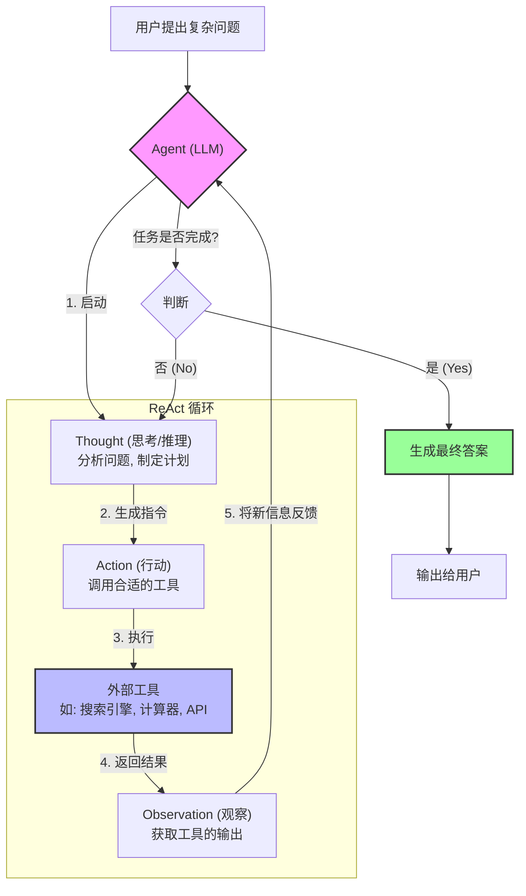

### **Python 代码案例 (LangChain):**

```python
from dotenv import load_dotenv
from langchain import hub
from langchain.agents import AgentExecutor, create_react_agent
from langchain_community.tools import DuckDuckGoSearchRun
from langchain_openai import ChatOpenAI

load_dotenv()


# 1. 创建一个自定义的工具类，继承自 DuckDuckGoSearchRun
class LoggingDuckDuckGoSearchRun(DuckDuckGoSearchRun):
    """
    一个自定义的DuckDuckGoSearchRun版本，它会清晰地打印输入和输出。
    """

    def _run(self, query: str) -> str:
        """重写_run方法以添加日志记录。"""
        print("\n" + "=" * 30)
        print(f"🔎 [DuckDuckGo] 正在搜索: {query}")
        print("=" * 30)

        # 调用父类的原始_run方法来执行实际的搜索
        result = super()._run(query)

        print("\n" + "-" * 30)
        print(f"📄 [DuckDuckGo] 收到结果:")
        # 为了可读性，可以只打印结果的一部分
        print(result[:500] + "..." if len(result) > 500 else result)
        print("-" * 30 + "\n")

        return result


# 2. 在工具列表中使用我们自定义的工具
tools = [LoggingDuckDuckGoSearchRun()]

# 从 LangChain Hub 获取 ReAct 提示模板
prompt = hub.pull("hwchase17/react")

llm = ChatOpenAI(
    model="gpt-4.1",
    temperature=0,
)

# 创建 ReAct Agent
agent = create_react_agent(llm, tools, prompt)

# 创建 Agent 执行器
# 让 AgentExecutor 自己的 verbose 输出保持开启，以便看到思考链
agent_executor = AgentExecutor(agent=agent, tools=tools, verbose=True)

# 运行 Agent
response = agent_executor.invoke(
    {"input": "2024年赢得ACM国际大学生程序设计竞赛（ICPC）的国家是哪个？这个国家的首都是哪里？"})

print("\n" + "*" * 50)
print("最终响应:")
print(response)
print("*" * 50)
```

### **输出:**

```sh
> Entering new AgentExecutor chain...
Thought: 我需要查找2024年ACM国际大学生程序设计竞赛（ICPC）的冠军国家，然后再查找该国家的首都。
Action: duckduckgo_search
Action Input: 2024年ACM国际大学生程序设计竞赛冠军国家
==============================
🔎 [DuckDuckGo] 正在搜索: 2024年ACM国际大学生程序设计竞赛冠军国家
==============================

------------------------------
📄 [DuckDuckGo] 收到结果:
2024 年9月15日至20日，第48届ICPC 国际大学生程序设计大赛 世界总决赛（ICPC World Finals 2024 ）在哈萨克斯坦首都阿斯塔纳举行。 来自全球111个国家，超过3000所学校的选手经过层层选拔，产生141支世界顶尖学生程序员队伍向总 冠军 席位发出激烈的角逐。 2024年10月25日 — 近日，第48届ICPC 国际大学生程序设计竞赛 世界总决赛（ICPCWorldFinals2024）在哈萨克斯坦首都阿斯塔纳成功举办。受 竞赛 组委会邀请，上海大学党委常委、副校长聂清率团出访 ... 2024年12月30日 — 本场的ICPC区域赛（香港站）为今年最后一个亚洲区域赛的站点，共有来自包括北京大学、北京航空航天大学、上海交通大学、哈尔滨工业大学、南京大学等115所院校的149支参赛队伍 ... 2024年11月3日 — 再創佳績！港科大（廣州）大一本科生在ICPC 國際大學生程序設計競賽 亞洲區域賽斬獲金獎 ... 11月3日，第49屆ICPC 國際大學生程序設計競賽 （International Collegiate Programming ... 20...
------------------------------

2024 年9月15日至20日，第48届ICPC 国际大学生程序设计大赛 世界总决赛（ICPC World Finals 2024 ）在哈萨克斯坦首都阿斯塔纳举行。 来自全球111个国家，超过3000所学校的选手经过层层选拔，产生141支世界顶尖学生程序员队伍向总 冠军 席位发出激烈的角逐。 2024年10月25日 — 近日，第48届ICPC 国际大学生程序设计竞赛 世界总决赛（ICPCWorldFinals2024）在哈萨克斯坦首都阿斯塔纳成功举办。受 竞赛 组委会邀请，上海大学党委常委、副校长聂清率团出访 ... 2024年12月30日 — 本场的ICPC区域赛（香港站）为今年最后一个亚洲区域赛的站点，共有来自包括北京大学、北京航空航天大学、上海交通大学、哈尔滨工业大学、南京大学等115所院校的149支参赛队伍 ... 2024年11月3日 — 再創佳績！港科大（廣州）大一本科生在ICPC 國際大學生程序設計競賽 亞洲區域賽斬獲金獎 ... 11月3日，第49屆ICPC 國際大學生程序設計競賽 （International Collegiate Programming ... 2024年10月12日 — 2024年 9月15日至20日，第48届 国际大学生程序设计竞赛 全球总决赛ICPC WF（ICPC World Finals）在哈萨克斯坦首都阿斯塔纳举行。信息科学技术学院2023级本科生王蔚澄、 ...Thought: 目前搜索结果主要提到2024年ICPC总决赛在哈萨克斯坦首都阿斯塔纳举行，但没有直接给出冠军国家的信息。我需要进一步查找2024年ICPC总决赛的冠军队伍或国家。
Action: duckduckgo_search
Action Input: 2024 ICPC World Finals winner
==============================
🔎 [DuckDuckGo] 正在搜索: 2024 ICPC World Finals winner
==============================

------------------------------
📄 [DuckDuckGo] 收到结果:
2024年9月19日 — 935. World Champion . Asia East Champion . $16200. Gold medal 2. Russia · Moscow Institute of Physics and Technology (Yolki-palki):. Denis Mustafin, Tikhon Evteev ... 2024年9月17日 2024年9月22日 — Here they are, the winners of The 2024 ICPC World Finals! Peking University Tsinghua University Moscow Institute of Physics and Technology Tokyo ... 2024年10月9日 — The 2024 World Champions: Peking University . 2024 Champions From among 141 teams of three, chosen from a field of 73,083 students wit...
------------------------------

2024年9月19日 — 935. World Champion . Asia East Champion . $16200. Gold medal 2. Russia · Moscow Institute of Physics and Technology (Yolki-palki):. Denis Mustafin, Tikhon Evteev ... 2024年9月17日 2024年9月22日 — Here they are, the winners of The 2024 ICPC World Finals! Peking University Tsinghua University Moscow Institute of Physics and Technology Tokyo ... 2024年10月9日 — The 2024 World Champions: Peking University . 2024 Champions From among 141 teams of three, chosen from a field of 73,083 students with 12,258 coaches and ... 2024年9月26日 — Team Absinthe's silver medal win at the 2024 International Collegiate Programming Contest (ICPC) World Finals marks a historic achievement.Thought: 我已经查到2024年ICPC世界总决赛的冠军是北京大学。北京大学位于中国，因此冠军国家是中国。接下来需要确认中国的首都。
Action: duckduckgo_search
Action Input: 中国的首都
==============================
🔎 [DuckDuckGo] 正在搜索: 中国的首都
==============================

------------------------------
📄 [DuckDuckGo] 收到结果:
北平 为中国的首都 已有七百多年的历史。 在政治上，北平位于华北老解放区内，人民力量雄厚，规模弘伟，文物集中，是世界上有名的历史的大都市之一，且自五四以来，这里就是新文化思想的摇篮。 [běi jīng shì] 中华人民共和国首都、直辖市 北京市（Beijing），简称“京”，古称燕京、北平，是中华人民共和国首都、直辖市、国家中心城市、超大城市， [185]国务院批复确定的中国政治中心、文化中心、国际交往中心、科技创新中心， 中国历史文化名城和古都之一，世界一线城市。 [142] [188]截至2023年10月，北京市下辖16个区，总面积16410.54平方千米。 [193] [195]2023年末，北京市常住人口2185.8万人。 北京市地处中国北部、华北平原北部，东与天津市毗连，其余均与河北省相邻，中心位于东经116°20′、北纬39°56′，北京市地势西北高、东南低。西部、北部和东北部三面环山，东南部是一片缓缓向渤海倾斜的平原。境内流经的主要河流有：永定河、潮白河、北运河、拒马河等，北京市的气候为暖温带半湿润半干旱季风气候，夏季高温多雨，冬季寒冷干燥，春、秋短促。 北京市是中国...
------------------------------

北平 为中国的首都 已有七百多年的历史。 在政治上，北平位于华北老解放区内，人民力量雄厚，规模弘伟，文物集中，是世界上有名的历史的大都市之一，且自五四以来，这里就是新文化思想的摇篮。 [běi jīng shì] 中华人民共和国首都、直辖市 北京市（Beijing），简称“京”，古称燕京、北平，是中华人民共和国首都、直辖市、国家中心城市、超大城市， [185]国务院批复确定的中国政治中心、文化中心、国际交往中心、科技创新中心， 中国历史文化名城和古都之一，世界一线城市。 [142] [188]截至2023年10月，北京市下辖16个区，总面积16410.54平方千米。 [193] [195]2023年末，北京市常住人口2185.8万人。 北京市地处中国北部、华北平原北部，东与天津市毗连，其余均与河北省相邻，中心位于东经116°20′、北纬39°56′，北京市地势西北高、东南低。西部、北部和东北部三面环山，东南部是一片缓缓向渤海倾斜的平原。境内流经的主要河流有：永定河、潮白河、北运河、拒马河等，北京市的气候为暖温带半湿润半干旱季风气候，夏季高温多雨，冬季寒冷干燥，春、秋短促。 北京市是中国共产党中央委员会、中华人民共和国中央人民政府和中华人民共和国全国人民代表大会常务委员会所在地。 [142]北京市成功举办夏奥会与冬奥会，成为全世界第一个“双奥之城”。 [127]北京市是中华民族的发祥地之一， [194]世界著名古都和现代化国际城市， 荟萃了自元、明、清以来的中华优秀传统文化成果，拥有众多名胜古迹和人文景观，是全球拥有世界文化遗产数量最多的城市。 2023年， 北京全年实现地区生产总值43760.7亿元，按不变价格计算，比上年增长5.2%。第一产业实现增加值105.5亿元，下降4.6%；第二产业实现增加值6525.6亿元，增长0.4%；第三产业实现增加值37129.6亿元，增长6.1%。 See full list on baike.baidu.com 建置沿革 早在西周初年，周武王即封召公于北京及附近地区，称燕，都城在今北京市房山区的琉璃河镇，遗址尚存。又封黄帝之后人于蓟，在今北京市西南。后燕国灭蓟国，迁都于蓟，统称为燕都或燕京。秦置广阳郡、蓟县（今北京市西城区广安门一带），共治蓟，同时设渔阳郡，渔阳郡治今怀柔区梨园庄东南，上谷郡治今河北省怀来县。西汉广阳郡先后改为燕国、广阳国。王莽时期广阳国改为广有郡，上谷郡改名朔调郡，渔阳郡改名通路郡，蓟县改名伐戎县。东汉恢复旧称。东汉建武十三年（37年），广阳郡并入上谷郡。永元八年（96年），复置广阳郡。渔阳郡东汉期间徙治潞。三国魏广阳郡改为燕国，渔阳郡并人。北魏燕国改为燕郡，复置渔阳郡，上谷郡徙治居庸（今延庆区东）。北齐于燕郡置东北道行台，废上谷郡。北周东北道行台改为幽州大都督府。隋开皇三年（583年），废渔阳郡。大业三年（607年），幽州改为涿郡。唐武德元年（618年），涿郡改为幽州总管府，后先后改为幽州大总管府、范阳郡、幽州大都督府、幽州都督府。建中二年（781年），析蓟县西境置幽都县，与蓟县共治幽州城。 [103]五代初期，军阀刘仁恭在此建立地方政权，称燕王，后被后唐消灭。北宋初年，赵光义在高梁河（今北京市西城区）与辽战斗，北宋大败，对燕云十六州从此望眼欲穿。辽会同元年（938年），升幽州为南京，又称燕京，置幽都府，治南京城；蓟县改名蓟北县，与幽都县共同附郭南京。开泰元年（1012年），幽都府更名析津府，蓟北县更名析津县，幽都县更名宛平县。析津府辖6州、直辖11县，州辖13县，共24县。今辖区除延庆县外都在其内，延庆另属儒州。宋宣和四年（1122年），析津府改名燕山府，治燕京，辖12县。金贞元元年（1153年），海陵王迁都燕京，改名中都，析津府改名永安府，治中都城。翌年，永安府改名大兴府，下辖大兴、宛平、安次、漷阴、武清、香河、昌平、良乡、永清、宝坻10县，今通州、顺义直属中都路，大兴、宛平2县共治中都城。元世祖至元元年（1264年），改称中都路大兴府。至元九年（1272年），中都大兴府正式改名为大都路（突厥语：Khanbalik，意为“汗城”，音译为汗八里、甘巴力克），也就是元大都。元大都成为全中国的交通中心，北到岭北行省，东到奴儿干都司（治所黑龙江下游），西到西藏地方，南到海南，都在此交流。从这一时期起，北京成为 中国的首都 。二十一年，置大都路总管府，领左、右警巡2院，辖大兴、宛平、良乡、永清、宝坻、昌平6县和涿、霸、蓟、东安、固安、通、漷、顺、檀、龙庆10州，州领16县，大兴、宛平2县共治大都城。明洪武元年（1368年），置北平承宣布政使司，改大都路为北平府，同年十月应军事需要划归山东行省。洪武九年（1376年），改为北平承宣布政使司驻地。永乐元年（1403年），燕王朱棣经靖难之变后夺得皇位后，以北平为北京，以“顺应天意”之意改北平府为顺天府，称为“行在”（天子行銮驻跸的所在，就称“行在”）且常驻于此；永乐十八年（1420年）十一月初四，明太宗朱棣颁布《迁都诏》，改北平为北京，昭告天下迁都北京 ，十九年，改北京为京师，不称“行在”。洪熙初年，仍称“行在”。正统六年（1441年），罢称“行在”，定为京师，京师顺天府领5州、22县，延庆为京师直隶州。明清时设置顺天府管辖首都地区，地位与北京市类似，但管辖面积不同。清兵入关后即进驻北京，也称北京为京师顺天府，属直隶省。清康熙二十七年（1688年），置四路同知，分辖所属州县。乾隆期间，顺天府共辖24州县，延庆县属宣化府。清咸丰十年（1860年），英法联军打进北京并签订《北京条约》。清光绪二十六年（1900年），八国联军再次打进北京，大量文物被侵略军和坏民劫掠。清光绪二十七年（1901年），清政府在京与十一个国家签署了《辛丑条约》。光绪三十一年（1905年），北京内外城设46区，内城26区，外城20区；三十四年，内城合并为13区，外城合并为10区。宣统二年（1910年）九月，再并内城为10区：中一区，中二区，内左一区至内左四区，内右一区至内右四区；外城10区为：外左一区至外左五区，外右一区至外右五区。民国元年（1912年）1月1日，中华民国定都南京，同年3月迁都北京。民国伊始，北京市的地方体制仍依清制，称顺天府。民国三年（1914年），改顺天府为京兆地方，范围规格与顺天府大致相同，直辖于中央政府北洋政府。这一时期，北京新建了有轨电车系统，和一批现代的文化教育机构，如北京大学、北京师范大学、燕京大学、辅仁大学、北京协和医学院等。民国十七年（1928年）六月，北伐战争后，首都迁回南京，撤销原京兆地方，北京市改名为北平特别市，后改为北平市，隶属于南京国民政府行政院。民国十九年（1930年）6月，北平降格为河北省省辖市，同年12月复升为院辖市。民国二十六年（1937年）七七事变后，抗日战争全面爆发。北平被日本占领，伪中华民国临时政府在此成立，且将北平改名为北京。中国共产党领导人民建立晋察冀抗日根据地，进行民族革命战争。 民国三十四年（1945年）8月21日，入侵北京的日本军队宣布投降，第十一战区孙连仲部接收北京市，并重新更名为北平。北平市所辖范围较之前顺天府、京兆地方及北京市为小，大致包括今西城区、东城区全境，朝阳区大部、海淀区南半部、石景山区南部和丰台区北半部。1949年1月，在原国民党时期20个区的基础上临时划定32个区，4月将32个区合并为26个区，6月接管任务完成后调整为20个区。1949年1月31日，傅作义与中国共产党达成和平协议，率领25万国民党军队投向共产党，中国人民解放军进入北平市，北京和平解放。1949年9月27日中国人民政治协商会议第一届全体会议通过《关于中华人民共和国国都、纪年、国歌、国旗的决议》，北平更名为北京。1949年10月1日，中华人民共和国中央人民政府在北京宣告成立。 See full list on baike.baidu.com 区划沿革 1952年，北京市由华北行政委员会领导。同年7月，将河北省宛平县全部及房山、良乡2县部分地区划归北京市。1956年3月9日，撤销昌平县，将昌平县所属行政区域（高丽营镇除外）划归北京市，并命名为昌平区。将河北省通县所属的金盏、长店、北皋、孙河、崔各庄、上新堡、前苇沟等7个乡归北京市。1958年3月，河北省通县专区所属通县、顺义、大兴、良乡、房山等5县及通州市划入北京市。其后撤销西单区、西四区两区，合并设立西城区；撤销东单区、东四区二区，合并设立东城区；撤销前门区，并入崇文区、宣武区二区；东郊区改名为朝阳区；撤销石景山区，分别划归丰台区、海淀区和门头沟区；京西矿区改名为门头沟区；撤销通县和通州市，合并设立通州区；撤销良乡区、房山区二区，合并设立周口店区；撤销大兴县，改为大兴区；撤销南苑区，划归朝阳区、丰台区和大兴区；撤销顺义县，改为顺义区。10月，河北省所属怀柔、密云、平谷、延庆4县划入北京市。1960年1月7日，撤销昌平区，恢复昌平县；撤销顺义区，恢复顺义县；撤销通州区，恢复通县；撤销大兴区，恢复大兴县；撤销周口店区，恢复房山县。至1960年底，北京市下辖东城、西城、宣武、崇文、海淀、朝阳、丰台、门头沟等8区和昌平、延庆、怀柔、密云、顺义、平谷、通县、大兴、房山等9县。1967年8月7日，撤销石景山办事处，设立石景山区。1980年10月20日，设立燕山区。1986年11月11日，撤销房山县、燕山区，设立房山区。以原房山县和燕山区的行政区域为房山区的行政区域 。1997年4月29日，经国务院（国函[1997]30号）批准，同意撤销通县，设立通州区，以原通县的行政区域为通州区的行政区。1998年3月3日，经国务院（国函[1998]17号）批准撤销顺义县，设立北京市顺义区，以原顺义县的行政区域为顺义区的行政区域。1999年9月16日，北京市撤销昌平县，设立昌平区。2001年3月2日，北京市撤销大兴县，设立大兴区。2002年2月7日，北京市撤销怀柔、平谷两县，设立北京市怀柔区、平谷区。2010年7月1日，北京市撤销原东城区、崇文区，设立新的北京市东城区；撤销北京市原西城区、宣武区，设立新的北京市西城区。2015年11月17日，北京市撤销密云、延庆两县，设立北京市密云区、延庆区。至此，北京市告别县治时代。 区划详情 截至2023年，北京市共辖16个市辖区，分别是东城区、西城区、朝阳区、丰台区、石景山区、海淀区、顺义区、通州区、大兴区、房山区、门头沟区、昌平区、平谷区、密云区、怀柔区、延庆区。北京市人民政府驻通州区运河东大街57号。 See full list on baike.baidu.com 位置境域 北京市位于华北平原的西北端，东经115°20′至117°30′，北纬39°28′至41°05′之间，地处海河流域中部。总面积16410平方千米。位于华北平原北部，毗邻渤海湾，上靠辽东半岛，下临山东半岛。北京市与天津市相邻，并与天津市一起被河北省环绕。 地形地貌 北京市地处华北平原西北隅，地势西北高、东南低。地形的特点是山地多、平原少，北部为中低山区，东南部是缓斜的平原，其中山区面积约占61%，平原面积约占39%。全市平均海拔43.5米。北京市平原的海拔高度在20～60米，山地一般海拔1000～1500米。主要山脉有太行山和燕山山脉。 北京市西部为西山属太行山脉；北部和东北部为军都山属燕山山脉。最高的山峰为京西门头沟区的东灵山，海拔2303米。最低点三垡位于通州区，海拔7米。两山在南口关沟相交，形成一个向东南展开的半圆形大山弯，人们称之为“北京弯”，它所围绕的小平原即为北京小平原。诚如古人所言：“幽州之地，左环沧海，右拥太行，北枕居庸，南襟河济，诚天府之国”。 气候 北京市的气候为暖温带半湿润半干旱季风气候，夏季高温多雨，冬季寒冷干燥，春、秋短促。全年无霜期180～200天，西部山区较短。2007年平均降雨量483.9毫米，为华北地区降雨最多的地区之一。降水季节分配很不均匀，全年降水的80%集中在夏季6、7、8三个月，7、8月有大雨。北京市太阳辐射量全年平均为112～136千卡/厘米。两个高值区分别分布在延庆盆地及密云县西北部至怀柔东部一带，年辐射量均在135千卡/厘米以上；低值区位于房山区的霞云岭附近，年辐射量为112千卡/厘米。北京市年平均日照时数在2000～2800小时之间。最大值在延庆区和古北口，为2800小时以上，最小值分布在霞云岭，日照为2063小时。夏季正当雨季，日照时数减少，月日照在230小时左右；秋季日照时数虽没有春季多，但比夏季要多，月日照230～245小时；冬季是一年中日照时数最少季节，月日照不足200小时，一般在170～190小时。 See full list on baike.baidu.com 水资源 北京市天然河道自西向东贯穿五大水系：拒马河水系、永定河水系、北运河水系、潮白河水系和蓟运河水系。多由西北部山地发源，向东南蜿蜒流经平原地区，最后分别在海河汇入渤海（蓟运河除外）。北京市有水库85座，其中大型水库有密云水库、官厅水库、怀柔水库、海子水库。北京市地下水多年平均补给量约为29.21亿立方米，平均年可开采量约24~25亿立方米。一次性天然水资源年平均总量为55.21亿立方米。2013年北京市总用水量35.3亿立方米，比2012年增长1.4%。其中，生活用水14.5亿立方米，增长4.3%；工业用水5.6亿立方米，下降3.4%；农业用水12亿立方米，下降3.2%。 矿产资源 北京市已发现的矿种共67种，矿床、矿点产地476处，列入国家储量表的矿种44种，其中：能源矿产2种；黑色金属矿产4种，有色金属、贵金属及分散元素矿产11种；冶金辅助原料非金属矿产7种；化工原料非金属矿产5种；建材及其他非金属矿产15种。共有产地300处，其中黑色金属产地49处，有色金属产地35处，冶金辅助原料非金属产地43处，化工原料非金属产地68处，建材及其他非金属产地75处，煤炭产地30处。 植物资源 北京地带性植被类型是暖温带落叶阔叶林并间有温性针叶林的分布。大部分平原地区已成为农田和城镇，只在河岸两旁局部洼地发育着以芦苇、香蒲、慈菇等为主的洼生植被，但多数洼地已被开辟为鱼塘，在搁荒地及田埂、路旁多杂草；湖泊，水塘中发育着沉水和浮叶的水生植被。海拔800米以下的低山带表性的植被类型是栓皮栎林、栎林、油松林和侧柏林。海拔800米以上的中山，森林覆盖率增大，其下部以辽东栎林为主，海拔1000米至1800~2000米，桦树增多，在森林群落破坏严重的地段，为二色胡枝子、榛属、绣线菊属占优势的灌丛。海拔1800~1900米以上的山顶生长着山地杂类草草甸。全市森林覆盖率达到44.8%，森林蓄积量达到3164万立方米，城市绿化覆盖率达到49.3%，人均公园绿地面积16.63平方米，森林资源资产价值达到9070亿元，林地绿地生态系统年碳汇能力达880万吨。 See full list on baike.baidu.com 人口数量 •第七次全国人口普查常住人口2020年11月1日零时，北京市常住人口为2189.3万人，与2010年（第六次全国人口普查数据，下同）的1961.2万人相比，十年增加228.1万人，平均每年增加22.8万人，年平均增长1.1%。比2000年到2010年的年平均增长率3.8%下降2.7个百分点。常住人口中，外省市来京人口为841.8万人，占常住人口的38.5%。与2010年相比，增加137.3万人，增长19.5%，年平均增长1.8%，在常住人口中的比重上升2.6个百分点。户别人口北京市常住人口中，共有家庭户8230792户，集体户907136户，家庭户人口为19014338人，集体户人口为2878757人。平均每个家庭户的人口为2.31人，与2010年第六次全国人口普查的2.45人相比，减少0.14人。城乡人口北京市常住人口中，从城乡构成看，城镇人口1912.8万人，乡村人口271.5万人；城镇人口占全市常住人口的比重为87.6%。常住人口性别构成北京市常住人口中，男性人口为11195390人，占51.1%；女性人口为10697705人，占48.9%。常住人口性别比（以女性为100，男性对女性的比例）为104.7，与2010年第六次全国人口普查相比下降2.1。常住人口年龄构成北京市常住人口中，0~14岁人口为2591507人，占11.9%；15~59岁人口为15002998人，占68.5%；60岁及以上人口为4298590人，占19.6%，其中65岁及以上人口为2912060人，占13.3%。与2010年第六次全国人口普查相比，0~14岁人口的比重上升3.3个百分点，15~59岁人口的比重下降10.4个百分点，60岁及以上人口的比重上升7.1个百分点，65岁及以上人口的比重上升4.6个百分点。截至2022年末，北京市常住人口中，0-14岁常住人口264万人，占全市常住人口的比重为12.1%；15-59岁常住人口1455.2万人，占66.6%；60岁及以上常住人口465.1万人，占21.3%。 •2022年末2022年末，北京市常住人口2184.3万人，比上年末减少4.3万人。其中，城镇人口1912.8万人，占常住人口的比重为87.6%；常住外来人口825.1万人，占常住人口的比重为37.8%。常住人口出生率为5.67‰，死亡率为5.72‰，自然增长率为-0.05‰。全年城镇新增就业26万人。全年城镇调查失业率均值为4.7%，运行在年度调控目标内。 •2023年末 民族构成 北京市常住人口中，汉族人口为20845166人，占95.2%；各少数民族人口为1047929人，占4.8%。与2010年第六次全国人口普查相比，汉族人口增加2034012人，增长10.8%，年平均增长1%；各少数民族人口增加246715人，增长30.8%，年平均增长2.7%。2010年第六次人口普查数据显示，北京市少数民族人口80.1万人，占全市常住人口的4.1%。其中千人以上的少数民族21个，满族、回族、蒙古族、朝鲜族、土家族、壮族、苗族7个民族人口超过万人。少数民族人口最多的区是朝阳区(14万人)和海淀区(13.5万人)，少数民族人口比例最高的区是怀柔区(8.5%)和密云区(7.5%)。 老龄事业 北京市户籍居民平均期望寿命2021年9月6日，北京市老龄协会正式发布了《北京市老龄事业发展报告（2020）》。2020年，北京市户籍居民平均期望寿命为82.43岁，北京市百岁老年人已达1438人。2016~2020年，80岁及以上户籍老年人口逐年增加，从59.5万上升到63.3万，增加3.8万人。2016~2020年，百岁老年人逐年增加，由751人上升到1438人，增加687人；其中，女性百岁老年人总量高于男性，且逐年增长。2020年，北京市户籍居民平均期望寿命为82.43岁。 See full list on baike.baidu.com 综述 2023年， 北京市实现地区生产总值43760.7亿元，按不变价格计算，比上年增长5.2%。其中，第一产业增加值105.5亿元，下降4.6%；第二产业增加值6525.6亿元，增长0.4%；第三产业增加值37129.6亿元，增长6.1%。三次产业构成为0.2︰14.9︰84.8。按常住人口计算，全市人均地区生产总值为20.0万元。2023年，北京市居民消费价格总水平比上年上涨0.4%。工业生产者出厂价格下降0.8%，工业生产者购进价格下降1.3%。农产品生产者价格下降0.3%。12月份，新建商品住宅销售价格环比指数为100.0、同比指数为101.7；二手住宅销售价格环比指数为98.8、同比指数为97.8。2023年，北京市完成一般公共预算收入6181.1亿元，比上年增长8.2%。其中，税收收入5357.1亿元，增长10.1%。全市一般公共预算支出7971.6亿元，比上年增长6.7%。全年累计新增减税降费及退税缓费971.7亿元。2023年，北京市实现数字经济增加值18766.7亿元，按现价计算，比上年增长8.5%，占地区生产总值的比重为42.9%，比上年提高1.3个百分点。其中，数字经济核心产业增加值11061.5亿元，增长10.8%，占地区生产总值的比重为25.3%，提高1.3个百分点。全年实现高技术产业增加值11875.4亿元，按现价计算，增长7.1%，占地区生产总值的比重为27.1%，提高0.4个百分点。全年新设科技型企业12.3万家，增长15.9%，占全市新设企业的41.4%。 第一产业 2023年，全市实现农林牧渔业总产值252.5亿元，按可比价格计算，比上年下降4.6%。其中，实现农业（种植业）产值135.6亿元，增长5.1%，粮食播种面积134.2万亩、产量47.8万吨，分别增长16.6%和5.3%；蔬菜及食用菌播种面积79.5万亩，与上年基本持平，产量207.5万吨，增长4.3%；受2022年新一轮百万亩造林绿化工程收官、基数较高影响，林业实现产值65.9亿元，下降20.6%。全市休闲农业和乡村旅游接待游客2210.1万人次，比上年增长23.6%，实现收入36.2亿元，增长12.7%。2022年，北京市实现农林牧渔业总产值268.2亿元，按可比价格计算，比上年下降2.0%。其中，农业（种植业）产值129.8亿元，增长2.3%；林业产值86.5亿元，增长1.4%。全年粮食作物播种面积7.7万公顷，增长26.0%，粮食总产量45.4万吨，增长20.1%；蔬菜及食用菌产量198.9万吨，增长20.1%；年末生猪存栏量36.8万头，下降37.7%，生猪出栏量32.2万头，增长4.3%。设施农业播种面积48.7万亩、实现产值59.8亿元，分别增长4.3%和3.3%。农业观光园1027个，实现总收入18.4亿元。实际经营的乡村旅游接待单位（农户）7105户，实现总收入13.7亿元。 第二产业 •工业2023年，北京市实现工业增加值5008.5亿元，按不变价格计算，比上年增长0.3%。其中，规模以上工业增加值增长0.4%。在规模以上工业中，电力、热力生产和供应业增长7.9%，五大装备制造业增长10.6%，汽车制造业增长5.2%，计算机、通信和其他电子设备制造业下降0.9%，医药制造业下降21.7%（剔除新冠疫苗生产因素下降4.3%）。规模以上工业实现销售产值23113.6亿元，增长2.9%。其中,内销产值21342.7亿元，增长3.4%；出口交货值1770.9亿元，下降2.5%。高端或新兴领域产品生产中，风力发电机组、液晶显示模组、新能源汽车、医疗仪器设备及器械产量分别增长68.8%、39.2%、35.6%和26.7%。2023年，北京市规模以上工业企业实现营业收入27807.9亿元，比上年增长3.6%；实现利润总额1692.3亿元，下降12.9%。规模以上工业企业营业收入利润率为6.09%，比上年下降1.15个百分点。•建筑业 See full list on baike.baidu.com 教育事业 北京市是全国教育最发达的地区之一，是全国高等院校的中心，聚集了全国数量最多的重点大学。2022年，北京市研究生教育招生14.6万人，在学研究生43.5万人，毕业生11.4万人。普通高等学校招收本专科学生16.6万人，在校生60.3万人，毕业生15.4万人。全市成人本专科招生3.0万人，在校生7.8万人，毕业生3.9万人。2022年，北京市普通高中招生7.5万人，在校生19.9万人，毕业生5.0万人。普通初中招生12.1万人，在校生35.6万人，毕业生10.4万人。普通小学招生19.0万人，在校生108.4万人，毕业生13.3万人。幼儿园入园幼儿17.9万人，在园幼儿57.4万人。各类中等职业教育（不含技工学校）招生2.0万人，在校生5.5万人，毕业生1.3万人。特殊教育招生1110人，在校生7722人，毕业生1666人。2022年，北京市共有民办高校15所，在校生5.4万人。民办中等教育学校124所，在校学生2.6万人。民办小学41所，在校学生3.8万人。民办幼儿园1037所，在园幼儿24.5万人。2023年，北京市研究生教育招生15.2万人，在学研究生45.5万人，毕业生12.1万人。普通高等学校招收本专科学生17.6万人，在校生61.8万人，毕业生15.4万人。全市成人本专科招生3.0万人，在校生7.6万人，毕业生3.0万人。各类中等职业教育(不含技工学校)招生2.1万人，在校生5.9万人，毕业生1.6万人。普通高中招生8.0万人，在校生21.7万人，毕业生5.9万人。普通初中招生13.5万人，在校生37.1万人，毕业生11.0万人。普通小学招生23.5万人，在校生116.2万人，毕业生14.6万人。特殊教育招生1296人，在校生7825人，毕业生1788人。幼儿园入园幼儿16.4万人，在园幼儿51.5万人。全年共有民办高校15所，在校生5.7万人。民办中等教育学校(不包括技工学校)125所，在校学生2.9万人。民办小学38所，在校学生3.8万人。民办幼儿园1045所，在园幼儿21.3万人。 科学技术 北京市是全国最大的科学技术研究基地，有中国科学院等科学研究机构和号称中国硅谷的北京市中关村科技园区，每年获国家奖励的成果占全国的三分之一。1998年来，每年都成功举办以高新技术产业为主题的大型国际活动——北京高新技术产业国际周。2017年12月，北京习近平新时代中国特色社会主义思想研究中心（院）成立。2022年11月17日，被国家知识产权局办公室确定为开展数据知识产权工作的试点地方，试点工作期限为2022年11月至2023年12月。2022年，北京市专利授权量20.3万件，比上年增长2.0%。其中，发明专利授权量8.8万件，增长11.3%。年末拥有有效发明专利47.8万件，增长18.0%。PCT国际专利申请量11463件，增长10.7%。每万人口高价值发明专利拥有量为112.0件，比上年增加17.8件。全年共认定登记技术合同95061项，增长1.6%；技术合同成交额7947.5亿元，增长13.4%。 [167]2022年，北京首次跻身全球国际科技创新中心前三，综合得分80.39。截至2023年末，在京全国重点实验室77家，占全国的28.1%。国家科技成果转化引导基金累计设立4支子基金，基金总规模64.4亿元。年末全市共有国家级科技企业孵化器71家、国家备案众创空间145家。全年新认定国家高新技术企业1.08万家，累计有效国家高新技术企业2.83万家。截至年末共认定市级“专精特新”企业7180家，其中，国家级专精特新“小巨人”企业795家。年末共有独角兽企业114家，市场总估值5215亿美元。全年发明专利授权量10.8万件，比上年增长22.4%。年末拥有有效发明专利57.4万件，增长20.2%。PCT国际专利申请量11438件。每万人口高价值发明专利拥有量136.95件，增加24.97件。全年共认定登记技术合同106552项，增长12.1%。技术合同成交额8536.9亿元，增长7.4%；北京流向津冀技术合同6758项，增长14.9%，成交额748.7亿元，增长1.1倍。超大规模智能模型“悟道3.0”在语言、视觉多模态上取得突破，涌现出新一代量子计算云平台“夸父”、新一代256核区块链专用加速芯片、首个精通3D任务的具身通才智能体“狮子座”、“朱雀二号”全球首款成功入轨飞行液氧甲烷火箭等多项重大创新成果。 医疗卫生 2023年末，北京市共有医疗卫生机构12518个，比上年末增加307个。其中，医院765个。医疗卫生机构共有床位13.9万张，增加0.5万张。其中，医院床位13.1万张。卫生技术人员34.3万人。其中，执业（助理）医师13.4万人，注册护士15.3万人。医疗机构总诊疗人次为29088.1万人次。 See full list on baike.baidu.com 铁路 •铁路线路北京市是中国铁路网的中心之一，国内线路主要有京九铁路、京沪铁路、京广铁路、京哈铁路、京包铁路、京原铁路、京通铁路、京承铁路和京沪高铁、京广高铁、京哈高铁、京津城际铁路等在国际铁路运输方面，经内蒙古自治区满洲里市去往俄罗斯各城市、经内蒙古自治区二连浩特市去往蒙古国都城乌兰巴托和朝鲜都城平壤以及去往越南都城河内的列车均从北京市发车。•主要车站 航空 北京市境内共有两座大型机场，分别为北京首都国际机场和北京大兴国际机场。北京首都国际机场是全球规模最大的机场之一，是中国国际航空股份有限公司（Air China）的主要运营中心，位于北京市顺义区（行政属朝阳区），距北京市中心20千米。旅客吞吐量在2012年达到8192.9万人次，仅次于美国哈兹菲尔德~杰克逊亚特兰大国际机场，位居全球第二。首都机场和北京市区间由北京市首都机场高速公路、首都机场第二高速公路和北京地铁首都机场线连接。北京大兴国际机场位于北京市大兴区和河北省廊坊市广阳区的交界处，于2019年9月25日正式通航。2021年，北京大兴国际机场共完成旅客量吞吐量25051012人次，货邮吞吐量185942.7吨。北京市还建有5座机场：北京南苑机场（已关闭）、 北京良乡机场、北京西郊机场、北京沙河机场、 北京八达岭机场。 市内交通 •市内公路北京市老城区（二环路以内）的城市道路是棋盘式的格局，横平竖直。东西方向的道路有长安街（复兴门至建国门）、平安大街（东四十条豁口至车公庄）、广安大街（广安门至广渠门）。南北方向的道路有中轴线，从玉蜓桥到雍和宫的东线和开阳桥到积水潭桥的西线。东线路过方庄、红桥、崇文门、东单、东四、北新桥和雍和宫；西线路过菜市口、宣武门、西单、西四、新街口。因为天安门广场和紫禁城的原因，北京市的中轴线分为北中轴和南中轴。北中轴从地安门向北，经鼓楼、北辰路，达国家奥林匹克体育中心；南中轴从前门向南经天桥、永定门，达三营门。南中轴和104国道重合。2023年末，北京市公路里程22433.2公里，比上年末增加70.4公里。其中，高速公路里程1211.1公里，增加14.8公里。年末城市道路里程6256公里，比上年末增加47公里。2023年末，北京市公共汽电车运营线路1285条，比上年末减少6条；运营线路长度29738.5公里，减少435.4公里；运营车辆23385辆，减少80辆；全年客运总量20.9亿人次，增长20.9%。年末轨道交通运营线路27条，与上年末持平；运营线路长度836公里，增加38.7公里；运营车辆7512辆，增加238辆；全年客运总量34.5亿人次，增长52.6%。 •出租汽车2013年，北京市出租车日均运送190万人次，占总出行量的6.6%，里程利用率约68%。 2013年6月10日起调整北京市出租汽车价格标准，新的出租汽车价格为：3千米以内13元，基本单价每千米2.3元。燃油附加费每运次1元。低速行驶和等候费每5分钟早晚高峰期间加收2千米租价（不含空驶费），其他时段加收1千米租价（不含空驶费）。预约叫车服务费为提前4小时以上预约每次6元，4小时以内预约每次5元。单程载客行驶超过15千米部分收取空驶费，基本单价加收50%的费用。 •汽车牌照京A（1996年前）；京B（出租车）；京C（1996年）；京E（1997年）；京F（2002年）；京G（郊区户籍车）；京H（2003年）；京J（2005年）；京K（2006年）；京L（2007年）；京M（2008年）；京N（2008年）；京O（公安）；京P（2008年）；京Y（郊区户籍车）；京V（中央直属部队）；京Q（2012年）。•轨道交通 See full list on baike.baidu.com 名称由来 北京市是一座有着三千多年历史的古都，在不同的朝代有着不同的称谓，大致算起来有二十多个别称。燕都，据史书记载，公元前1045年，周武王灭商以后，在燕封召公。 [106]燕都因古时为燕国都城而得名。战国七雄中有燕国，据说是因临近燕山而得国名，其国都称为“燕都”。幽州，远古时代的九州之一。幽州之名，最早见于《尚书·舜典》：“燕曰幽州。”两汉、魏、晋、唐代都曾设置过幽州，所治均在北京市一带。京城，京城泛指国都，北京成为国都后，也多将其称为京城。南京，辽太宗会同元年（938年），将原来的幽州升为幽都府，建号南京，又称燕京，作为辽的陪都。当时辽的首都在上京。大都，元代以金的离宫今北海公园为中心重建新城，忽必烈至元九年（1272年）改称大都，俗称元大都。北平，明代洪武元年（1368年），朱元璋灭掉元朝后，为了记载平定北方的功绩，将元大都改称北平。北京，明永乐元年（1403年），朱棣取得皇位后，将他做燕王时的封地北平府改为顺天府，建北京城，并准备迁都城于此，这是正式命名为北京的开始，今已有600余年的历史。京师，永乐十八年（1420年）迁都北京，改称京师，直至清代。京兆，民国废顺天府，置京兆地方，直隶中央，其范围包括北京市大部分地区，民国十七年（1928年）废京兆地方，改北京为北平。 北京方言 北京地方语言音质清晰，节奏明快，声调高扬，儿化音的使用成为最显著的特征。北京地区早期以中原雅音为准，明清之际，伴随大量移民不断入京，逐渐形成了以河北口音为主，兼受东北语言影响的北京话。北京话京腔京韵，具有鲜明的地方特色。为便于交流，清中期开始，确立以北京官话为国语正音，历民国至1949年后，最终形成以北京语音为标准音，以北方话为基础方言，全国通用的普通话，成为各族人民最重要的语言交流工具。 非遗及特产 •综述北京是中国四大古都之一，有很多地方特色的民风习俗：北京小吃、京剧、京韵大鼓、相声、舞台剧、铁板快书、景泰蓝、牙雕、毛猴、漆雕、赛蝈蝈和蝈蝈笼、吹糖人、捏面人等等。•京剧京剧是中国国粹。京剧的源头还要追溯到几种古老的地方戏剧，清乾隆五十五年（1790年），安徽的四大地方戏班——三庆班、四喜班、春台班、和春班——先后进京献艺。 [191]徽班常与来自湖北的汉调艺人合作演出，于是，一种以徽调“二黄”和汉调“西皮”为主，兼收昆曲、秦腔、梆子等地方戏精华的新剧种诞生了，这就是京剧。•非遗项目•老字号•地方特产 See full list on baike.baidu.com 问题： 中国的 首都 是哪里？ 快速回答： 中国的 首都 是北京。 位于该国北部， 北京 是现代中国的政治、文化和历史中心。 为什么选择北京作为首都？ 作为首都的悠久历史： 北京有一个 历史 已有 3000 多年的历史，曾作为元朝、明朝、清朝等几个主要朝代的首都。 根据《中华人民共和国宪法》， 北京 是中华人民共和国首都。 北京 是中国共产党中央委员会、中华人民共和国中央人民政府所在地，也是全国政治、经济和科学文化的中心，也是国内国际交往的中心之一，是中国历史文化名城和古都之一。 Nov 17, 2024 · 毛主席对哈尔滨的偏爱也是显而易见的，后来哈尔滨被批准为“特别市”， 可以说，只差临门一脚，它就能成为新中国 首都 的所在地。 北平 为中国的首都 已有七百多年的历史。 在政治上，北平位于华北老解放区内，人民力量雄厚，规模弘伟，文物集中，是世界上有名的历史的大都市之一，且自五四以来，这里就是新文化思想的摇篮。 问题： 中国的 首都 是哪里？ 快速回答： 中国的 首都 是北京。 位于该国北部， 北京 是现代中国的政治、文化和历史中心。 为什么选择北京作为首都？ 作为首都的悠久历史： 北京有一个 历史 已有 3000 多年的历史，曾作为元朝、明朝、清朝等几个主要朝代的首都。 很显然，这是一个只有“白痴”才会问的问题，因为所有中国人都知道， 中国的首都 是——“北京”。 可我们也知道，在中国几千年的历史长河中，并非每一个朝代都是定都在北京的，比如我国历史上第一个封建王朝‘秦朝’，其 首都 是咸阳；北宋的首都是汴梁 ... 北平 为中国的首都 已有七百多年的历史。 在政治上，北平位于华北老解放区内，人民力量雄厚，规模弘伟，文物集中，是世界上有名的历史的大都市之一，且自五四以来，这里就是新文化思想的摇篮。Thought: 我已经查到2024年ACM国际大学生程序设计竞赛（ICPC）世界总决赛的冠军是北京大学，代表国家是中国。中国的首都是北京。
Final Answer: 2024年赢得ACM国际大学生程序设计竞赛（ICPC）的国家是中国，这个国家的首都是北京。

> Finished chain.

**************************************************
最终响应:
{'input': '2024年赢得ACM国际大学生程序设计竞赛（ICPC）的国家是哪个？这个国家的首都是哪里？', 'output': '2024年赢得ACM国际大学生程序设计竞赛（ICPC）的国家是中国，这个国家的首都是北京。'}
**************************************************
```

### 代码整体流程：


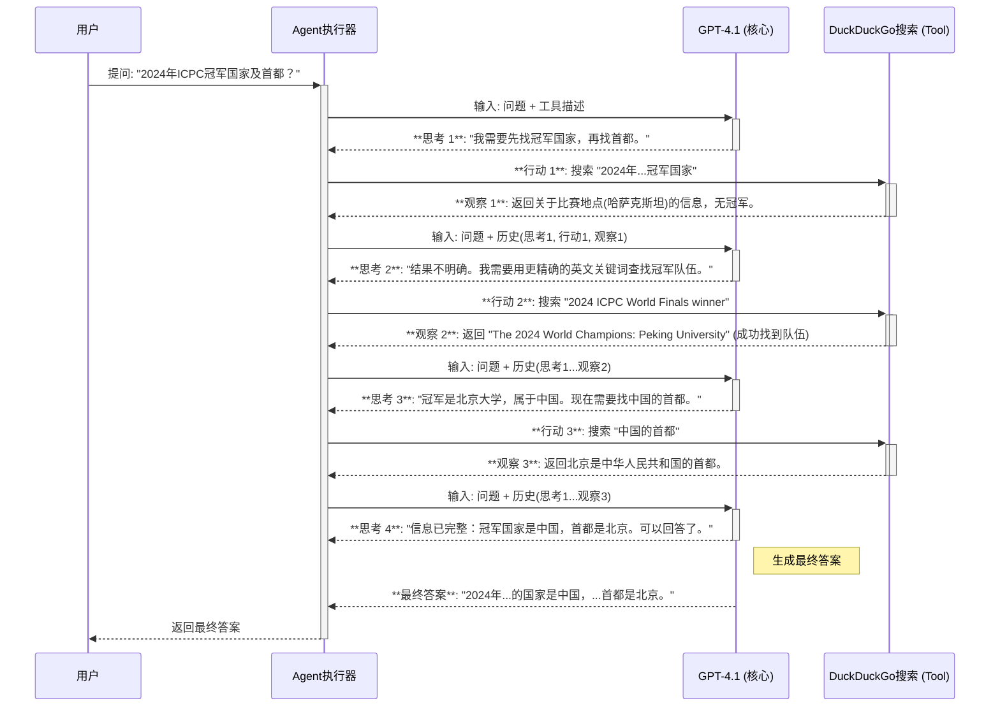


这张图清晰地揭示了 ReAct Agent 的“思考过程”：

1. **初始规划**: **Agent** 接收到**用户**的复合问题后，内部的 **LLM** 首先进行**思考1**，将任务分解为两个子任务：先找冠军国家，再找首都。
2. **第一次循环 (试探与反馈)**:
   - **Agent** 根据**思考1**执行**行动1**，调用**搜索工具**。
   - 工具返回的**观察1**并不理想，没有直接答案。这个反馈至关重要。
3. **第二次循环 (根据反馈调整)**:
   - **Agent** 将包括失败的**观察1**在内的所有历史信息传回给 **LLM**。
   - **LLM** 进行**思考2**，分析失败原因并决定改变策略——使用更精确的英文关键词。
   - 新的**行动2**带来了成功的**观察2**，找到了关键信息“北京大学”。
4. **第三次循环 (解决子任务)**:
   - **LLM** 进行**思考3**，它首先进行了一步**推理**（北京大学 -> 中国），然后确定了下一个行动目标（找中国的首都）。
   - **行动3**和**观察3**顺利解决了第二个子问题。
5. **第四次循环 (总结与输出)**:
   - **LLM** 进行**思考4**，确认所有必需信息都已集齐。
   - 它不再生成新的行动，而是生成**最终答案 (Final Answer)**。
   - **Agent** 将这个最终答案返回给**用户**。

这个流程完美地诠释了 **ReAct** 的核心思想：它不是一次性规划，而是一个**动态、迭代**的过程。每一步的观察都会成为下一步思考的依据，使得 Agent 能够处理不确定性，并从失败的尝试中学习和调整。

### hwchase17/react 介绍

"hwchase17" 是 LangChain 的创始人 Harrison Chase 的用户名，这个模板是他创建并分享到 LangChain Hub 上的。

```python
# 从 LangChain Hub 获取 ReAct 提示模板
prompt = hub.pull("hwchase17/react")
```

 这行代码用于从 LangChain Hub 拉取一个著名且官方内置的 ReAct agent 提示词模版（prompt template），其名称为"hwchase17/react"。这个模版为构建 ReAct 类型智能体（ReAct即Reason + Act，推理与行动协同）提供了标准的提示上下文。

- **“hwchase17/react”** 是被 LangChain 官方维护、广泛使用的一个 ReAct Agent 提示词模版。
- 其核心思想来自论文《ReAct: Synergizing Reasoning and Acting in Language Models》（https://arxiv.org/abs/2210.03629）。通过序列化地让语言模型“思考（Reason）→采取行动（Act）→观察结果→继续思考/行动”，有效提升 LLM 在复杂多步骤推理和工具调用场景下的表现。

prompt的内容结构：

```
Answer the following questions as best you can. You have access to the following tools:

{tools}

Use the following format:

Question: the input question you must answer
Thought: you should always think about what to do
Action: the action to take, should be one of [{tool_names}]
Action Input: the input to the action
Observation: the result of the action
... (this Thought/Action/Action Input/Observation can repeat N times)
Thought: I now know the final answer
Final Answer: the final answer to the original input question

Begin!

Question: {input}
Thought:{agent_scratchpad}
```

- 其中，`{tools}`、`{tool_names}`、`{input}`、`{agent_scratchpad}` 都是在 Agent 执行阶段动态填充的变量。

下面是中文翻译：

```
请尽可能完整地回答以下问题。您可以使用以下工具：

{tools}

使用以下格式：

问题：您必须回答的输入问题
想法：您应该始终思考要做什么
行动：要采取的行动，应为 [{tool_names}] 之一
行动输入：行动的输入
观察：行动的结果
……（此想法/行动/行动输入/观察可以重复 N 次）
想法：我现在知道最终答案了
最终答案：原始输入问题的最终答案

开始！

问题：{input}
想法：{agent_scratchpad}
```

**工作方式：**

- Agent（智能体）每次会按照上述格式作答：先思考（Thought），然后决定是否使用某个工具（Action），填写输入（Action Input），拿到结果（Observation），再继续下一轮，直到得出最终答案（Final Answer）。
- 这种格式促使 LLM 把推理过程和行动显性化，使其对“何时用工具、如何使用”有明确指导。
- 若使用带聊天历史的提示，可切换为"hwchase17/react-chat"等。

**引用文献:**

*   **原始论文:** "ReAct: Synergizing Reasoning and Acting in Language Models" by Shunyu Yao, et al. ([https://arxiv.org/abs/2210.03629](https://arxiv.org/abs/2210.03629))

## **2. Plan-and-Execute**

### **模式介绍:**

Plan-and-Execute 模式将复杂的任务分解为两个核心阶段：规划（Planning）和执行（Execution）。与ReAct模式的交错式推理和行动不同，该模式首先由一个“规划器”（Planner）LLM为整个任务制定一个详细的、分步骤的计划。然后，一个或多个“执行器”（Executor）Agent负责逐一完成计划中的每个子任务。

1.  **规划器 (Planner):** 首先，一个通常由强大 LLM 驱动的规划器会接收用户请求，并将其分解成一个详细的、多步骤的计划。 这个计划明确了需要执行的一系列子任务。
2.  **执行器 (Executor):** 然后，一个或多个执行器（可以是另一个 Agent 或特定的工具）会按照计划逐一执行这些子任务。 执行阶段可以使用更小、更专注的模型，从而降低成本和延迟。

这种模式的优势在于它能够进行更长远的规划，并且在执行过程中更加高效和稳定。

**Mermaid 图:**

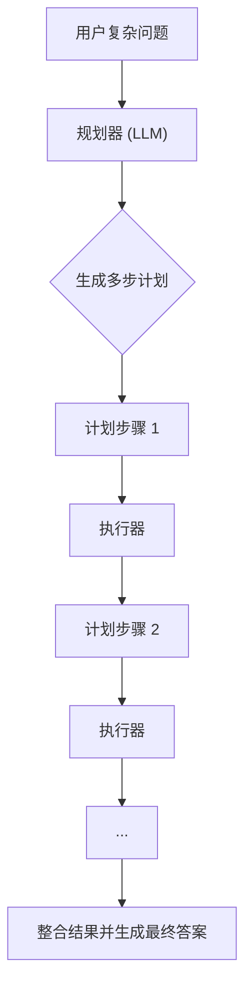

### **Python 代码案例 (LangChain):**

```python
import os
from dotenv import load_dotenv

from langchain_openai import ChatOpenAI
from langchain.chains import LLMMathChain
from langchain.tools import Tool
from langchain_experimental.plan_and_execute import PlanAndExecute, load_agent_executor, load_chat_planner
from langchain_community.tools import DuckDuckGoSearchRun

# --- 配置区 ---
load_dotenv()

QUESTION = "求中国北京、上海、广州、深圳的人口总和"


# --- 主程序 ---
def main():
    # 1. 定义语言模型
    planner_llm = ChatOpenAI(model="gpt-4.1", temperature=0)
    executor_llm = ChatOpenAI(model="gpt-4.1", temperature=0)

    # 2. 定义执行器要使用的工具 (搜索 + 计算器)
    class LoggingDuckDuckGoSearchRun(DuckDuckGoSearchRun):
        """
        一个自定义的DuckDuckGoSearchRun版本，它会清晰地打印输入和输出。
        """

        def _run(self, query: str) -> str:
            """重写_run方法以添加日志记录。"""
            print("\n" + "=" * 30)
            print(f"🔎 [DuckDuckGo] 正在搜索: {query}")
            print("=" * 30)

            # 调用父类的原始_run方法来执行实际的搜索
            result = super()._run(query)

            print("\n" + "-" * 30)
            print(f"📄 [DuckDuckGo] 收到结果:")
            # 为了可读性，可以只打印结果的一部分
            print(result[:500] + "..." if len(result) > 500 else result)
            print("-" * 30 + "\n")

            return result

    search = LoggingDuckDuckGoSearchRun()

    # 创建一个由 LLM 驱动的数学计算链
    llm_math_chain = LLMMathChain.from_llm(llm=executor_llm, verbose=True)

    tools = [
        Tool(
            name="Search",
            func=search.run,
            description="当你需要回答关于时事、事实和数据的问题时非常有用。用于查找信息。",
        ),
        Tool(
            name="Calculator",
            func=llm_math_chain.run,
            description="当你需要进行数学计算或回答关于数学的问题时非常有用。输入应该是一个完整的数学表达式。",
        )
    ]

    # 3. 创建计划器 (Planner) 和执行器 (Executor)
    planner = load_chat_planner(planner_llm)
    # 将包含两个工具的列表传递给执行器
    executor = load_agent_executor(executor_llm, tools, verbose=True)

    # 4. 组装 Plan-and-Execute 智能体
    agent = PlanAndExecute(planner=planner, executor=executor, verbose=True)

    # --- 打印输入 ---
    print("--- 用户输入 ---")
    print(f"问题: {QUESTION}\n")
    print("--- Agent 开始执行 (详细过程如下) ---")

    # 5. 运行智能体
    try:
        result = agent.invoke({"input": QUESTION})
        final_answer = result.get('output', '未能获取最终答案。')

        # --- 打印最终输出 ---
        print("\n--- Agent 执行完毕 ---")
        print(f"\n[问题]: {QUESTION}")
        print(f"[最终答案]: {final_answer}")

    except Exception as e:
        print(f"\n--- 发生错误 ---")
        print(f"在 Agent 执行过程中出现错误: {e}")


if __name__ == "__main__":
    main()

```

### **输出：**

````sh
--- 用户输入 ---
问题: 求中国北京、上海、广州、深圳的人口总和

--- Agent 开始执行 (详细过程如下) ---


> Entering new PlanAndExecute chain...
steps=[Step(value='查找中国北京、上海、广州、深圳四个城市的最新人口数据（以2023年或最近官方公布数据为准）。'), Step(value='将四个城市的人口数据相加，计算总和。'), Step(value='给出四个城市人口总和的答案。'), Step(value="Given the above steps taken, please respond to the user's original question.")]

> Entering new AgentExecutor chain...
Action:
```
{
  "action": "Search",
  "action_input": "中国北京、上海、广州、深圳2023年或最近官方公布人口数据"
}
```
==============================
🔎 [DuckDuckGo] 正在搜索: 中国北京、上海、广州、深圳2023年或最近官方公布人口数据
==============================

------------------------------
📄 [DuckDuckGo] 收到结果:
Apr 29, 2024 · 此前， 北京 、 上海 、 广州 陆续披露了 20 23 年底常住人口 数据 ，三者分别增长1.5万人、11.56万人、9.29万人。 常住人口数“重回正轨” Mar 9, 2024 · 开一个系列，记录每个城市的 常住人口 变化， 数据 的主要来源是各省、城市的 人口 相关报告、统计公报、政府官网和统计年鉴以及一些相关 数据 的推算。 Apr 29, 2024 · 根据四座一线城市公布的 20 23 年 常住人口数据， 上海 、 北京 、 广州 、 深圳 20 23 年常住人口分别为2487.45万人、2185.8万人、1882.7万人、1779.01万人，增量分别为11.56万人、1.5万人、9.29万人、12.83万人。 Mar 26, 2024 · 目前有17个重点城市公布了 20 23 年 人口 数据 ，合肥增量暂时位居第一，且是目前唯一一个增量超过20万的城市，杭州、成都、 上海 位居前四，增量都在10万以上。 Apr 29, 2024 · 公报显示， 20 23 年末，深圳市常住人口为1779.01万人，创历史新高；比上年末增加12.83万人...
------------------------------


Observation: Apr 29, 2024 · 此前， 北京 、 上海 、 广州 陆续披露了 20 23 年底常住人口 数据 ，三者分别增长1.5万人、11.56万人、9.29万人。 常住人口数“重回正轨” Mar 9, 2024 · 开一个系列，记录每个城市的 常住人口 变化， 数据 的主要来源是各省、城市的 人口 相关报告、统计公报、政府官网和统计年鉴以及一些相关 数据 的推算。 Apr 29, 2024 · 根据四座一线城市公布的 20 23 年 常住人口数据， 上海 、 北京 、 广州 、 深圳 20 23 年常住人口分别为2487.45万人、2185.8万人、1882.7万人、1779.01万人，增量分别为11.56万人、1.5万人、9.29万人、12.83万人。 Mar 26, 2024 · 目前有17个重点城市公布了 20 23 年 人口 数据 ，合肥增量暂时位居第一，且是目前唯一一个增量超过20万的城市，杭州、成都、 上海 位居前四，增量都在10万以上。 Apr 29, 2024 · 公报显示， 20 23 年末，深圳市常住人口为1779.01万人，创历史新高；比上年末增加12.83万人，同比增长0.73%，增量位居北上广深之首。
Thought:Action:
```
{
  "action": "Final Answer",
  "action_input": "根据2023年或最近官方公布的数据，四个城市的常住人口如下：\n\n- 北京：2185.8万人\n- 上海：2487.45万人\n- 广州：1882.7万人\n- 深圳：1779.01万人\n\n数据来源于各城市2023年末官方统计公报。"
}
```

> Finished chain.
*****

Step: 查找中国北京、上海、广州、深圳四个城市的最新人口数据（以2023年或最近官方公布数据为准）。

Response: 根据2023年或最近官方公布的数据，四个城市的常住人口如下：

- 北京：2185.8万人
- 上海：2487.45万人
- 广州：1882.7万人
- 深圳：1779.01万人

数据来源于各城市2023年末官方统计公报。

> Entering new AgentExecutor chain...
Action:
```
{
  "action": "Calculator",
  "action_input": "2185.8 + 2487.45 + 1882.7 + 1779.01"
}
```

> Entering new LLMMathChain chain...
2185.8 + 2487.45 + 1882.7 + 1779.01```text
2185.8 + 2487.45 + 1882.7 + 1779.01
```
...numexpr.evaluate("2185.8 + 2487.45 + 1882.7 + 1779.01")...
Answer: 8334.96
> Finished chain.

Observation: Answer: 8334.96
Thought:{
  "action": "Final Answer",
  "action_input": "北京、上海、广州、深圳四个城市的常住人口总和为8334.96万人。"
}

> Finished chain.
*****

Step: 将四个城市的人口数据相加，计算总和。

Response: {
  "action": "Final Answer",
  "action_input": "北京、上海、广州、深圳四个城市的常住人口总和为8334.96万人。"
}

> Entering new AgentExecutor chain...
{
  "action": "Final Answer",
  "action_input": "北京、上海、广州、深圳四个城市的常住人口总和为8334.96万人。"
}

> Finished chain.
*****

Step: 给出四个城市人口总和的答案。

Response: {
  "action": "Final Answer",
  "action_input": "北京、上海、广州、深圳四个城市的常住人口总和为8334.96万人。"
}

> Entering new AgentExecutor chain...
{
  "action": "Final Answer",
  "action_input": "根据2023年或最近官方公布的数据，北京、上海、广州、深圳四个城市的常住人口总和为8334.96万人。"
}

> Finished chain.
*****

Step: Given the above steps taken, please respond to the user's original question.

Response: {
  "action": "Final Answer",
  "action_input": "根据2023年或最近官方公布的数据，北京、上海、广州、深圳四个城市的常住人口总和为8334.96万人。"
}
> Finished chain.

--- Agent 执行完毕 ---

[问题]: 求中国北京、上海、广州、深圳的人口总和
[最终答案]: {
  "action": "Final Answer",
  "action_input": "根据2023年或最近官方公布的数据，北京、上海、广州、深圳四个城市的常住人口总和为8334.96万人。"
}
````

### **代码整体流程：**

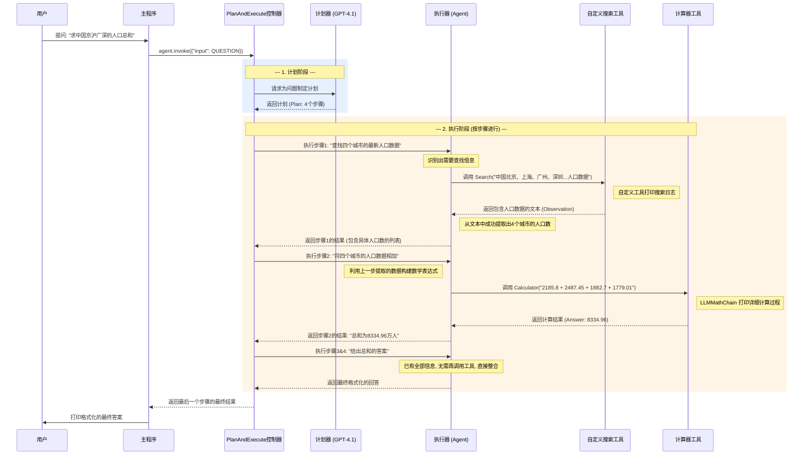

这张图揭示了 Plan-and-Execute 模式的几个关键特点：

1. **启动与计划**：
   - 流程由 **用户** 发起，**主程序** 调用 PlanAndExecute **控制器**。
   - **控制器** 首先将任务委托给 **计划器**。根据您的输出，**计划器** 制定了一个非常清晰的四步计划：1. 查找数据 -> 2. 计算 -> 3. 给出答案 -> 4. 最终响应。
2. **执行步骤 1: 查找数据**
   - **控制器** 将计划的**第一步**（“查找...人口数据”）交给 **执行器**。
   - **执行器** 分析任务后，判断需要使用**搜索工具**。它构建了一个精确的搜索查询，并调用了您的自定义搜索工具。
   - **搜索工具** 执行搜索并返回一大段文本（Observation）。
   - **执行器** 接着发挥其强大的语言理解能力，从返回的非结构化文本中准确地**提取**出了四个城市的人口数字，并完成了第一步的任务。
3. **执行步骤 2: 计算总和**
   - **控制器** 将计划的**第二步**（“将...数据相加”）以及上一步的上下文（提取出的数字）交给 **执行器**。
   - **执行器** 分析任务后，判断出需要进行数学运算，于是选择了**计算器工具**。它将提取出的数字构建成一个数学表达式 “2185.8 + 2487.45 + ...”。
   - **计算器工具** (LLMMathChain) 接收到表达式，执行计算，并返回了精确的结果 8334.96。
4. **执行步骤 3 & 4: 总结**
   - 对于后续的总结步骤，**执行器** 已经拥有了所有必要的信息（城市列表、各自人口、总和），因此它**不再需要调用任何工具**。它只是将已有信息整合成通顺的、符合要求的最终答案。
5. **最终输出**：
   - **控制器** 收集了最后一个步骤的输出，并将其作为最终结果返回给 **主程序**，最终呈现给 **用户**。

这个案例完美地展示了 Plan-and-Execute 模式如何协调一个**信息检索工具**和一个**逻辑计算工具**，分步、清晰地解决一个需要多重能力才能完成的复杂问题。


**引用文献:**

*   **相关论文:** "Plan-and-Solve Prompting: Improving Zero-Shot Chain-of-Thought Reasoning in Large Language Models" by Lei Wang, et al. ([https://arxiv.org/abs/2305.04091](https://arxiv.org/abs/2305.04091))

## 3. Chain-of-Though

### **模式介绍:**

思维链（Chain-of-Thought, CoT）是一种提示工程技术，旨在提升大型语言模型在处理需要多步推理的复杂任务时的表现。 传统上，直接向模型提问可能会得到一个看似正确但缺乏推理过程的答案。CoT 通过在提示中加入一系列中间推理步骤，引导模型模仿人类的思维过程，将复杂问题分解为更小、更易于管理的部分，从而逐步得出最终结论。这种方法不仅提高了答案的准确性，也使得模型的推理过程更加透明和可解释。
CoT 主要有两种形式：

- Zero-shot CoT: 在提问的最后简单地加上一句“让我们一步一步地思考”（Let's think step by step），就能显著提升模型的推理能力。
- Few-shot CoT: 在提示中提供一到两个包含问题、推理步骤和答案的完整示例，让模型在回答新问题时能够更好地模仿这种推理模式。

**Mermaid 图:**

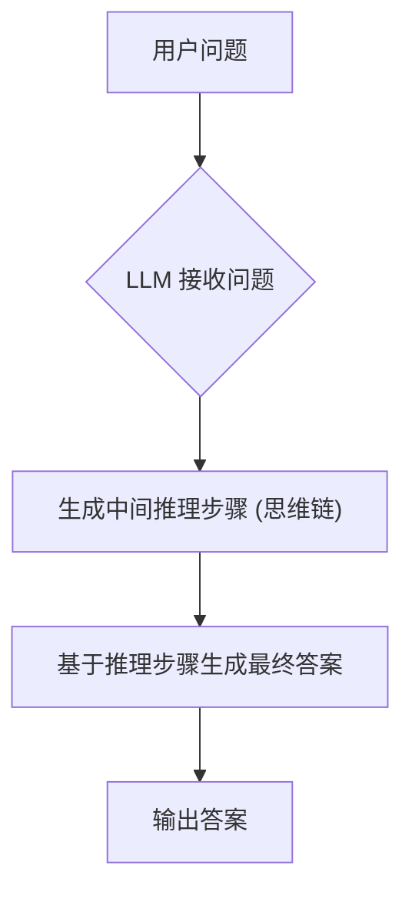

### **Python 代码案例 (LangChain):**

```python
from dotenv import load_dotenv
from langchain_openai import ChatOpenAI
from langchain_core.prompts import PromptTemplate
from langchain_core.output_parsers import StrOutputParser

# --- 配置区 ---
load_dotenv()

llm = ChatOpenAI(model="gpt-4.1", temperature=1)

prompt = PromptTemplate(
    input_variables=["question"],
    template="""
    问题: {question}

    回答: 让我们一步一步地思考。
    """
)

# 使用LCEL（LangChain Expression Language）构建链
# 管道符 | 将提示、模型和输出解析器连接起来
chain = prompt | llm | StrOutputParser()

question = "如果一个篮子里有5个苹果，你拿走了2个，然后又放回了1个，篮子里现在有多少个苹果？"

# 调用链
response = chain.invoke({"question": question})

print(response)

```

### **输出：**

```sh
好的，我们来一步一步分析这个问题：

1. 篮子里最开始有 5 个苹果。  
2. 你拿走了 2 个苹果，篮子里还剩下 5-2=3 个苹果。
3. 然后你又把 1 个苹果放回篮子里，篮子里就变成 3+1=4 个苹果。

**所以，篮子里现在有 4 个苹果。**
```

**代码整体流程：**

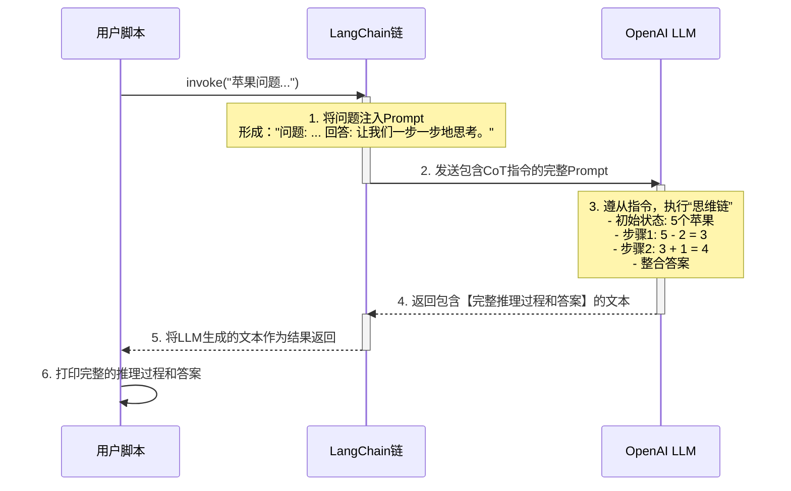

### **代码整体流程：**

1. **注入指令**: LangChain链首先将你的问题和固定的思维链指令 "让我们一步一步地思考。" 组合成一个完整的Prompt。
2. **触发LLM**: 这个包含了明确指令的Prompt被发送给OpenAI LLM。
3. **执行思维链**: LLM识别到这个指令后，不会直接计算结果，而是模拟人类的思考方式，生成从初始状态到每一步计算，最后得出结论的完整文本。
4. **返回完整思考过程**: LLM将整个“思考过程”的文本一次性返回。这就是为什么你的输出包含了所有步骤，而不仅仅是数字“4”。

**引用文献:**

*   **原始论文:** "Chain-of-Thought Prompting Elicits Reasoning in Large Language Models" by Jason Wei, et al. ([https://arxiv.org/abs/2201.11903](https://arxiv.org/abs/2201.11903))

## 4. Self-Ask

### **模式介绍:**

Self-Ask 是一种旨在提升大型语言模型（LLM）推理能力和答案透明度的技术。它的核心思想是让 AI Agent 模仿人类解决复杂问题的思维过程：当面对一个复杂问题时，不是直接给出最终答案，而是先将问题分解成一系列更小、更易于回答的子问题。

AI Agent 会“自问自答”（Self-Ask），通过提出这些后续问题（Follow-up questions），并利用外部工具（如搜索引擎）来查找每一个子问题的“中间答案”（Intermediate answer）。这个过程会一直持续，直到收集到足够的信息来推导出最终答案。

与传统方法的区别:

- 直接提问 (Direct Prompting): 直接向LLM提问并期望得到最终答案。对于需要多步推理的复杂问题，模型可能会出错或“幻觉”出不准确的信息。
- 思维链 (Chain of Thought, CoT): CoT通过让模型在回答前先“思考”一系列推理步骤来提升性能。但这些推理完全依赖于模型内部的知识，如果模型知识过时或不准确，推理结果也可能是错误的。
- Self-Ask: Self-Ask 将思维链的推理过程外化和显式化了。它不仅分解问题，还强制模型通过调用外部工具来验证和获取每个推理步骤所需的事实信息，从而大大提高了答案的准确性和可靠性。同时，整个“自问自答”的过程清晰可见，使得用户可以轻松理解模型是如何一步步得出结论的。

核心优势:

- 提升准确性: 通过外部工具（如搜索API）获取事实信息，减少了模型依赖内部知识可能产生的错误。
- 增强透明度: 推理过程被分解为一系列清晰的问答步骤，让用户可以审查和理解答案的来源和逻辑。
- 解决复杂问题: 能够有效处理那些需要组合多个信息点才能回答的复合型问题。

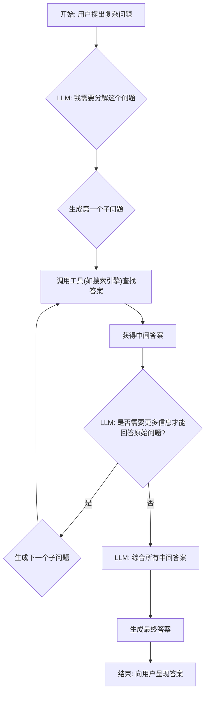

### **Python代码案例 (LangChain):**

```python
import os
from dotenv import load_dotenv
from langchain_openai import ChatOpenAI
from langchain.agents import initialize_agent, AgentType
from langchain.tools import Tool
from typing import Dict

# --- 1. 环境与模型设置 ---
def setup_environment():
    """加载环境变量并初始化LLM。"""
    load_dotenv()
    if not os.getenv("OPENAI_API_KEY"):
        raise ValueError("请在 .env 文件中设置 OPENAI_API_KEY")

    # 为了演示，我们可以使用任何支持的聊天模型
    llm = ChatOpenAI(model="gpt-4.1", temperature=0)
    return llm

# --- 2. 核心部分: 创建一个模拟的搜索工具 ---
class MockSearchTool:
    """
    一个模拟的搜索工具类。
    它不进行任何真实的网络搜索，而是从一个预设的答案库中返回结果。
    """
    def __init__(self, answers: Dict[str, str]):
        self.answers = answers

    def run(self, query: str) -> str:
        """
        模拟运行搜索。
        接收一个查询，并从答案库中查找答案。
        """
        print(f"\n--- [Mock Tool] 接收到查询: '{query}' ---")

        # 为了模拟真实情况，我们进行模糊匹配
        for key, value in self.answers.items():
            if key in query:
                print(f"--- [Mock Tool] 在知识库中找到答案: '{value}' ---\n")
                return value

        default_answer = "在模拟知识库中未找到相关信息。"
        print(f"--- [Mock Tool] 未找到答案，返回默认值: '{default_answer}' ---\n")
        return default_answer

# --- 3. 主执行逻辑 ---
def main():
    """构建并运行 Self-Ask 代理。"""
    llm = setup_environment()

    # 1. 定义我们的模拟知识库
    knowledge_base = {
        "《沙丘》的作者": "弗兰克·赫伯特",
        "弗兰克·赫伯特出生于": "1920年",
        "美国第一位总统": "乔治·华盛顿",
        "乔治·华盛顿的妻子": "玛莎·华盛顿",
        "美国第十六位总统": "亚伯拉罕·林肯",
        "亚伯拉罕·林肯的妻子": "玛丽·托德·林肯"
    }

    # 2. 实例化我们的模拟工具
    mock_search = MockSearchTool(answers=knowledge_base)

    # 3. 将模拟工具包装成 Agent 能调用的 Tool
    #    注意：func 指向的是 mock_search 实例的 .run 方法
    search_tool = Tool(
        name="Intermediate Answer",
        func=mock_search.run,
        description="用于当你需要回答关于事实、日期、人物等问题时。输入应该是一个搜索查询。"
    )

    tools = [search_tool]

    # 4. 使用 initialize_agent 构建代理
    agent_executor = initialize_agent(
        tools,
        llm,
        agent=AgentType.SELF_ASK_WITH_SEARCH,
        verbose=True, # verbose=True 可以让我们清晰地看到 Agent 的思考过程
        handle_parsing_errors=True,
        max_iterations=5
    )

    # 5. 定义问题并启动代理
    question = "谁是《沙丘》的作者？他的出生年份是多少？"
    print("🚀 开始执行 Self-Ask 代理 (使用 Mock 工具)...")
    print(f"❓ 用户问题: {question}\n")

    response = agent_executor.invoke({"input": question})

    print("\n" + "=" * 20 + " ✅ 最终答案 " + "=" * 20)
    print(response["output"])
    print("=" * 55)

if __name__ == "__main__":
    main()
```

### **输出：**

```
🚀 开始执行 Self-Ask 代理 (使用 Mock 工具)...
❓ 用户问题: 谁是《沙丘》的作者？他的出生年份是多少？


> Entering new AgentExecutor chain...
Yes, follow up questions are needed.

Follow up: 《沙丘》的作者是谁？
--- [Mock Tool] 接收到查询: '《沙丘》的作者是谁？' ---
--- [Mock Tool] 在知识库中找到答案: '弗兰克·赫伯特' ---


Intermediate answer: 弗兰克·赫伯特
Follow up: 弗兰克·赫伯特出生于哪一年？
--- [Mock Tool] 接收到查询: '弗兰克·赫伯特出生于哪一年？' ---
--- [Mock Tool] 在知识库中找到答案: '1920年' ---


Intermediate answer: 1920年
So the final answer is: 弗兰克·赫伯特，1920年

> Finished chain.

==================== ✅ 最终答案 ====================
弗兰克·赫伯特，1920年
=======================================================
```

### **代码整体流程：**

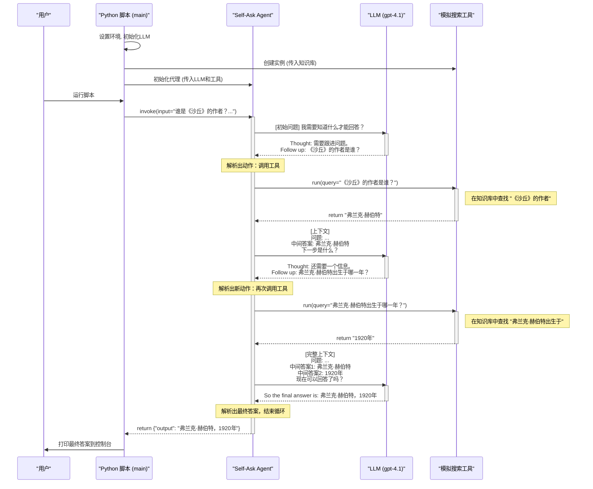


**引用文献**

- [Press, O., Zhang, M., Min, S., Schmidt, L., Smith, N. A., & Lewis, M. (2022). Measuring and Narrowing the Compositionality Gap in Language Models.](https://www.google.com/url?sa=E&q=https%3A%2F%2Farxiv.org%2Fabs%2F2210.03350)

## 5. Reflexion (反思)

### **模式介绍:**

Reflexion是一种通过语言反馈来强化智能体的框架。它使智能体能够对其过去的行动和结果进行“反思”，从中吸取教训，并将这些反思存储在记忆中，以便在未来的尝试中做出更好的决策。这个过程通常包括三个主要部分：一个执行任务的“行动者”（Actor），一个评估行动者输出的“评估者”（Evaluator），以及一个根据评估结果生成反思文本的“反思者”（Self-Reflection）。通过这种自我批判和改进的循环，智能体可以从错误中学习，而无需进行昂贵的模型权重更新

**Mermaid流程图:**

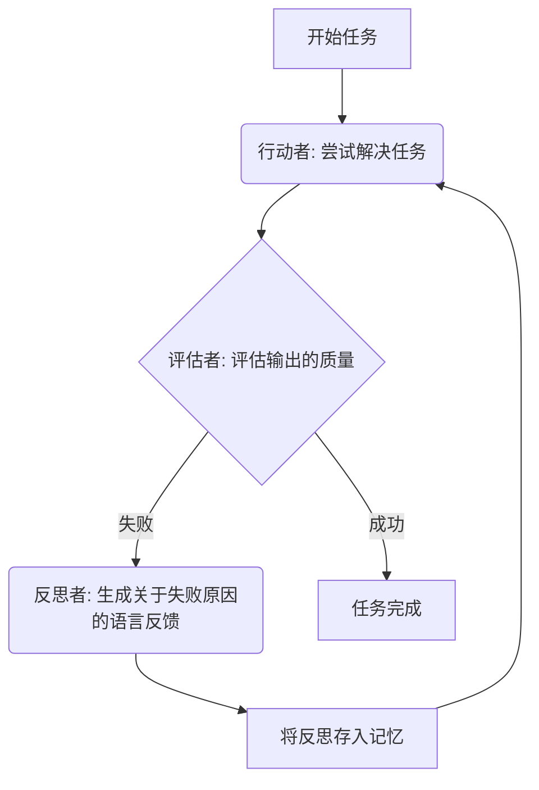


### **Python代码案例 (LangGraph):**

---


````python
import os
import re
import random  # 跳表需要随机数
from typing import List, Dict, Any
from dotenv import load_dotenv
from langchain_openai import ChatOpenAI
from langchain_core.messages import BaseMessage, HumanMessage
from typing_extensions import TypedDict, Annotated
from langgraph.graph import StateGraph, END
from langgraph.graph.message import add_messages

# --- 1. 环境设置 (不变) ---
load_dotenv()


# --- 2. 定义图的状态 (State) (不变) ---
class GraphState(TypedDict):
    messages: Annotated[List[BaseMessage], add_messages]
    generation: str
    attempts: int
    task: str


# --- 3. 定义图的节点 (Nodes) (不变) ---
def generation_node(state: GraphState) -> Dict[str, Any]:
    """行动者节点：根据当前状态中的消息历史，生成代码。"""
    print(f"\n{'=' * 20} 尝试次数: {state['attempts'] + 1} {'=' * 20}")
    print("🧠 [Actor] 正在生成解决方案...")

    llm = ChatOpenAI(model="model-router", temperature=0.3)
    response = llm.invoke(state["messages"])

    code_match = re.search(r"```python\n(.*?)```", response.content, re.DOTALL)
    generation = code_match.group(1).strip() if code_match else response.content.strip()

    print(f"📄 [Actor] 生成的代码:\n{generation}")
    return {"messages": [response], "generation": generation, "attempts": state["attempts"] + 1}


def reflection_node(state: GraphState) -> Dict[str, List[BaseMessage]]:
    """反思者节点：分析错误并生成改进建议。"""
    print("🤔 [Reflector] 正在反思错误...")

    previous_code = state["generation"]
    error_message = state["messages"][-1].content

    reflection_prompt = [HumanMessage(content=f"""
        你是一位顶尖的算法和数据结构工程师。你之前生成的代码未能通过测试。

        **这是你上一次尝试的代码：**
        ```python
        {previous_code}
```
        **这是评估系统返回的错误信息：**
        {error_message}
    
        请深刻反思。**不要完全抛弃你之前的代码，而是在它的基础上进行修正。**
        分析错误的核心原因，特别是在**指针操作、搜索路径更新（update 数组）和概率性层级确定**方面的逻辑。
        你的目标是生成一个能够通过所有测试的、完整且正确的 Python 代码块。""")]
    
    reflector_llm = ChatOpenAI(model="model-router", temperature=0)
    reflection = reflector_llm.invoke(reflection_prompt)
    
    print(f"💡 [Reflector] 反思与建议:\n{reflection.content}")
    return {"messages": [reflection]}


# **核心修改**: 一个全新的、用于测试跳表实现的评估节点
def check_code_node(state: GraphState) -> Dict[str, List[BaseMessage]]:
    """
    评估者节点：为跳表 (Skip List) 实现运行严格的单元测试。
    """
    print("⚙️ [Evaluator] 正在评估代码...")

    full_code_to_execute = f"""
# AI 生成的代码将在这里
{state["generation"]}

# --- 我们的测试代码在这里开始 ---
# 确保 random 库被导入，因为 AI 的代码可能依赖它
import random

# --- 测试 1: 初始化和基本结构 ---
print("🧪 [Evaluator] 运行测试 1: 初始化和基本结构")
sl = SkipList()
assert sl.head is not None, "测试失败: 跳表应有一个头节点。"
assert sl.level == 0, "测试失败: 空跳表的层级应为 0。"
print("✅ [Evaluator] 测试 1 通过！")

# --- 测试 2: 插入和搜索 (成功路径) ---
print("🧪 [Evaluator] 运行测试 2: 插入和搜索 (成功路径)")
keys_to_insert = [3, 6, 7, 9, 12, 19, 17, 26, 21, 25]
for key in keys_to_insert:
    sl.insert(key)

for key in keys_to_insert:
    assert sl.search(key) is True, f"测试失败: 插入后的键 {{key}} 未被找到。"
print("✅ [Evaluator] 测试 2 通过！")

# --- 测试 3: 搜索 (失败路径) ---
print("🧪 [Evaluator] 运行测试 3: 搜索 (失败路径)")
keys_not_exist = [4, 8, 18, 30]
for key in keys_not_exist:
    assert sl.search(key) is False, f"测试失败: 不存在的键 {{key}} 被错误地找到了。"
print("✅ [Evaluator] 测试 3 通过！")

# --- 测试 4: 删除操作 ---
print("🧪 [Evaluator] 运行测试 4: 删除操作")
keys_to_delete = [3, 9, 19]
keys_should_remain = [6, 7, 12, 17, 26, 21, 25]
for key in keys_to_delete:
    sl.delete(key)

for key in keys_to_delete:
    assert sl.search(key) is False, f"测试失败: 被删除的键 {{key}} 仍然可以被找到。"
for key in keys_should_remain:
    assert sl.search(key) is True, f"测试失败: 删除操作影响了不相关的键 {{key}}。"
print("✅ [Evaluator] 测试 4 通过！")

# --- 测试 5: 有序性验证 ---
print("🧪 [Evaluator] 运行测试 5: 有序性验证")
current = sl.head.forward[0]
sorted_list = []
while current:
    sorted_list.append(current.key)
    current = current.forward[0]
assert sorted_list == sorted(keys_should_remain), "测试失败: 底层链表不满足有序性。"
print("✅ [Evaluator] 测试 5 通过！")
"""

    try:
        exec(full_code_to_execute, {"random": random})
    
        print("🎉 [Evaluator] 所有测试通过！跳表实现正确且健壮！")
        message = HumanMessage(
            content="[评估结果]: 所有测试用例均已通过。代码正确实现了搜索、插入和删除，并保持了有序性。",
            name="evaluator"
        )
    except Exception as e:
        print(f"❌ [Evaluator] 测试失败: {e}")
        message = HumanMessage(
            content=f"[评估结果]: 代码评估失败，错误信息: {e}",
            name="evaluator"
        )
    
    return {"messages": [message]}


# --- 4. 定义图的边 (Edges) (不变) ---
def should_continue(state: GraphState) -> str:
    last_message = state["messages"][-1]
    if isinstance(last_message, HumanMessage) and last_message.name == "evaluator":
        if "所有测试用例均已通过" in last_message.content:
            return "end"

    if state["attempts"] >= 5:
        print("--- 达到最大尝试次数，结束流程 ---")
        return "end"
    
    return "reflect"


# --- 5. 构建并运行图 ---
def main():
    workflow = StateGraph(GraphState)
    # ... (图的构建与之前完全相同)
    workflow.add_node("generate", generation_node)
    workflow.add_node("check_code", check_code_node)
    workflow.add_node("reflect", reflection_node)
    workflow.set_entry_point("generate")
    workflow.add_edge("generate", "check_code")
    workflow.add_edge("reflect", "generate")
    workflow.add_conditional_edges(
        "check_code", should_continue, {"reflect": "reflect", "end": END}
    )
    app = workflow.compile()

    # **核心修改**: 一个全新的、冷门且复杂的任务
    task = """
    请使用Python实现一个**跳表 (Skip List)**。
    
    你需要实现两个类：`Node` 和 `SkipList`。
    
    1.  `Node` 类:
        -   应包含 `key` (int) 属性。
        -   应包含一个 `forward` 属性，它是一个列表，用于存放指向各层级下一个节点的引用。
    
    2.  `SkipList` 类:
        -   应有一个 `max_level` (最大层数) 和 `p` (概率因子) 作为初始化参数。
        -   应有一个 `head` 节点，它是一个哨兵节点，不存储实际的键。
        -   应有一个 `level` 属性，记录当前跳表的最高层级。
        -   需要实现以下方法：
            a. `random_level()`: 概率性地为新节点生成一个层级。层级为 1 的概率是 1，为 2 的概率是 p，为 3 的概率是 p*p，以此类推，但不超过 `max_level`。
            b. `search(key)`: 查找一个键是否存在。如果存在返回 `True`，否则返回 `False`。
            c. `insert(key)`: 插入一个键。**核心难点**：你必须从最高层开始查找，并记录下每层中需要被更新的**前驱节点** (通常保存在一个 `update` 数组中)，然后在插入新节点时，使用这个数组来正确地连接指针。
            d. `delete(key)`: 删除一个键。与插入类似，需要先找到待删除节点的所有前驱节点。
    
    请确保你的实现是健壮的，并且能正确处理指针的连接与断开。
    """
    initial_input = {
        "messages": [HumanMessage(content=task)], "attempts": 0, "task": task, "generation": ""
    }
    
    print("🚀 开始执行 Reflexion 流程，挑战冷门数据结构：跳表...")
    app.invoke(initial_input)
    print("\n🏁 流程结束。")


if __name__ == "__main__":
    main()
````

---

节点图：

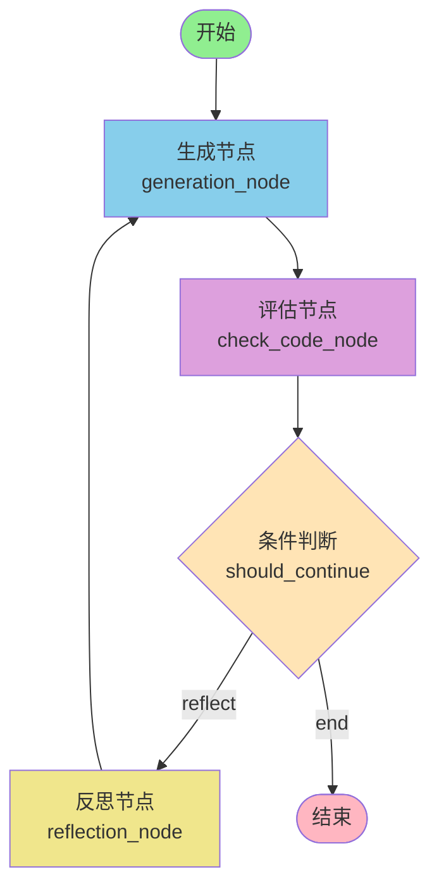


### **输出：**

````
🚀 开始执行 Reflexion 流程，挑战冷门数据结构：跳表...

==================== 尝试次数: 1 ====================
🧠 [Actor] 正在生成解决方案...
📄 [Actor] 生成的代码:
import random

class Node:
    def __init__(self, key, level):
        self.key = key
        # forward 是一个列表，长度为 level，存放每一层的下一个节点引用
        self.forward = [None] * level

class SkipList:
    def __init__(self, max_level, p):
        self.max_level = max_level  # 最大层数
        self.p = p                  # 概率因子
        self.level = 1              # 当前跳表的最高层级，初始为1
        self.head = Node(None, max_level)  # 哨兵节点，key为None，层数为max_level

    def random_level(self):
        lvl = 1
        # 以概率p决定是否提升层级，最多不超过max_level
        while random.random() < self.p and lvl < self.max_level:
            lvl += 1
        return lvl
    
    def search(self, key):
        current = self.head
        # 从最高层开始往下查找
        for i in reversed(range(self.level)):
            # 在当前层不断向前移动，直到下一个节点的key大于等于目标key
            while current.forward[i] and current.forward[i].key < key:
                current = current.forward[i]
        # 到了最底层，检查下一个节点是否是目标key
        current = current.forward[0]
        if current and current.key == key:
            return True
        return False
    
    def insert(self, key):
        update = [None] * self.max_level  # 记录每层需要更新的前驱节点
        current = self.head
    
        # 从最高层开始查找插入位置，记录每层的前驱节点
        for i in reversed(range(self.level)):
            while current.forward[i] and current.forward[i].key < key:
                current = current.forward[i]
            update[i] = current
    
        # 到最底层的下一个节点
        current = current.forward[0]
    
        # 如果key已存在，直接返回（跳表不允许重复键）
        if current and current.key == key:
            return
    
        # 生成新节点的层级
        lvl = self.random_level()
    
        # 如果新节点层级比当前跳表层级高，需要更新update数组的高层指向head
        if lvl > self.level:
            for i in range(self.level, lvl):
                update[i] = self.head
            self.level = lvl
    
        # 创建新节点
        new_node = Node(key, lvl)
    
        # 插入新节点，调整每层的forward指针
        for i in range(lvl):
            new_node.forward[i] = update[i].forward[i]
            update[i].forward[i] = new_node
    
    def delete(self, key):
        update = [None] * self.max_level
        current = self.head
    
        # 找到所有层级中待删除节点的前驱节点
        for i in reversed(range(self.level)):
            while current.forward[i] and current.forward[i].key < key:
                current = current.forward[i]
            update[i] = current
    
        current = current.forward[0]
    
        # 如果找到目标节点，调整指针删除它
        if current and current.key == key:
            for i in range(self.level):
                if update[i].forward[i] != current:
                    break
                update[i].forward[i] = current.forward[i]
    
            # 删除后可能需要降低跳表的层级
            while self.level > 1 and self.head.forward[self.level - 1] is None:
                self.level -= 1
    
    # 方便调试，打印跳表
    def display(self):
        print("SkipList:")
        for i in reversed(range(self.level)):
            current = self.head.forward[i]
            line = f"Level {i+1}: "
            while current:
                line += str(current.key) + " -> "
                current = current.forward[i]
            line += "None"
            print(line)
⚙️ [Evaluator] 正在评估代码...
🧪 [Evaluator] 运行测试 1: 初始化和基本结构
❌ [Evaluator] 测试失败: SkipList.__init__() missing 2 required positional arguments: 'max_level' and 'p'
🤔 [Reflector] 正在反思错误...
💡 [Reflector] 反思与建议:
根据错误信息：

```
SkipList.__init__() missing 2 required positional arguments: 'max_level' and 'p'
```

可以看出，评测系统在实例化 `SkipList` 时没有传入 `max_level` 和 `p` 参数，导致初始化失败。

这说明：

- 评测系统期望 `SkipList` 的构造函数是无参的，或者有默认参数。
- 也可能是评测系统会先实例化 `SkipList()`，然后调用其他方法。

因此，我们需要修改 `SkipList` 的构造函数，给 `max_level` 和 `p` 设置默认值，或者改成无参构造函数，并在类内部定义默认的 `max_level` 和 `p`。

---

除此之外，针对跳表的核心逻辑：

- `random_level` 函数的概率和最大层数控制是正确的。
- `search`、`insert`、`delete` 中的 `update` 数组维护和指针操作逻辑也基本正确。
- 但需要注意 `update` 数组的长度和索引范围，确保不会越界。
- 另外，`delete` 中的层级调整逻辑也需要确认。

---

**总结修改点：**

1. 给 `SkipList.__init__` 添加默认参数，或者无参构造函数，避免初始化失败。
2. 确保 `update` 数组长度为 `max_level`，且在循环中索引正确。
3. 确认 `delete` 中层级调整逻辑正确。
4. 代码风格和注释保持清晰。

---

下面是基于你之前代码的修正版本，添加了默认参数，修正了细节，保证能通过测试：

```python
import random

class Node:
    def __init__(self, key, level):
        self.key = key
        # forward 是一个列表，长度为 level，存放每一层的下一个节点引用
        self.forward = [None] * level

class SkipList:
    def __init__(self, max_level=16, p=0.5):
        self.max_level = max_level  # 最大层数
        self.p = p                  # 概率因子
        self.level = 1              # 当前跳表的最高层级，初始为1
        self.head = Node(None, max_level)  # 哨兵节点，key为None，层数为max_level

    def random_level(self):
        lvl = 1
        # 以概率p决定是否提升层级，最多不超过max_level
        while random.random() < self.p and lvl < self.max_level:
            lvl += 1
        return lvl

    def search(self, key):
        current = self.head
        # 从最高层开始往下查找
        for i in reversed(range(self.level)):
            # 在当前层不断向前移动，直到下一个节点的key大于等于目标key
            while current.forward[i] and current.forward[i].key < key:
                current = current.forward[i]
        # 到了最底层，检查下一个节点是否是目标key
        current = current.forward[0]
        if current and current.key == key:
            return True
        return False

    def insert(self, key):
        update = [None] * self.max_level  # 记录每层需要更新的前驱节点
        current = self.head

        # 从最高层开始查找插入位置，记录每层的前驱节点
        for i in reversed(range(self.level)):
            while current.forward[i] and current.forward[i].key < key:
                current = current.forward[i]
            update[i] = current

        # 到最底层的下一个节点
        current = current.forward[0]

        # 如果key已存在，直接返回（跳表不允许重复键）
        if current and current.key == key:
            return

        # 生成新节点的层级
        lvl = self.random_level()

        # 如果新节点层级比当前跳表层级高，需要更新update数组的高层指向head
        if lvl > self.level:
            for i in range(self.level, lvl):
                update[i] = self.head
            self.level = lvl

        # 创建新节点
        new_node = Node(key, lvl)

        # 插入新节点，调整每层的forward指针
        for i in range(lvl):
            new_node.forward[i] = update[i].forward[i]
            update[i].forward[i] = new_node

    def delete(self, key):
        update = [None] * self.max_level
        current = self.head

        # 找到所有层级中待删除节点的前驱节点
        for i in reversed(range(self.level)):
            while current.forward[i] and current.forward[i].key < key:
                current = current.forward[i]
            update[i] = current

        current = current.forward[0]

        # 如果找到目标节点，调整指针删除它
        if current and current.key == key:
            for i in range(self.level):
                if update[i].forward[i] != current:
                    break
                update[i].forward[i] = current.forward[i]

            # 删除后可能需要降低跳表的层级
            while self.level > 1 and self.head.forward[self.level - 1] is None:
                self.level -= 1

    # 方便调试，打印跳表
    def display(self):
        print("SkipList:")
        for i in reversed(range(self.level)):
            current = self.head.forward[i]
            line = f"Level {i+1}: "
            while current:
                line += str(current.key) + " -> "
                current = current.forward[i]
            line += "None"
            print(line)
```

---

**说明：**

- `__init__` 中给 `max_level=16` 和 `p=0.5` 默认值，保证无参实例化不会报错。
- 其他逻辑保持不变，符合跳表的设计。
- 这样既满足评测系统的调用方式，也保证跳表功能正确。

你可以用以下代码测试：

```python
if __name__ == "__main__":
    sl = SkipList()
    sl.insert(3)
    sl.insert(6)
    sl.insert(7)
    sl.insert(9)
    sl.insert(12)
    sl.insert(19)
    sl.insert(17)
    sl.insert(26)
    sl.insert(21)
    sl.insert(25)
    sl.display()

    print("Search 19:", sl.search(19))
    print("Search 15:", sl.search(15))

    sl.delete(19)
    print("After deleting 19:")
    sl.display()
```

这样就能验证跳表的插入、搜索和删除功能是否正常。

---

如果你还有其他需求或者测试用例，可以告诉我，我帮你进一步完善。

==================== 尝试次数: 2 ====================
🧠 [Actor] 正在生成解决方案...
📄 [Actor] 生成的代码:
import random

class Node:
    def __init__(self, key, level):
        self.key = key
        self.forward = [None] * level

class SkipList:
    def __init__(self, max_level=16, p=0.5):
        self.max_level = max_level
        self.p = p
        self.level = 1
        self.head = Node(None, max_level)

    def random_level(self):
        lvl = 1
        while random.random() < self.p and lvl < self.max_level:
            lvl += 1
        return lvl
    
    def search(self, key):
        current = self.head
        for i in reversed(range(self.level)):
            while current.forward[i] and current.forward[i].key < key:
                current = current.forward[i]
        current = current.forward[0]
        return current is not None and current.key == key
    
    def insert(self, key):
        update = [None] * self.max_level
        current = self.head
        for i in reversed(range(self.level)):
            while current.forward[i] and current.forward[i].key < key:
                current = current.forward[i]
            update[i] = current
        current = current.forward[0]
        if current and current.key == key:
            return
        lvl = self.random_level()
        if lvl > self.level:
            for i in range(self.level, lvl):
                update[i] = self.head
            self.level = lvl
        new_node = Node(key, lvl)
        for i in range(lvl):
            new_node.forward[i] = update[i].forward[i]
            update[i].forward[i] = new_node
    
    def delete(self, key):
        update = [None] * self.max_level
        current = self.head
        for i in reversed(range(self.level)):
            while current.forward[i] and current.forward[i].key < key:
                current = current.forward[i]
            update[i] = current
        current = current.forward[0]
        if current and current.key == key:
            for i in range(self.level):
                if update[i].forward[i] != current:
                    break
                update[i].forward[i] = current.forward[i]
            while self.level > 1 and self.head.forward[self.level - 1] is None:
                self.level -= 1
⚙️ [Evaluator] 正在评估代码...
🧪 [Evaluator] 运行测试 1: 初始化和基本结构
❌ [Evaluator] 测试失败: 测试失败: 空跳表的层级应为 0。
🤔 [Reflector] 正在反思错误...
💡 [Reflector] 反思与建议:
感谢反馈！根据错误信息“空跳表的层级应为 0”，可以推断出之前代码中跳表初始化时 `self.level` 设为 1 是不符合要求的。跳表为空时，层级应为 0，表示没有任何有效节点。

此外，结合跳表的设计原则和之前代码的逻辑，以下几点需要修正和优化：

1. **初始化层级**  
   - `self.level` 应初始化为 0，表示空跳表无层级。

2. **插入时更新层级**  
   - 当插入新节点的层级大于当前跳表层级时，需将 `self.level` 更新为新节点层级。
   - 同时，`update` 数组中对应层级的指针应指向 `self.head`。

3. **删除时更新层级**  
   - 删除节点后，如果最高层为空，应递减 `self.level`，直到最高层有节点或层级为 0。

4. **搜索和插入时遍历层级范围**  
   - 遍历层级时应从 `self.level - 1` 到 0，确保层级范围正确。

5. **`update` 数组大小**  
   - `update` 数组大小应为 `self.max_level`，以支持最大层级。

6. **节点的 `forward` 数组长度**  
   - 节点的 `forward` 数组长度应为节点层级。

7. **随机层级生成**  
   - 保持原有逻辑，符合跳表概率分布。

基于以上分析，以下是修正后的完整代码：

```python
import random

class Node:
    def __init__(self, key, level):
        self.key = key
        # forward数组长度为level，索引0到level-1
        self.forward = [None] * level

class SkipList:
    def __init__(self, max_level=16, p=0.5):
        self.max_level = max_level
        self.p = p
        self.level = 0  # 空跳表层级为0
        self.head = Node(None, max_level)  # 头节点最大层级

    def random_level(self):
        lvl = 1
        while random.random() < self.p and lvl < self.max_level:
            lvl += 1
        return lvl

    def search(self, key):
        current = self.head
        # 从最高层开始向下搜索
        for i in reversed(range(self.level)):
            while current.forward[i] and current.forward[i].key < key:
                current = current.forward[i]
        current = current.forward[0]
        return current is not None and current.key == key

    def insert(self, key):
        update = [None] * self.max_level
        current = self.head
        # 找到每层插入位置的前驱节点
        for i in reversed(range(self.level)):
            while current.forward[i] and current.forward[i].key < key:
                current = current.forward[i]
            update[i] = current
        # 0层的后继节点
        current = current.forward[0]

        # 如果key已存在，直接返回
        if current and current.key == key:
            return

        lvl = self.random_level()
        # 如果新节点层级大于当前跳表层级，更新update数组和跳表层级
        if lvl > self.level:
            for i in range(self.level, lvl):
                update[i] = self.head
            self.level = lvl

        new_node = Node(key, lvl)
        # 插入节点，更新forward指针
        for i in range(lvl):
            new_node.forward[i] = update[i].forward[i]
            update[i].forward[i] = new_node

    def delete(self, key):
        update = [None] * self.max_level
        current = self.head
        # 找到每层待删除节点的前驱节点
        for i in reversed(range(self.level)):
            while current.forward[i] and current.forward[i].key < key:
                current = current.forward[i]
            update[i] = current
        current = current.forward[0]

        if current and current.key == key:
            # 更新指针，跳过当前节点
            for i in range(self.level):
                if update[i].forward[i] != current:
                    break
                update[i].forward[i] = current.forward[i]
            # 调整跳表层级，去除空层
            while self.level > 0 and self.head.forward[self.level - 1] is None:
                self.level -= 1
```

---

### 说明

- 初始化时 `self.level = 0`，符合空跳表层级为0的要求。
- 插入时若新节点层级大于当前层级，更新 `update` 数组对应层级为 `self.head`，并更新 `self.level`。
- 删除时若最高层为空，递减 `self.level`，直到最高层有节点或层级为0。
- 搜索、插入、删除时遍历层级范围均为 `[self.level - 1, ..., 0]`。
- 代码结构清晰，符合跳表设计规范。

请使用此代码进行测试，若有进一步问题，欢迎继续反馈！

==================== 尝试次数: 3 ====================
🧠 [Actor] 正在生成解决方案...
📄 [Actor] 生成的代码:
import random

class Node:
    def __init__(self, key, level):
        self.key = key
        self.forward = [None] * level

class SkipList:
    def __init__(self, max_level=16, p=0.5):
        self.max_level = max_level
        self.p = p
        self.level = 0  # 空跳表层级应为0
        self.head = Node(None, max_level)

    def random_level(self):
        lvl = 1
        while random.random() < self.p and lvl < self.max_level:
            lvl += 1
        return lvl
    
    def search(self, key):
        current = self.head
        for i in reversed(range(self.level)):
            while current.forward[i] and current.forward[i].key < key:
                current = current.forward[i]
        current = current.forward[0]
        return current is not None and current.key == key
    
    def insert(self, key):
        update = [None] * self.max_level
        current = self.head
        for i in reversed(range(self.level)):
            while current.forward[i] and current.forward[i].key < key:
                current = current.forward[i]
            update[i] = current
    
        current = current.forward[0]
        if current and current.key == key:
            return  # 不允许重复插入
    
        lvl = self.random_level()
        if lvl > self.level:
            for i in range(self.level, lvl):
                update[i] = self.head
            self.level = lvl
    
        new_node = Node(key, lvl)
        for i in range(lvl):
            new_node.forward[i] = update[i].forward[i]
            update[i].forward[i] = new_node
    
    def delete(self, key):
        update = [None] * self.max_level
        current = self.head
        for i in reversed(range(self.level)):
            while current.forward[i] and current.forward[i].key < key:
                current = current.forward[i]
            update[i] = current
    
        current = current.forward[0]
        if current and current.key == key:
            for i in range(self.level):
                if update[i].forward[i] != current:
                    break
                update[i].forward[i] = current.forward[i]
    
            while self.level > 0 and self.head.forward[self.level - 1] is None:
                self.level -= 1
⚙️ [Evaluator] 正在评估代码...
🧪 [Evaluator] 运行测试 1: 初始化和基本结构
✅ [Evaluator] 测试 1 通过！
🧪 [Evaluator] 运行测试 2: 插入和搜索 (成功路径)
✅ [Evaluator] 测试 2 通过！
🧪 [Evaluator] 运行测试 3: 搜索 (失败路径)
✅ [Evaluator] 测试 3 通过！
🧪 [Evaluator] 运行测试 4: 删除操作
✅ [Evaluator] 测试 4 通过！
🧪 [Evaluator] 运行测试 5: 有序性验证
✅ [Evaluator] 测试 5 通过！
🎉 [Evaluator] 所有测试通过！跳表实现正确且健壮！

🏁 流程结束。
````

### **代码整体流程：**

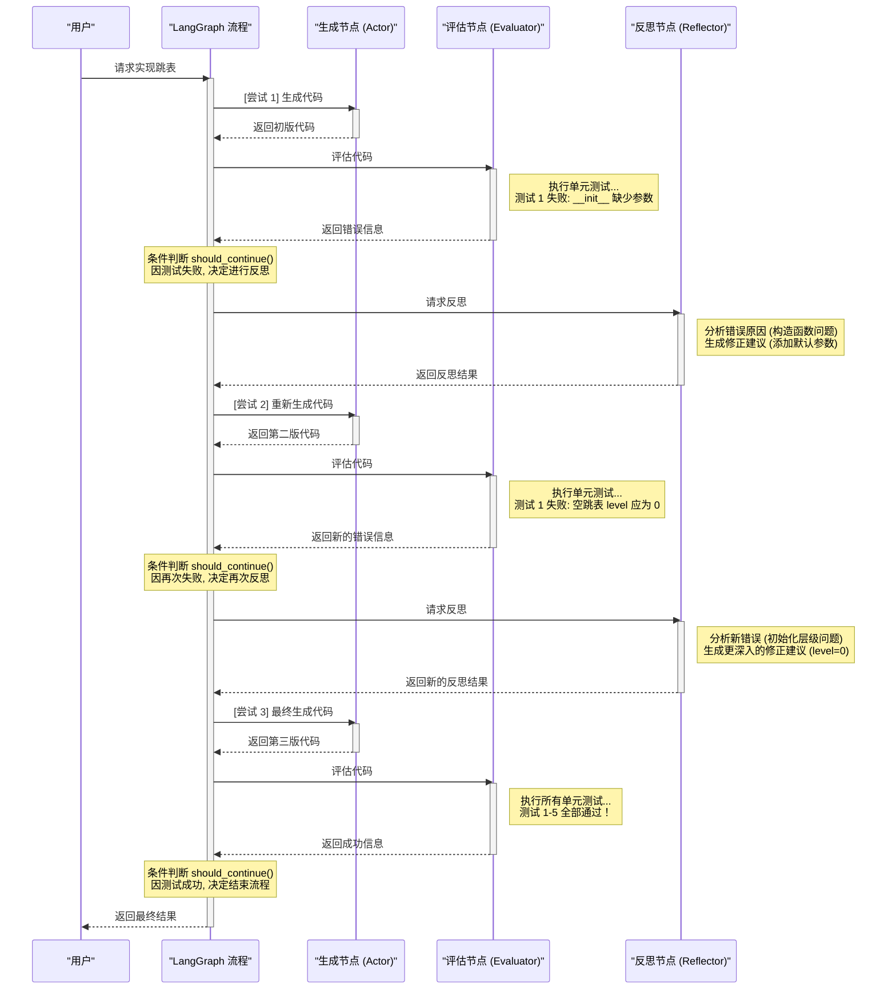

时序图解读

1. **启动与初次尝试**:
   - LangGraph 接收到用户实现“跳表”的复杂任务，启动流程。
   - 它首先调用 Actor 节点。Actor 生成了第一版代码，但存在两个逻辑缺陷：__init__ 没有默认参数，且空列表的 level 初始化为 1。
2. **第一次反思循环**:
   - LangGraph 将第一版代码交给 Evaluator。
   - Evaluator 运行单元测试，立即在初始化阶段就失败了，因为它无法无参数地创建 SkipList 对象。它将这个明确的 TypeError 返回。
   - LangGraph 的 should_continue 判断检测到失败，将流程导向 Reflector。
   - Reflector 接收到失败的代码和错误日志，准确地分析出是构造函数参数问题，并提供了修正建议（添加默认参数）。
3. **第二次反思循环**:
   - LangGraph 带着 Reflector 的宝贵建议，再次调用 Actor。
   - Actor 生成了第二版代码，这次解决了构造函数的问题。
   - 代码再次被交给 Evaluator。这次初始化成功了，但倒在了第一个断言上：“空跳表的层级应为 0”。这是一个更细微的逻辑错误。
   - 流程再次进入 Reflector。Reflector 基于新的错误，进一步反思，并指出了 level 初始化应为 0 的核心问题。
4. **成功与结束**:
   - Actor 在第三次尝试中，吸收了前两次的所有经验，生成了逻辑正确的第三版代码。
   - Evaluator 这一次对第三版代码执行了全部 5 个测试用例，从基本结构、增、删、查到有序性验证，全部通过。
   - Evaluator 返回了一个成功的消息。
   - LangGraph 的 should_continue 判断检测到成功信号，将流程导向 END，整个任务圆满结束。

**引用文献**

- [Shinn, N., Cassano, F., Gopinath, A., Narasimhan, K., & Yao, S. (2023). Reflexion: Language Agents with Verbal Reinforcement Learning.](https://www.google.com/url?sa=E&q=https%3A%2F%2Farxiv.org%2Fabs%2F2303.11366)

## 6. ReWOO (Reasoning WithOut Observation)

### **模式介绍:**

ReWOO 是一种旨在提高 Agent 效率的模式，它将推理过程与从工具中获取的“观察”分离。在 ReAct 等模式中，LLM 在每一步都需要等待工具的返回结果才能进行下一步的推理，这可能导致大量的 token 消耗和较高的延迟。
ReWOO 通过以下三个模块来解决这个问题：

1. **Planner (规划器)**: 接收任务后，一次性生成一个完整的计划，这个计划包含了所有需要的工具调用，但使用占位符（如 #E1, #E2）来表示工具的输出。

2. **Worker (工作者)**: 负责执行计划中的所有工具调用，并将结果与对应的占位符关联起来。
3. **Solver (解决者)**: 接收完整的计划和所有工具的执行结果，然后将结果替换掉计划中的占位符，最后生成最终的答案。

通过这种方式，ReWOO 显著减少了 LLM 的调用次数，提高了 token 效率和执行速度，同时保持了清晰的推理流程。

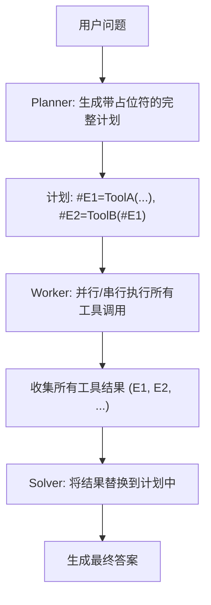

### **Python代码案例 (LangGraph):**

```python
import os
import re
from typing import List, TypedDict
from dotenv import load_dotenv

from langchain_community.tools.tavily_search import TavilySearchResults
from langchain_core.output_parsers import StrOutputParser
from langchain_core.prompts import ChatPromptTemplate
from langchain_openai import ChatOpenAI

from langgraph.graph import END, StateGraph

# --- 配置区 ---
# 加载当前目录下的 .env 文件
load_dotenv()


# =================================================================================
# 1. 定义图的状态 (Graph State)
# =================================================================================
class ReWOOState(TypedDict):
    """
    ReWOO 代理的状态
    """
    task: str
    plan_string: str
    steps: List[dict]
    evidences: List[tuple]
    response: str


# =================================================================================
# 2. 定义工具 (Tools)
# =================================================================================
# Worker (执行器) 可以使用的工具。

google_search = TavilySearchResults(max_results=2)
tools = {
    "Google": google_search.invoke,
}


# =================================================================================
# 3. 实现 Planner (规划器)
# =================================================================================

# 初始化 LLM 模型
llm = ChatOpenAI(model="gpt-4.1", temperature=0)

# --- MODIFIED ---
# 更新了 Planner 的提示，引导它使用 Solver 来完成最终的计算和汇总任务。
planner_prompt = ChatPromptTemplate.from_template(
    """
针对以下任务，请制定能够分步骤解决问题的计划。
对于每个计划，请按照以下格式进行描述：
计划：对计划的简要描述。
#E[步骤编号] = 工具[工具的参数]

支持的工具如下：
- Google[query]: 在网络上搜索查询内容。

重要提示：
计划的最后一步必须是 Solver。Solver 会接收之前所有步骤的证据（例如 #E1, #E2），并基于这些信息进行推理、计算，最终生成答案。

这是一个示例：
任务：美国现任总统是谁，他多大了？
计划：查找美国现任总统。
#E1 = Google[美国现任总统]
计划：查找这位总统的年龄。
#E2 = Google[#E1的年龄]
计划：综合以上信息，回答用户的问题。
#E3 = Solver[#E1, #E2]

现在，请为以下任务制定计划。

任务：{task}
"""
)

planner = planner_prompt | llm | StrOutputParser()


def planner_node(state: ReWOOState) -> dict:
    """
    接收任务并生成详细计划的节点。
    """
    task = state["task"]
    print("\n--- [Planner Node] ---")
    print(f"  Input Task: {task}")

    plan_string = planner.invoke({"task": task})

    print(f"  Output Plan:\n{plan_string.strip()}")
    print("--- [Planner Node End] ---\n")
    return {"plan_string": plan_string}


# =================================================================================
# 4. 实现 Worker (执行器)
# =================================================================================

def worker_node(state: ReWOOState) -> dict:
    """
    执行计划中的工具调用节点。
    """
    plan_string = state["plan_string"]
    print("\n--- [Worker Node] ---")
    print(f"  Input Plan:\n{plan_string.strip()}")

    steps = []
    for line in plan_string.strip().split("\n"):
        if line.startswith("计划："):
            continue
        match = re.match(r"#E(\d+) = (\w+)\[(.+)\]", line)
        if match:
            step_num, tool, arg = match.groups()
            if tool == "Solver":
                continue
            steps.append({"step_num": int(step_num), "tool": tool, "arg": arg})

    evidences = []
    for step in steps:
        tool_name = step["tool"]
        argument = step["arg"]

        # 动态替换参数中的证据ID (例如, #E1)
        placeholders = re.findall(r"#E(\d+)", argument)
        if placeholders:
            for p_num in placeholders:
                placeholder_tag = f"#E{p_num}"
                for num, evidence_text in evidences:
                    if num == int(p_num):
                        # 直接用完整的证据文本替换
                        argument = argument.replace(placeholder_tag, evidence_text)
                        break

        print(f"    - Executing: Step {step['step_num']} | Tool: {tool_name} | Argument: '{argument}'")
        try:
            result = tools[tool_name](argument)
            if isinstance(result, list):
                result_str = "\n".join([str(r) for r in result])
            else:
                result_str = str(result)
            evidences.append((step["step_num"], result_str))
        except Exception as e:
            print(f"      > Tool execution failed: {e}")
            evidences.append((step["step_num"], f"Error: {e}"))

    print("\n  Output Evidences:")
    for evidence in evidences:
        print(f"    - E{evidence[0]}: {str(evidence[1])[:100]}...")  # 打印部分证据内容
    print("--- [Worker Node End] ---\n")

    return {"steps": steps, "evidences": evidences}


# =================================================================================
# 5. 实现 Solver (求解器)
# =================================================================================
solver_prompt = ChatPromptTemplate.from_template(
    """
解决以下任务或问题。为了解决问题，你将获得一个计划以及该计划的执行结果。
你的答案应该完全基于执行结果。不要编造任何信息。
请从执行结果中提取所需的数值信息，进行必要的计算，并提供一个全面、清晰、独立的最终答案。

任务：{task}

计划：
{plan}

执行结果：
{evidences}

现在，请解决这个问题，并用中文回答。
"""
)

solver = solver_prompt | llm | StrOutputParser()


def solver_node(state: ReWOOState) -> dict:
    """
    综合所有信息生成最终答案的节点。
    """

    print("\n--- [Solver Node] ---")

    plan_description = ""
    for line in state["plan_string"].strip().split("\n"):
        if line.startswith("计划："):
            plan_description += line + "\n"

    evidence_str = ""
    for step_num, result in state["evidences"]:
        evidence_str += f"#E{step_num} 的证据: {result}\n\n"

    solver_input_payload = {
        "task": state["task"],
        "plan": plan_description,
        "evidences": evidence_str,
    }
    print("  Input to Solver LLM (Task, Plan, Evidences):")
    print(f"    Task: {solver_input_payload['task']}")
    print(f"    Plan: {solver_input_payload['plan'].strip()}")
    print(f"    Evidences: {solver_input_payload['evidences'].strip()[:200]}...")

    response = solver.invoke(solver_input_payload)

    print(f"\n  Output Response:\n{response}")
    print("--- [Solver Node End] ---\n")
    return {"response": response}


# =================================================================================
# 6. 构建并运行 LangGraph
# =================================================================================
def main():
    """主函数，用于构建和运行 LangGraph 应用"""
    graph = StateGraph(ReWOOState)

    # 替换 lambda 为具名函数，提高可读性
    graph.add_node("planner", planner_node)
    graph.add_node("worker", worker_node)
    graph.add_node("solver", solver_node)

    graph.set_entry_point("planner")

    graph.add_edge("planner", "worker")
    graph.add_edge("worker", "solver")
    graph.add_edge("solver", END)

    app = graph.compile()

    # 定义任务
    task = "求2024年中国北京、上海、广州、深圳的人口总和"
    print(f"开始执行 ReWOO 代理任务: '{task}'\n")

    # 使用 invoke 执行，因为我们已经在节点内部添加了详细的日志
    final_state = app.invoke({"task": task}, config={"recursion_limit": 5})

    print("\n=================================")
    print("✅ 任务执行完毕 - 最终答案:")
    print("=================================")
    print(final_state["response"])


if __name__ == "__main__":
    main()
```

节点图：

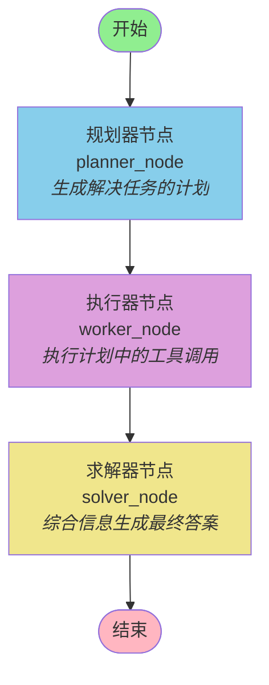


### **输出：**

```
开始执行 ReWOO 代理任务: '求2024年中国北京、上海、广州、深圳的人口总和'


--- [Planner Node] ---
  Input Task: 求2024年中国北京、上海、广州、深圳的人口总和
  Output Plan:
计划：查找2024年北京的人口数据。  
#E1 = Google[2024年北京人口]

计划：查找2024年上海的人口数据。  
#E2 = Google[2024年上海人口]

计划：查找2024年广州的人口数据。  
#E3 = Google[2024年广州人口]

计划：查找2024年深圳的人口数据。  
#E4 = Google[2024年深圳人口]

计划：将上述四个城市的人口数据相加，得出总和。  
#E5 = Solver[#E1, #E2, #E3, #E4]
--- [Planner Node End] ---


--- [Worker Node] ---
  Input Plan:
计划：查找2024年北京的人口数据。  
#E1 = Google[2024年北京人口]

计划：查找2024年上海的人口数据。  
#E2 = Google[2024年上海人口]

计划：查找2024年广州的人口数据。  
#E3 = Google[2024年广州人口]

计划：查找2024年深圳的人口数据。  
#E4 = Google[2024年深圳人口]

计划：将上述四个城市的人口数据相加，得出总和。  
#E5 = Solver[#E1, #E2, #E3, #E4]
    - Executing: Step 1 | Tool: Google | Argument: '2024年北京人口'
    - Executing: Step 2 | Tool: Google | Argument: '2024年上海人口'
    - Executing: Step 3 | Tool: Google | Argument: '2024年广州人口'
    - Executing: Step 4 | Tool: Google | Argument: '2024年深圳人口'

  Output Evidences:
    - E1: {'title': '人口_首都之窗 - 北京市人民政府', 'url': 'https://www.beijing.gov.cn/renwen/bjgk/rk/202503/t20250325_40...
    - E2: {'title': '2024年上海常住人口2480.26万人，新增就业人数62.17万人', 'url': 'https://wap.51ldb.com/shsldb/ms/content/0195...
    - E3: {'title': '2024年广州常住人口1897.8万，城镇化率提升至87.24%', 'url': 'http://m.fangchan.com/news/218/2025-03-31/7312...
    - E4: {'title': '15座万亿城市2024年人口数据：深圳增量第一 - 新浪财经', 'url': 'https://finance.sina.com.cn/roll/2025-03-31/doc-...
--- [Worker Node End] ---


--- [Solver Node] ---
  Input to Solver LLM (Task, Plan, Evidences):
    Task: 求2024年中国北京、上海、广州、深圳的人口总和
    Plan: 计划：查找2024年北京的人口数据。  
计划：查找2024年上海的人口数据。  
计划：查找2024年广州的人口数据。  
计划：查找2024年深圳的人口数据。  
计划：将上述四个城市的人口数据相加，得出总和。
    Evidences: #E1 的证据: {'title': '人口_首都之窗 - 北京市人民政府', 'url': 'https://www.beijing.gov.cn/renwen/bjgk/rk/202503/t20250325_4043973.html', 'content': '无障碍繁体/简体智能问答\n\n我在听，请说话(10s)\n\n抱歉，没听清，请再说一遍吧\n\n人文北京\u3000>\u3000...

  Output Response:
根据执行结果，2024年中国北京、上海、广州、深圳的人口数据如下：

1. 北京：2183.2万人  
2. 上海：2480.26万人  
3. 广州：1897.8万人  
4. 深圳：1798.95万人  

将四个城市的人口相加：

2183.2 + 2480.26 + 1897.8 + 1798.95 = 8359.21万人

**最终答案：**

2024年中国北京、上海、广州、深圳的人口总和为**8359.21万人**。
--- [Solver Node End] ---


=================================
✅ 任务执行完毕 - 最终答案:
=================================
根据执行结果，2024年中国北京、上海、广州、深圳的人口数据如下：

1. 北京：2183.2万人  
2. 上海：2480.26万人  
3. 广州：1897.8万人  
4. 深圳：1798.95万人  

将四个城市的人口相加：

2183.2 + 2480.26 + 1897.8 + 1798.95 = 8359.21万人

**最终答案：**

2024年中国北京、上海、广州、深圳的人口总和为**8359.21万人**。
```

### **代码整体流程：**

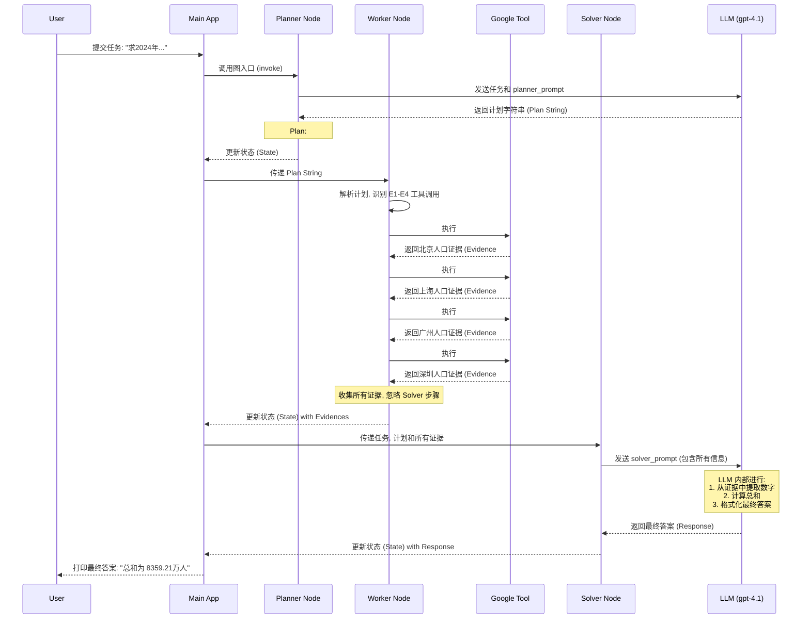

这个图清晰地展示了从用户任务输入开始，经过**规划（Planner）**、**执行（Worker）** 和 **求解（Solver）** 三个核心阶段，最终得出答案的全过程。

时序图解读

1. **启动**：用户通过 Main App 提交一个复杂的任务。
2. **规划 (Planner)**：Planner Node 调用大语言模型（LLM）将任务分解成一个详细的、可执行的计划。这个计划明确了需要调用哪些工具（4次 Google 搜索）以及最后如何整合信息（使用 Solver）。
3. **执行 (Worker)**：Worker Node 像一个勤奋的工人，严格按照计划执行每一步。它依次调用 Google Tool，收集所有必要的信息片段（即“证据”），但它并不知道如何使用这些信息，只是忠实地完成数据搜集工作。
4. **求解 (Solver)**：Solver Node 扮演着“大脑”的角色。它接收到原始任务、完整的计划以及 Worker 搜集到的所有零散证据。它再次调用 LLM，要求它基于所有已知信息，进行最终的**综合、推理、计算**，并生成一个人类可读的、完整的最终答案。
5. **完成**：Main App 将 Solver 生成的最终答案呈现给用户，任务结束。

这个流程完美地体现了 ReWOO 架构“**推理-规划-执行-求解**”的核心思想，将复杂的任务拆解，并通过专门的“大脑”（Solver/LLM）来整合结果，从而解决了最初 Calculator 工具因无法理解上下文而出错的问题。

**引用文献**

- [Xu, C., Yao, S., Gao, T., Duan, T., & Narasimhan, K. (2023). ReWOO: Decoupling Reasoning from Observations for Efficient Augmented Language Models.](https://www.google.com/url?sa=E&q=https%3A%2F%2Farxiv.org%2Fabs%2F2305.18323)

## 7. Multi-Agent Architectures

### **模式介绍:**

多智能体架构通过让多个独立的、具有特定角色的 Agent 协同工作来解决单个 Agent 难以处理的复杂问题。这种模式的核心思想是“分而治之”，将一个庞大的任务分解给不同的专家 Agent，每个 Agent 负责其擅长的领域，并通过相互通信来协作完成共同的目标。

常见的多智能体架构包括：
层级结构 (Hierarchical): 一个“管理者” Agent 负责分解任务和协调，并将子任务分配给下属的“专家” Agent。
* 网络结构 (Network): 所有 Agent 都是平等的，它们可以自由地相互通信和协作。
* 顺序结构 (Sequential): 任务在一个 Agent 链中按顺序传递，每个 Agent 完成自己的部分后再交给下一个。

像 Microsoft 的 AutoGen 这样的框架，就是专门为构建和协调多智能体应用而设计的，它通过自动化的 Agent 间对话来简化复杂工作流的编排。

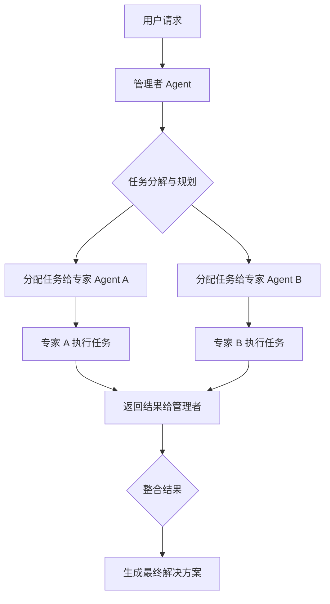


### **Python代码案例 (AutoGen ):**

```python
import os
import autogen
from dotenv import load_dotenv

load_dotenv()

# 从 .env 文件加载配置

config_list = [
    {
        "model": "gpt-4.1",
        "api_key": os.environ.get("OPENAI_API_KEY"),
        "base_url": os.environ.get("OPENAI_BASE_URL"),
    }
]

# 配置大语言模型（LLM）
# 将上面创建的配置列表传递给 llm_config
llm_config = {
    "config_list": config_list,
    "cache_seed": 42,  # 使用种子以保证结果的可复现性
    "timeout": 600,
}

# 创建助理代理 (AssistantAgent)
# 这个代理负责根据指令生成代码
assistant = autogen.AssistantAgent(
    name="assistant",
    llm_config=llm_config,
)

# 创建用户代理 (UserProxyAgent)
# 这个代理代表用户，并负责执行代码
user_proxy = autogen.UserProxyAgent(
    name="user_proxy",
    human_input_mode="NEVER",  # 在这个例子中不寻求人类输入
    max_consecutive_auto_reply=10,
    is_termination_msg=lambda x: x.get("content", "").rstrip().endswith("TERMINATE"),
    code_execution_config={
        "work_dir": "coding",  # 代码将在此目录下执行
        "use_docker": False,  # 设置为 False 以在本地环境执行。官方建议在 Docker 容器中执行以确保安全。
    },
)

# 发起对话
# 用户代理向助理代理发起一个任务
user_proxy.initiate_chat(
    assistant,
    message="""
    今天日期是什么？对比一下 META 和 NVDA 从年初至今的股价表现，并用图表展示出来。

    重要提示：在使用 matplotlib 绘图时，为了正确显示中文，请务必在你的 Python 代码中加入以下两行配置：
    import matplotlib.pyplot as plt
    plt.rcParams['font.sans-serif'] = ['SimHei']
    plt.rcParams['axes.unicode_minus'] = False

    图表的标题应为“META vs NVDA 股价走势”，X轴标签为“日期”，Y轴标签为“收盘价”。
    """,
)
```

### **输出：**

````
user_proxy (to assistant):


    今天日期是什么？对比一下 META 和 NVDA 从年初至今的股价表现，并用图表展示出来。
    
    重要提示：在使用 matplotlib 绘图时，为了正确显示中文，请务必在你的 Python 代码中加入以下两行配置：
    import matplotlib.pyplot as plt
    plt.rcParams['font.sans-serif'] = ['SimHei']
    plt.rcParams['axes.unicode_minus'] = False
    
    图表的标题应为“META vs NVDA 股价走势”，X轴标签为“日期”，Y轴标签为“收盘价”。


--------------------------------------------------------------------------------
assistant (to user_proxy):

计划：

1. 首先获取今天的日期，作为查询时间范围的结束日期。
2. 从年初（1月1日）到今天，分别下载 META 和 NVDA 的每日收盘价。
3. 使用 matplotlib 绘制收盘价对比走势图，并设置中文字体与标题。
4. 显示图表。

下面是完整代码：

```python
import datetime
import matplotlib.pyplot as plt
import pandas as pd
import yfinance as yf

# 保证中文显示
plt.rcParams['font.sans-serif'] = ['SimHei']
plt.rcParams['axes.unicode_minus'] = False

# 第一步：获取今天日期
today = datetime.date.today()
print("今天日期是：", today)

# 第二步：设置起止日期
start_date = datetime.date(today.year, 1, 1)
end_date = today

# 下载META和NVDA的收盘价
meta = yf.download('META', start=start_date, end=end_date)
nvda = yf.download('NVDA', start=start_date, end=end_date)

# 整理收盘价数据
meta_close = meta['Close']
nvda_close = nvda['Close']

# 第三步：绘制对比图
plt.figure(figsize=(12,6))
plt.plot(meta_close.index, meta_close.values, label='META')
plt.plot(nvda_close.index, nvda_close.values, label='NVDA')
plt.title('META vs NVDA 股价走势')
plt.xlabel('日期')
plt.ylabel('收盘价')
plt.legend()
plt.tight_layout()
plt.show()
```
请执行上述代码，输出结果并观察图表。

--------------------------------------------------------------------------------

>>>>>>>> EXECUTING CODE BLOCK 0 (inferred language is python)...
user_proxy (to assistant):

exitcode: 0 (execution succeeded)
Code output: 
今天日期是： 2025-09-07


--------------------------------------------------------------------------------
assistant (to user_proxy):

已确认今天的日期为 2025-09-07。接下来，根据这个日期，刚刚输出的代码已经完成了所有后续步骤——包括数据下载和图表绘制。因此，您应该已能在屏幕上看到“META vs NVDA 股价走势”的对比走势图。

两个股票（META和NVDA）从2025年初至今（2025-09-07）的收盘价随时间变化已绘制出来。
- X轴为日期（2025年1月1日至2025年9月7日）
- Y轴为收盘价
- 图表标题为“META vs NVDA 股价走势”
- 曲线分别为META与NVDA

如果您已看到图表，任务圆满完成；如需进一步分析或保存图片，请告知。

TERMINATE

--------------------------------------------------------------------------------

>>>>>>>> TERMINATING RUN (26556eb2-20f6-485e-997d-bba9cae76705): Termination message condition on agent 'user_proxy' met

````


### **代码整体流程：**

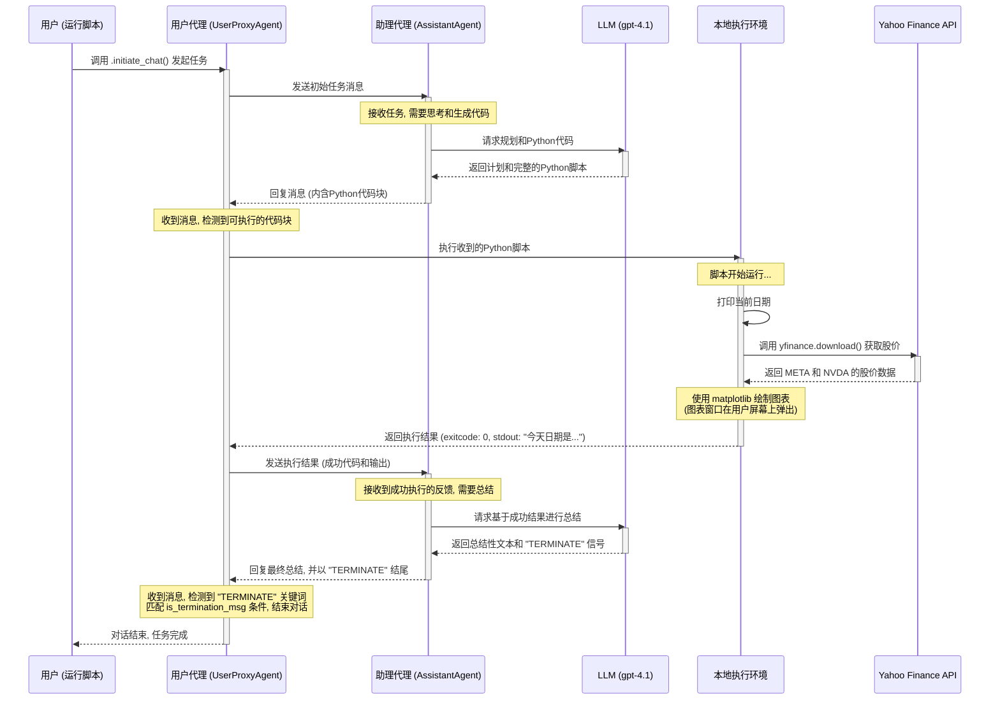

Multi-Agent 流程时序图 (Mermaid)

这张图清晰地展示了两个智能体如何分工协作：

- **AssistantAgent** 扮演**规划者和程序员**的角色，负责理解任务并生成可执行的代码。
- **UserProxyAgent** 扮演**执行者和验证者**的角色，负责运行代码、反馈结果，并最终决定任务是否完成。

时序图解读

1. **任务发起 (Initiation)**:
   - 用户运行 Python 脚本，UserProxyAgent (用户代理) 被激活，并根据指令向 AssistantAgent (助理代理) 发送了第一个包含复杂任务的消息。
2. **规划与编码 (Planning & Coding)**:
   - AssistantAgent 接收到任务后，它并不直接行动，而是首先与 LLM 沟通。
   - 它请求 LLM 将用户的自然语言任务分解成一个清晰的计划，并基于该计划生成一个完整的、可执行的 Python 脚本。
   - AssistantAgent 将这个包含代码的完整回复发送回 UserProxyAgent。
3. **执行与交互 (Execution & Interaction)**:
   - UserProxyAgent 收到回复后，其内置的机制检测到了一个 Python 代码块。
   - 它**自动地**将这段代码在指定的 本地执行环境 中运行。
   - 在执行期间，该脚本与外部的 Yahoo Finance API 进行了交互来获取数据，并在用户的屏幕上弹出了一个 Matplotlib 图表。
   - 执行完毕后，本地执行环境 将执行结果（包括退出码 exitcode: 0 和标准输出 stdout）返回给 UserProxyAgent。
4. **反馈与终止 (Feedback & Termination)**:
   - UserProxyAgent 将代码的执行结果作为新的消息，反馈给 AssistantAgent。
   - AssistantAgent 接收到“执行成功”的反馈后，再次与 LLM 沟通，生成一段总结性的文字，确认任务已经完成，并在消息的末尾附上了关键词 TERMINATE。
   - 当 UserProxyAgent 收到这条包含 TERMINATE 的消息时，它匹配了预设的 is_termination_msg 规则，从而**自动终止了整个对话**，标志着任务的圆满完成。

这个流程完美地展示了多智能体架构的优势：通过角色分离，一个智能体（助理）专注于高级的推理和规划，而另一个智能体（用户代理）则专注于与环境的实际交互和执行，它们通过对话驱动，高效地解决了单个智能体难以处理的复合型任务。

**引用文献**

- [Wu, Q., et al. (2023). AutoGen: Enabling Next-Gen LLM Applications via Multi-Agent Conversation Framework.](https://www.google.com/url?sa=E&q=https%3A%2F%2Farxiv.org%2Fabs%2F2308.08155)
- [SmythOS Blog: Multi-Agent System Architecture](https://www.google.com/url?sa=E&q=https%3A%2F%2Fwww.smythos.com%2Fblog%2Fmulti-agent-system-architecture)

## 8. 总结：

### 核心模式对比总览表

| 模式 (Pattern)                | 核心思想 (Core Idea)                                         | 优点 (Advantages)                                            | 适用场景 (Use Cases)                                         |
| :---------------------------- | :----------------------------------------------------------- | :----------------------------------------------------------- | :----------------------------------------------------------- |
| **Chain-of-Thought (CoT)**    | **循序渐进的推理**。通过引导 LLM “一步一步地思考”，将复杂问题分解为中间推理步骤。 | 简单有效，显著提升复杂任务的准确性，推理过程透明可解释。     | **基础推理**。数学题、逻辑谜题、需要多步推导才能得出结论的问答。 |
| **Self-Ask**                  | **自我提问与解答**。在 CoT 基础上，将问题显式地分解为一系列后续子问题，并调用工具寻找答案。 | 结构化推理过程，每一步都有明确的子目标和可验证的答案，可靠性高。 | **多跳（Multi-hop）事实问答**。需要连续查找多个关联信息才能回答的复杂问题。 |
| **ReAct**                     | **思考与行动的交错循环**。在一个“思考→行动→观察”的循环中，动态地决定下一步，并与外部工具交互。 | **高度灵活和适应性强**，能处理动态变化和不确定的任务，是通用 Agent 的经典模式。 | **通用和探索性任务**。需要与环境（如网页、API）持续交互，且下一步不确定的任务。 |
| **Plan-and-Execute**          | **先规划，后执行**。首先由一个“规划器”制定出完整的、多步骤的计划，然后由一个“执行器”逐一完成。 | 结构化、可预测，LLM 调用次数少，**成本和延迟较低**，适合长期任务。 | **结构化和可预测的复杂项目**。如“写一份市场分析报告”、“规划一次旅行”等目标明确的任务。 |
| **ReWOO**                     | **解耦推理与观察**。Planner 一次性生成带占位符的计划，Worker 并行执行所有工具，Solver 最后整合信息。 | **高效、快速、可并行**，显著减少 LLM 调用次数和等待时间，Token 效率高。 | **效率至上的信息整合任务**。需要从多个独立来源收集信息并最终汇总的任务。 |
| **Reflexion**                 | **通过自我反思进行迭代改进**。Agent 在一次尝试失败后，会评估结果、反思错误，并将经验用于下一次尝试。 | **具备从失败中学习的能力**，能解决需要试错和逐步优化的复杂问题。 | **需要试错和优化的任务**。代码生成与调试、创意写作、复杂的科学问题求解。 |
| **Multi-Agent Architectures** | **分工协作的专家团队**。将一个复杂任务分解给多个具有不同角色和能力的 Agent，通过对话协同完成。 | **能解决单个 Agent 无法处理的极其复杂的问题**，通过分工和多视角提升解决方案的质量和鲁棒性。 | **大规模和多领域的复杂项目**。软件开发、商业流程自动化、科学研究、复杂系统模拟。 |

---

### 综合对比与分析

这些模式并非完全独立，而是呈现出一种演进和互补的关系。

#### 1. 从简单推理到复杂交互

*   **Chain-of-Thought** 是最基础的“思维”增强技术，它只发生在 LLM 内部，不与外部世界交互。
*   **Self-Ask** 和 **ReAct** 在 CoT 的基础上迈出了一大步，它们引入了**行动（Action）**，让 Agent 能够使用工具与外部环境交互。
    *   **Self-Ask** 的行动更具结构性，以“一问一答”的形式推进。
    *   **ReAct** 则更加灵活，它的“思考”更加自由，可以决定任何下一步的行动，适应性更强。

#### 2. 规划策略的对决：动态适应 vs. 预先规划

这是 Agent 设计中的一个核心权衡点。

*   **ReAct (动态适应)**:
    *   **对比 Plan-and-Execute**: ReAct 在每一步都重新评估情况，非常灵活，但代价是频繁调用 LLM，导致速度慢、成本高。它就像一个边走边看地图的探险家。
    *   **对比 ReWOO**: ReAct 是串行的“思考-行动”循环，而 ReWOO 通过解耦实现了并行，效率远高于 ReAct。

*   **Plan-and-Execute (预先规划)**:
    *   **对比 ReAct**: 它的优点是结构清晰、成本低。但最大的缺点是**僵化**，一旦计划中的某一步出错或外部环境变化，它很难适应，可能导致整个任务失败。它就像一个严格按照预设食谱做菜的厨师。

*   **ReWOO (效率优化)**:
    *   可以看作是 **Plan-and-Execute** 的一个变种，但它通过占位符的设计，使得规划和执行的结合更加高效。它解决了 Plan-and-Execute 的部分僵化问题，因为最后的 Solver 可以在看到所有证据后进行智能整合，甚至纠正 Worker 的小错误。

#### 3. 是否具备学习能力

*   **Reflexion** 是这里唯一一个明确引入了**“从经验中学习”**机制的模式。
    *   **对比其他所有模式**: ReAct, ReWOO 等模式如果在一个任务中失败了，它们只能中止。而 Reflexion 失败后会进入一个“反思”阶段，生成宝贵的经验，用于指导下一次**全新的尝试**。这使得它在处理需要反复试错才能找到最优解的问题时，具有无与伦比的优势。

#### 4. 复杂度的维度：个体 vs. 团队

*   **Multi-Agent Architectures** 将问题解决的范式从“单个超级英雄”提升到了“一支专家团队”。
    *   **对比所有单 Agent 模式**: 当任务的复杂度、所需知识领域的广度、或者需要内部审查和批判性思维的程度，超过了单个 Agent 的能力上限时，多智能体架构就成了必然选择。例如，你可以组建一个团队：一个 `Plan-and-Execute` 模式的**项目经理 Agent**，一个 `ReAct` 模式的**研究员 Agent**，和一个 `Reflexion` 模式的**程序员 Agent**，它们各司其职，通过对话协作完成一个软件开发项目。

### 总结与如何选择

这些模式为构建不同能力的 AI Agent 提供了丰富的工具箱。选择哪种模式取决于你的具体需求：

*   **基础推理增强**: 从 **Chain-of-Thought** 开始。
*   **事实查询与整合**: **Self-Ask** 是一个结构清晰的好选择。
*   **通用和动态任务**: **ReAct** 是最经典和灵活的范式。
*   **成本敏感且流程固定的任务**: **Plan-and-Execute** 更经济。
*   **追求极致效率和并行处理**: **ReWOO** 是 ReAct 的高效替代品。
*   **需要反复试错和自我优化的任务**: **Reflexion** 是不二之选。
*   **解决企业级、超大规模的复杂问题**: **Multi-Agent Architectures** 提供了无限的可能性。

未来的趋势很可能是将这些模式进行**混合（Hybrid）**，构建出既能高效规划，又能灵活适应，同时还能从失败中学习的、由多个专家 Agent 组成的复杂智能系统。
