# agentæ€ç»´æ¨¡å¼ä»‹ç»

智能体（AI）Agent 正在迅速å‘展，其核心在于其“æ€ç»´æ¨¡å¼â€æˆ–认知架构，这决定了它们如何推ç†ã€è§„划和执行任务。

本文将详细介ç»ä»¥ä¸‹å‡ ç§æµè¡Œçš„AI Agentæ€ç»´æ¨¡å¼ï¼Œå¹¶ä¸ºæ‚¨æ供详细的解释ã€Mermaidæµç¨‹å›¾ã€åŸºäºŽLangChainå’ŒAutoGenç­‰æµè¡Œæ¡†æž¶çš„Python代ç ç¤ºä¾‹ï¼Œä»¥åŠç›¸å…³çš„å‚考文献链接。

## 1. ReAct (Reasoning and Acting)

### 模å¼ä»‹ç»

ReAct模å¼æ˜¯ä¸€ç§å°†æŽ¨ç†ï¼ˆReasoning）和行动（Acting）相结åˆçš„框架。在这个模å¼ä¸­ï¼ŒAgentä¸ä»…仅是生æˆæ–‡æœ¬ï¼Œè€Œæ˜¯ä»¥ä¸€ç§äº¤é”™çš„æ–¹å¼ç”ŸæˆæŽ¨ç†è½¨è¿¹å’Œä»»åŠ¡ç›¸å…³çš„行动。 è¿™ç§æ–¹å¼å…许Agent在与外部工具（如æœç´¢å¼•æ“Žã€API）交互以获å–é¢å¤–ä¿¡æ¯çš„åŒæ—¶ï¼Œè¿˜èƒ½è¿›è¡ŒåŠ¨æ€çš„推ç†æ¥åˆ›å»ºã€ç»´æŠ¤å’Œè°ƒæ•´å…¶è¡ŒåŠ¨è®¡åˆ’。ReAct的核心æ€æƒ³æ˜¯é€šè¿‡ä¸€ä¸ªâ€œæ€è€ƒ-行动-观察â€çš„循环æ¥è§£å†³é—®é¢˜ã€‚

ReAct 的工作æµç¨‹æ˜¯ä¸€ä¸ªå¾ªçŽ¯ï¼š**æ€è€ƒ -> 行动 -> 观察**。

*   **æ€è€ƒ (Thought)**: Agentæ ¹æ®å½“å‰ä»»åŠ¡å’Œå·²æœ‰ä¿¡æ¯ï¼Œç”Ÿæˆä¸€ä¸ªå…³äºŽä¸‹ä¸€æ­¥åº”该åšä»€ä¹ˆçš„推ç†è¿‡ç¨‹ã€‚
*   **行动 (Action)**: 基于æ€è€ƒçš„结果，Agent决定并执行一个具体的行动，例如调用一个工具。
*   **观察 (Observation)**: Agent接收æ¥è‡ªè¡ŒåŠ¨çš„å馈结果。

这个循环会一直é‡å¤ï¼Œç›´åˆ° Agent 认为已ç»æ”¶é›†åˆ°è¶³å¤Ÿçš„ä¿¡æ¯æ¥å›žç­”用户的问题。 è¿™ç§æ¨¡å¼å¢žå¼ºäº†æ¨¡åž‹çš„é€æ˜Žåº¦å’Œå¯é æ€§ï¼Œå› ä¸ºå®ƒå…许我们追溯Agentçš„æ€è€ƒè¿‡ç¨‹ï¼Œå¹¶ä¸”通过与外部世界的交互æ¥å‡å°‘幻觉和错误。

**Mermaid 图:**

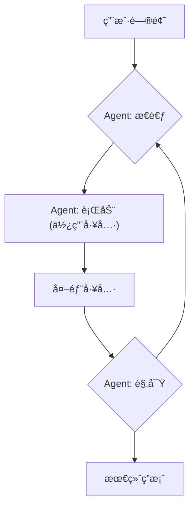

### **Python 代ç æ¡ˆä¾‹ (LangChain):**

```python
from dotenv import load_dotenv
from langchain import hub
from langchain.agents import AgentExecutor, create_react_agent
from langchain_community.tools import DuckDuckGoSearchRun
from langchain_openai import ChatOpenAI

load_dotenv()


# 1. 创建一个自定义的工具类，继承自 DuckDuckGoSearchRun
class LoggingDuckDuckGoSearchRun(DuckDuckGoSearchRun):
    """
    一个自定义的DuckDuckGoSearchRun版本，它会清晰地打å°è¾“入和输出。
    """

    def _run(self, query: str) -> str:
        """é‡å†™_run方法以添加日志记录。"""
        print("\n" + "=" * 30)
        print(f"🔎 [DuckDuckGo] 正在æœç´¢: {query}")
        print("=" * 30)

        # 调用父类的原始_run方法æ¥æ‰§è¡Œå®žé™…çš„æœç´¢
        result = super()._run(query)

        print("\n" + "-" * 30)
        print(f"📄 [DuckDuckGo] 收到结果:")
        # 为了å¯è¯»æ€§ï¼Œå¯ä»¥åªæ‰“å°ç»“果的一部分
        print(result[:500] + "..." if len(result) > 500 else result)
        print("-" * 30 + "\n")

        return result


# 2. 在工具列表中使用我们自定义的工具
tools = [LoggingDuckDuckGoSearchRun()]

# 从 LangChain Hub èŽ·å– ReAct æ示模æ¿
prompt = hub.pull("hwchase17/react")

llm = ChatOpenAI(
    model="gpt-4.1",
    temperature=0,
)

# 创建 ReAct Agent
agent = create_react_agent(llm, tools, prompt)

# 创建 Agent 执行器
# 让 AgentExecutor 自己的 verbose 输出ä¿æŒå¼€å¯ï¼Œä»¥ä¾¿çœ‹åˆ°æ€è€ƒé“¾
agent_executor = AgentExecutor(agent=agent, tools=tools, verbose=True)

# è¿è¡Œ Agent
response = agent_executor.invoke(
    {"input": "2024年赢得ACM国际大学生程åºè®¾è®¡ç«žèµ›ï¼ˆICPC）的国家是哪个？这个国家的首都是哪里？"})

print("\n" + "*" * 50)
print("最终å“应:")
print(response)
print("*" * 50)
```

### **输出:**

```sh
> Entering new AgentExecutor chain...
Thought: 我需è¦æŸ¥æ‰¾2024å¹´ACM国际大学生程åºè®¾è®¡ç«žèµ›ï¼ˆICPC）的冠军国家，然åŽå†æŸ¥æ‰¾è¯¥å›½å®¶çš„首都。
Action: duckduckgo_search
Action Input: 2024å¹´ACM国际大学生程åºè®¾è®¡ç«žèµ›å† å†›å›½å®¶
==============================
🔎 [DuckDuckGo] 正在æœç´¢: 2024å¹´ACM国际大学生程åºè®¾è®¡ç«žèµ›å† å†›å›½å®¶
==============================

------------------------------
📄 [DuckDuckGo] 收到结果:
2024 å¹´9月15日至20日，第48届ICPC 国际大学生程åºè®¾è®¡å¤§èµ› 世界总决赛（ICPC World Finals 2024 ）在哈è¨å…‹æ–¯å¦é¦–都阿斯塔纳举行。 æ¥è‡ªå…¨çƒ111个国家，超过3000所学校的选手ç»è¿‡å±‚层选拔，产生141支世界顶尖学生程åºå‘˜é˜Ÿä¼å‘总 冠军 席ä½å‘出激烈的角é€ã€‚ 2024å¹´10月25æ—¥ — 近日，第48届ICPC 国际大学生程åºè®¾è®¡ç«žèµ› 世界总决赛（ICPCWorldFinals2024）在哈è¨å…‹æ–¯å¦é¦–都阿斯塔纳æˆåŠŸä¸¾åŠžã€‚å— ç«žèµ› 组委会邀请，上海大学党委常委ã€å‰¯æ ¡é•¿è‚清率团出访 ... 2024å¹´12月30æ—¥ — 本场的ICPC区域赛（香港站）为今年最åŽä¸€ä¸ªäºšæ´²åŒºåŸŸèµ›çš„站点，共有æ¥è‡ªåŒ…括北京大学ã€åŒ—京航空航天大学ã€ä¸Šæµ·äº¤é€šå¤§å­¦ã€å“ˆå°”滨工业大学ã€å—京大学等115所院校的149支å‚èµ›é˜Ÿä¼ ... 2024å¹´11月3æ—¥ — å†å‰µä½³ç¸¾ï¼æ¸¯ç§‘大（廣州）大一本科生在ICPC 國際大學生程åºè¨­è¨ˆç«¶è³½ 亞洲å€åŸŸè³½æ–¬ç²é‡‘çŽ ... 11月3日，第49屆ICPC 國際大學生程åºè¨­è¨ˆç«¶è³½ （International Collegiate Programming ... 20...
------------------------------

2024 å¹´9月15日至20日，第48届ICPC 国际大学生程åºè®¾è®¡å¤§èµ› 世界总决赛（ICPC World Finals 2024 ）在哈è¨å…‹æ–¯å¦é¦–都阿斯塔纳举行。 æ¥è‡ªå…¨çƒ111个国家，超过3000所学校的选手ç»è¿‡å±‚层选拔，产生141支世界顶尖学生程åºå‘˜é˜Ÿä¼å‘总 冠军 席ä½å‘出激烈的角é€ã€‚ 2024å¹´10月25æ—¥ — 近日，第48届ICPC 国际大学生程åºè®¾è®¡ç«žèµ› 世界总决赛（ICPCWorldFinals2024）在哈è¨å…‹æ–¯å¦é¦–都阿斯塔纳æˆåŠŸä¸¾åŠžã€‚å— ç«žèµ› 组委会邀请，上海大学党委常委ã€å‰¯æ ¡é•¿è‚清率团出访 ... 2024å¹´12月30æ—¥ — 本场的ICPC区域赛（香港站）为今年最åŽä¸€ä¸ªäºšæ´²åŒºåŸŸèµ›çš„站点，共有æ¥è‡ªåŒ…括北京大学ã€åŒ—京航空航天大学ã€ä¸Šæµ·äº¤é€šå¤§å­¦ã€å“ˆå°”滨工业大学ã€å—京大学等115所院校的149支å‚èµ›é˜Ÿä¼ ... 2024å¹´11月3æ—¥ — å†å‰µä½³ç¸¾ï¼æ¸¯ç§‘大（廣州）大一本科生在ICPC 國際大學生程åºè¨­è¨ˆç«¶è³½ 亞洲å€åŸŸè³½æ–¬ç²é‡‘çŽ ... 11月3日，第49屆ICPC 國際大學生程åºè¨­è¨ˆç«¶è³½ （International Collegiate Programming ... 2024å¹´10月12æ—¥ — 2024å¹´ 9月15日至20日，第48届 国际大学生程åºè®¾è®¡ç«žèµ› å…¨çƒæ€»å†³èµ›ICPC WF（ICPC World Finals）在哈è¨å…‹æ–¯å¦é¦–都阿斯塔纳举行。信æ¯ç§‘学技术学院2023级本科生王蔚澄〠...Thought: ç›®å‰æœç´¢ç»“果主è¦æ到2024å¹´ICPC总决赛在哈è¨å…‹æ–¯å¦é¦–都阿斯塔纳举行，但没有直接给出冠军国家的信æ¯ã€‚我需è¦è¿›ä¸€æ­¥æŸ¥æ‰¾2024å¹´ICPC总决赛的冠军队ä¼æˆ–国家。
Action: duckduckgo_search
Action Input: 2024 ICPC World Finals winner
==============================
🔎 [DuckDuckGo] 正在æœç´¢: 2024 ICPC World Finals winner
==============================

------------------------------
📄 [DuckDuckGo] 收到结果:
2024年9月19日 — 935. World Champion . Asia East Champion . $16200. Gold medal 2. Russia · Moscow Institute of Physics and Technology (Yolki-palki):. Denis Mustafin, Tikhon Evteev ... 2024年9月17日 2024年9月22日 — Here they are, the winners of The 2024 ICPC World Finals! Peking University Tsinghua University Moscow Institute of Physics and Technology Tokyo ... 2024年10月9日 — The 2024 World Champions: Peking University . 2024 Champions From among 141 teams of three, chosen from a field of 73,083 students wit...
------------------------------

2024å¹´9月19æ—¥ — 935. World Champion . Asia East Champion . $16200. Gold medal 2. Russia · Moscow Institute of Physics and Technology (Yolki-palki):. Denis Mustafin, Tikhon Evteev ... 2024å¹´9月17æ—¥ 2024å¹´9月22æ—¥ — Here they are, the winners of The 2024 ICPC World Finals! Peking University Tsinghua University Moscow Institute of Physics and Technology Tokyo ... 2024å¹´10月9æ—¥ — The 2024 World Champions: Peking University . 2024 Champions From among 141 teams of three, chosen from a field of 73,083 students with 12,258 coaches and ... 2024å¹´9月26æ—¥ — Team Absinthe's silver medal win at the 2024 International Collegiate Programming Contest (ICPC) World Finals marks a historic achievement.Thought: 我已ç»æŸ¥åˆ°2024å¹´ICPC世界总决赛的冠军是北京大学。北京大学ä½äºŽä¸­å›½ï¼Œå› æ­¤å† å†›å›½å®¶æ˜¯ä¸­å›½ã€‚接下æ¥éœ€è¦ç¡®è®¤ä¸­å›½çš„首都。
Action: duckduckgo_search
Action Input: 中国的首都
==============================
🔎 [DuckDuckGo] 正在æœç´¢: 中国的首都
==============================

------------------------------
📄 [DuckDuckGo] 收到结果:
北平 为中国的首都 已有七百多年的历å²ã€‚ 在政治上，北平ä½äºŽåŽåŒ—è€è§£æ”¾åŒºå†…，人民力é‡é›„厚，规模弘伟，文物集中，是世界上有å的历å²çš„大都市之一，且自五四以æ¥ï¼Œè¿™é‡Œå°±æ˜¯æ–°æ–‡åŒ–æ€æƒ³çš„摇篮。 [bÄ›i jÄ«ng shì] 中åŽäººæ°‘共和国首都ã€ç›´è¾–市 北京市（Beijing），简称“京â€ï¼Œå¤ç§°ç‡•äº¬ã€åŒ—平，是中åŽäººæ°‘共和国首都ã€ç›´è¾–市ã€å›½å®¶ä¸­å¿ƒåŸŽå¸‚ã€è¶…大城市， [185]国务院批å¤ç¡®å®šçš„中国政治中心ã€æ–‡åŒ–中心ã€å›½é™…交往中心ã€ç§‘技创新中心， 中国历å²æ–‡åŒ–å城和å¤éƒ½ä¹‹ä¸€ï¼Œä¸–界一线城市。 [142] [188]截至2023å¹´10月，北京市下辖16个区，总é¢ç§¯16410.54平方åƒç±³ã€‚ [193] [195]2023年末，北京市常ä½äººå£2185.8万人。 北京市地处中国北部ã€åŽåŒ—平原北部，东与天津市毗连，其余å‡ä¸Žæ²³åŒ—çœç›¸é‚»ï¼Œä¸­å¿ƒä½äºŽä¸œç»116°20′ã€åŒ—纬39°56′，北京市地势西北高ã€ä¸œå—低。西部ã€åŒ—部和东北部三é¢çŽ¯å±±ï¼Œä¸œå—部是一片缓缓å‘渤海倾斜的平原。境内æµç»çš„主è¦æ²³æµæœ‰ï¼šæ°¸å®šæ²³ã€æ½®ç™½æ²³ã€åŒ—è¿æ²³ã€æ‹’马河等，北京市的气候为暖温带åŠæ¹¿æ¶¦åŠå¹²æ—±å­£é£Žæ°”候，å¤å­£é«˜æ¸©å¤šé›¨ï¼Œå†¬å­£å¯’冷干燥，春ã€ç§‹çŸ­ä¿ƒã€‚ 北京市是中国...
------------------------------

北平 为中国的首都 已有七百多年的历å²ã€‚ 在政治上，北平ä½äºŽåŽåŒ—è€è§£æ”¾åŒºå†…，人民力é‡é›„厚，规模弘伟，文物集中，是世界上有å的历å²çš„大都市之一，且自五四以æ¥ï¼Œè¿™é‡Œå°±æ˜¯æ–°æ–‡åŒ–æ€æƒ³çš„摇篮。 [bÄ›i jÄ«ng shì] 中åŽäººæ°‘共和国首都ã€ç›´è¾–市 北京市（Beijing），简称“京â€ï¼Œå¤ç§°ç‡•äº¬ã€åŒ—平，是中åŽäººæ°‘共和国首都ã€ç›´è¾–市ã€å›½å®¶ä¸­å¿ƒåŸŽå¸‚ã€è¶…大城市， [185]国务院批å¤ç¡®å®šçš„中国政治中心ã€æ–‡åŒ–中心ã€å›½é™…交往中心ã€ç§‘技创新中心， 中国历å²æ–‡åŒ–å城和å¤éƒ½ä¹‹ä¸€ï¼Œä¸–界一线城市。 [142] [188]截至2023å¹´10月，北京市下辖16个区，总é¢ç§¯16410.54平方åƒç±³ã€‚ [193] [195]2023年末，北京市常ä½äººå£2185.8万人。 北京市地处中国北部ã€åŽåŒ—平原北部，东与天津市毗连，其余å‡ä¸Žæ²³åŒ—çœç›¸é‚»ï¼Œä¸­å¿ƒä½äºŽä¸œç»116°20′ã€åŒ—纬39°56′，北京市地势西北高ã€ä¸œå—低。西部ã€åŒ—部和东北部三é¢çŽ¯å±±ï¼Œä¸œå—部是一片缓缓å‘渤海倾斜的平原。境内æµç»çš„主è¦æ²³æµæœ‰ï¼šæ°¸å®šæ²³ã€æ½®ç™½æ²³ã€åŒ—è¿æ²³ã€æ‹’马河等，北京市的气候为暖温带åŠæ¹¿æ¶¦åŠå¹²æ—±å­£é£Žæ°”候，å¤å­£é«˜æ¸©å¤šé›¨ï¼Œå†¬å­£å¯’冷干燥，春ã€ç§‹çŸ­ä¿ƒã€‚ 北京市是中国共产党中央委员会ã€ä¸­åŽäººæ°‘共和国中央人民政府和中åŽäººæ°‘共和国全国人民代表大会常务委员会所在地。 [142]北京市æˆåŠŸä¸¾åŠžå¤å¥¥ä¼šä¸Žå†¬å¥¥ä¼šï¼Œæˆä¸ºå…¨ä¸–界第一个“åŒå¥¥ä¹‹åŸŽâ€ã€‚ [127]北京市是中åŽæ°‘æ—çš„å‘祥地之一， [194]世界著åå¤éƒ½å’ŒçŽ°ä»£åŒ–国际城市， èŸèƒäº†è‡ªå…ƒã€æ˜Žã€æ¸…以æ¥çš„中åŽä¼˜ç§€ä¼ ç»Ÿæ–‡åŒ–æˆæžœï¼Œæ‹¥æœ‰ä¼—多å胜å¤è¿¹å’Œäººæ–‡æ™¯è§‚，是全çƒæ‹¥æœ‰ä¸–界文化é—产数é‡æœ€å¤šçš„城市。 2023年， 北京全年实现地区生产总值43760.7亿元，按ä¸å˜ä»·æ ¼è®¡ç®—，比上年增长5.2%。第一产业实现增加值105.5亿元，下é™4.6%；第二产业实现增加值6525.6亿元，增长0.4%；第三产业实现增加值37129.6亿元，增长6.1%。 See full list on baike.baidu.com å»ºç½®æ²¿é© æ—©åœ¨è¥¿å‘¨åˆå¹´ï¼Œå‘¨æ­¦çŽ‹å³å°å¬å…¬äºŽåŒ—京åŠé™„近地区，称燕，都城在今北京市房山区的ç‰ç’ƒæ²³é•‡ï¼Œé—å€å°šå­˜ã€‚åˆå°é»„å¸ä¹‹åŽäººäºŽè“Ÿï¼Œåœ¨ä»ŠåŒ—京市西å—。åŽç‡•å›½ç­è“Ÿå›½ï¼Œè¿éƒ½äºŽè“Ÿï¼Œç»Ÿç§°ä¸ºç‡•éƒ½æˆ–燕京。秦置广阳郡ã€è“ŸåŽ¿ï¼ˆä»ŠåŒ—京市西城区广安门一带），共治蓟，åŒæ—¶è®¾æ¸”阳郡，渔阳郡治今怀柔区梨园庄东å—，上谷郡治今河北çœæ€€æ¥åŽ¿ã€‚西汉广阳郡先åŽæ”¹ä¸ºç‡•å›½ã€å¹¿é˜³å›½ã€‚王莽时期广阳国改为广有郡，上谷郡改å朔调郡，渔阳郡改å通路郡，蓟县改åä¼æˆŽåŽ¿ã€‚东汉æ¢å¤æ—§ç§°ã€‚东汉建武å三年（37年），广阳郡并入上谷郡。永元八年（96年），å¤ç½®å¹¿é˜³éƒ¡ã€‚渔阳郡东汉期间徙治潞。三国é­å¹¿é˜³éƒ¡æ”¹ä¸ºç‡•å›½ï¼Œæ¸”阳郡并人。北é­ç‡•å›½æ”¹ä¸ºç‡•éƒ¡ï¼Œå¤ç½®æ¸”阳郡，上谷郡徙治居庸（今延庆区东）。北é½äºŽç‡•éƒ¡ç½®ä¸œåŒ—é“è¡Œå°ï¼ŒåºŸä¸Šè°·éƒ¡ã€‚北周东北é“è¡Œå°æ”¹ä¸ºå¹½å·žå¤§éƒ½ç£åºœã€‚隋开皇三年（583年），废渔阳郡。大业三年（607年），幽州改为涿郡。å”武德元年（618年），涿郡改为幽州总管府，åŽå…ˆåŽæ”¹ä¸ºå¹½å·žå¤§æ€»ç®¡åºœã€èŒƒé˜³éƒ¡ã€å¹½å·žå¤§éƒ½ç£åºœã€å¹½å·žéƒ½ç£åºœã€‚建中二年（781年），æžè“ŸåŽ¿è¥¿å¢ƒç½®å¹½éƒ½åŽ¿ï¼Œä¸Žè“ŸåŽ¿å…±æ²»å¹½å·žåŸŽã€‚ [103]五代åˆæœŸï¼Œå†›é˜€åˆ˜ä»æ­åœ¨æ­¤å»ºç«‹åœ°æ–¹æ”¿æƒï¼Œç§°ç‡•çŽ‹ï¼ŒåŽè¢«åŽå”消ç­ã€‚北宋åˆå¹´ï¼Œèµµå…‰ä¹‰åœ¨é«˜æ¢æ²³ï¼ˆä»ŠåŒ—京市西城区）与辽战斗，北宋大败，对燕云å六州从此望眼欲穿。辽会åŒå…ƒå¹´ï¼ˆ938年），å‡å¹½å·žä¸ºå—京，åˆç§°ç‡•äº¬ï¼Œç½®å¹½éƒ½åºœï¼Œæ²»å—京城；蓟县改å蓟北县，与幽都县共åŒé™„郭å—京。开泰元年（1012年），幽都府更åæžæ´¥åºœï¼Œè“ŸåŒ—县更åæžæ´¥åŽ¿ï¼Œå¹½éƒ½åŽ¿æ›´å宛平县。æžæ´¥åºœè¾–6å·žã€ç›´è¾–11县，州辖13县，共24县。今辖区除延庆县外都在其内，延庆å¦å±žå„’州。宋宣和四年（1122年），æžæ´¥åºœæ”¹å燕山府，治燕京，辖12县。金贞元元年（1153年），海陵王è¿éƒ½ç‡•äº¬ï¼Œæ”¹å中都，æžæ´¥åºœæ”¹å永安府，治中都城。翌年，永安府改å大兴府，下辖大兴ã€å®›å¹³ã€å®‰æ¬¡ã€æ¼·é˜´ã€æ­¦æ¸…ã€é¦™æ²³ã€æ˜Œå¹³ã€è‰¯ä¹¡ã€æ°¸æ¸…ã€å®å»10县，今通州ã€é¡ºä¹‰ç›´å±žä¸­éƒ½è·¯ï¼Œå¤§å…´ã€å®›å¹³2县共治中都城。元世祖至元元年（1264年），改称中都路大兴府。至元ä¹å¹´ï¼ˆ1272年），中都大兴府正å¼æ”¹å为大都路（çªåŽ¥è¯­ï¼šKhanbalik，æ„为“汗城â€ï¼ŒéŸ³è¯‘为汗八里ã€ç”˜å·´åŠ›å…‹ï¼‰ï¼Œä¹Ÿå°±æ˜¯å…ƒå¤§éƒ½ã€‚元大都æˆä¸ºå…¨ä¸­å›½çš„交通中心，北到岭北行çœï¼Œä¸œåˆ°å¥´å„¿å¹²éƒ½å¸ï¼ˆæ²»æ‰€é»‘龙江下游），西到西è—地方，å—到海å—，都在此交æµã€‚从这一时期起，北京æˆä¸º 中国的首都 。二å一年，置大都路总管府，领左ã€å³è­¦å·¡2院，辖大兴ã€å®›å¹³ã€è‰¯ä¹¡ã€æ°¸æ¸…ã€å®å»ã€æ˜Œå¹³6县和涿ã€éœ¸ã€è“Ÿã€ä¸œå®‰ã€å›ºå®‰ã€é€šã€æ¼·ã€é¡ºã€æª€ã€é¾™åº†10州，州领16县，大兴ã€å®›å¹³2县共治大都城。明洪武元年（1368年），置北平承宣布政使å¸ï¼Œæ”¹å¤§éƒ½è·¯ä¸ºåŒ—平府，åŒå¹´å月应军事需è¦åˆ’归山东行çœã€‚洪武ä¹å¹´ï¼ˆ1376年），改为北平承宣布政使å¸é©»åœ°ã€‚æ°¸ä¹å…ƒå¹´ï¼ˆ1403年），燕王朱棣ç»é–难之å˜åŽå¤ºå¾—皇ä½åŽï¼Œä»¥åŒ—平为北京，以“顺应天æ„â€ä¹‹æ„改北平府为顺天府，称为“行在â€ï¼ˆå¤©å­è¡ŒéŠ®é©»è·¸çš„所在，就称“行在â€ï¼‰ä¸”常驻于此；永ä¹å八年（1420年）å一月åˆå››ï¼Œæ˜Žå¤ªå®—朱棣é¢å¸ƒã€Šè¿éƒ½è¯ã€‹ï¼Œæ”¹åŒ—平为北京，昭告天下è¿éƒ½åŒ—京 ，åä¹å¹´ï¼Œæ”¹åŒ—京为京师，ä¸ç§°â€œè¡Œåœ¨â€ã€‚洪熙åˆå¹´ï¼Œä»ç§°â€œè¡Œåœ¨â€ã€‚正统六年（1441年），罢称“行在â€ï¼Œå®šä¸ºäº¬å¸ˆï¼Œäº¬å¸ˆé¡ºå¤©åºœé¢†5å·žã€22县，延庆为京师直隶州。明清时设置顺天府管辖首都地区，地ä½ä¸ŽåŒ—京市类似，但管辖é¢ç§¯ä¸åŒã€‚清兵入关åŽå³è¿›é©»åŒ—京，也称北京为京师顺天府，属直隶çœã€‚清康熙二å七年（1688年），置四路åŒçŸ¥ï¼Œåˆ†è¾–所属州县。乾隆期间，顺天府共辖24州县，延庆县属宣化府。清咸丰å年（1860年），英法è”军打进北京并签订《北京æ¡çº¦ã€‹ã€‚清光绪二å六年（1900年），八国è”军å†æ¬¡æ‰“进北京，大é‡æ–‡ç‰©è¢«ä¾µç•¥å†›å’Œå民劫掠。清光绪二å七年（1901年），清政府在京与å一个国家签署了《辛丑æ¡çº¦ã€‹ã€‚光绪三å一年（1905年），北京内外城设46区，内城26区，外城20区；三å四年，内城åˆå¹¶ä¸º13区，外城åˆå¹¶ä¸º10区。宣统二年（1910年）ä¹æœˆï¼Œå†å¹¶å†…城为10区：中一区，中二区，内左一区至内左四区，内å³ä¸€åŒºè‡³å†…å³å››åŒºï¼›å¤–城10区为：外左一区至外左五区，外å³ä¸€åŒºè‡³å¤–å³äº”区。民国元年（1912年）1月1日，中åŽæ°‘国定都å—京，åŒå¹´3月è¿éƒ½åŒ—京。民国伊始，北京市的地方体制ä»ä¾æ¸…制，称顺天府。民国三年（1914年），改顺天府为京兆地方，范围规格与顺天府大致相åŒï¼Œç›´è¾–于中央政府北洋政府。这一时期，北京新建了有轨电车系统，和一批现代的文化教育机构，如北京大学ã€åŒ—京师范大学ã€ç‡•äº¬å¤§å­¦ã€è¾…ä»å¤§å­¦ã€åŒ—京å和医学院等。民国å七年（1928年）六月，北ä¼æˆ˜äº‰åŽï¼Œé¦–都è¿å›žå—京，撤销原京兆地方，北京市改å为北平特别市，åŽæ”¹ä¸ºåŒ—平市，隶属于å—京国民政府行政院。民国åä¹å¹´ï¼ˆ1930年）6月，北平é™æ ¼ä¸ºæ²³åŒ—çœçœè¾–市，åŒå¹´12月å¤å‡ä¸ºé™¢è¾–市。民国二å六年（1937年）七七事å˜åŽï¼ŒæŠ—日战争全é¢çˆ†å‘。北平被日本å é¢†ï¼Œä¼ªä¸­åŽæ°‘国临时政府在此æˆç«‹ï¼Œä¸”将北平改å为北京。中国共产党领导人民建立晋察冀抗日根æ®åœ°ï¼Œè¿›è¡Œæ°‘æ—é©å‘½æˆ˜äº‰ã€‚ 民国三å四年（1945年）8月21日，入侵北京的日本军队宣布投é™ï¼Œç¬¬å一战区孙连仲部接收北京市，并é‡æ–°æ›´å为北平。北平市所辖范围较之å‰é¡ºå¤©åºœã€äº¬å…†åœ°æ–¹åŠåŒ—京市为å°ï¼Œå¤§è‡´åŒ…括今西城区ã€ä¸œåŸŽåŒºå…¨å¢ƒï¼Œæœé˜³åŒºå¤§éƒ¨ã€æµ·æ·€åŒºå—åŠéƒ¨ã€çŸ³æ™¯å±±åŒºå—部和丰å°åŒºåŒ—åŠéƒ¨ã€‚1949å¹´1月，在原国民党时期20个区的基础上临时划定32个区，4月将32个区åˆå¹¶ä¸º26个区，6月接管任务完æˆåŽè°ƒæ•´ä¸º20个区。1949å¹´1月31日，傅作义与中国共产党达æˆå’Œå¹³å议，率领25万国民党军队投å‘共产党，中国人民解放军进入北平市，北京和平解放。1949å¹´9月27日中国人民政治å商会议第一届全体会议通过《关于中åŽäººæ°‘共和国国都ã€çºªå¹´ã€å›½æ­Œã€å›½æ——的决议》，北平更å为北京。1949å¹´10月1日，中åŽäººæ°‘共和国中央人民政府在北京宣告æˆç«‹ã€‚ See full list on baike.baidu.com åŒºåˆ’æ²¿é© 1952年，北京市由åŽåŒ—行政委员会领导。åŒå¹´7月，将河北çœå®›å¹³åŽ¿å…¨éƒ¨åŠæˆ¿å±±ã€è‰¯ä¹¡2县部分地区划归北京市。1956å¹´3月9日，撤销昌平县，将昌平县所属行政区域（高丽è¥é•‡é™¤å¤–）划归北京市，并命å为昌平区。将河北çœé€šåŽ¿æ‰€å±žçš„金ç›ã€é•¿åº—ã€åŒ—çš‹ã€å­™æ²³ã€å´”å„庄ã€ä¸Šæ–°å ¡ã€å‰è‹‡æ²Ÿç­‰7个乡归北京市。1958å¹´3月，河北çœé€šåŽ¿ä¸“区所属通县ã€é¡ºä¹‰ã€å¤§å…´ã€è‰¯ä¹¡ã€æˆ¿å±±ç­‰5县åŠé€šå·žå¸‚划入北京市。其åŽæ’¤é”€è¥¿å•åŒºã€è¥¿å››åŒºä¸¤åŒºï¼Œåˆå¹¶è®¾ç«‹è¥¿åŸŽåŒºï¼›æ’¤é”€ä¸œå•åŒºã€ä¸œå››åŒºäºŒåŒºï¼Œåˆå¹¶è®¾ç«‹ä¸œåŸŽåŒºï¼›æ’¤é”€å‰é—¨åŒºï¼Œå¹¶å…¥å´‡æ–‡åŒºã€å®£æ­¦åŒºäºŒåŒºï¼›ä¸œéƒŠåŒºæ”¹å为æœé˜³åŒºï¼›æ’¤é”€çŸ³æ™¯å±±åŒºï¼Œåˆ†åˆ«åˆ’归丰å°åŒºã€æµ·æ·€åŒºå’Œé—¨å¤´æ²ŸåŒºï¼›äº¬è¥¿çŸ¿åŒºæ”¹å为门头沟区；撤销通县和通州市，åˆå¹¶è®¾ç«‹é€šå·žåŒºï¼›æ’¤é”€è‰¯ä¹¡åŒºã€æˆ¿å±±åŒºäºŒåŒºï¼Œåˆå¹¶è®¾ç«‹å‘¨å£åº—区；撤销大兴县，改为大兴区；撤销å—苑区，划归æœé˜³åŒºã€ä¸°å°åŒºå’Œå¤§å…´åŒºï¼›æ’¤é”€é¡ºä¹‰åŽ¿ï¼Œæ”¹ä¸ºé¡ºä¹‰åŒºã€‚10月，河北çœæ‰€å±žæ€€æŸ”ã€å¯†äº‘ã€å¹³è°·ã€å»¶åº†4县划入北京市。1960å¹´1月7日，撤销昌平区，æ¢å¤æ˜Œå¹³åŽ¿ï¼›æ’¤é”€é¡ºä¹‰åŒºï¼Œæ¢å¤é¡ºä¹‰åŽ¿ï¼›æ’¤é”€é€šå·žåŒºï¼Œæ¢å¤é€šåŽ¿ï¼›æ’¤é”€å¤§å…´åŒºï¼Œæ¢å¤å¤§å…´åŽ¿ï¼›æ’¤é”€å‘¨å£åº—区，æ¢å¤æˆ¿å±±åŽ¿ã€‚至1960年底，北京市下辖东城ã€è¥¿åŸŽã€å®£æ­¦ã€å´‡æ–‡ã€æµ·æ·€ã€æœé˜³ã€ä¸°å°ã€é—¨å¤´æ²Ÿç­‰8区和昌平ã€å»¶åº†ã€æ€€æŸ”ã€å¯†äº‘ã€é¡ºä¹‰ã€å¹³è°·ã€é€šåŽ¿ã€å¤§å…´ã€æˆ¿å±±ç­‰9县。1967å¹´8月7日，撤销石景山办事处，设立石景山区。1980å¹´10月20日，设立燕山区。1986å¹´11月11日，撤销房山县ã€ç‡•å±±åŒºï¼Œè®¾ç«‹æˆ¿å±±åŒºã€‚以原房山县和燕山区的行政区域为房山区的行政区域 。1997å¹´4月29日，ç»å›½åŠ¡é™¢ï¼ˆå›½å‡½[1997]30å·ï¼‰æ‰¹å‡†ï¼ŒåŒæ„撤销通县，设立通州区，以原通县的行政区域为通州区的行政区。1998å¹´3月3日，ç»å›½åŠ¡é™¢ï¼ˆå›½å‡½[1998]17å·ï¼‰æ‰¹å‡†æ’¤é”€é¡ºä¹‰åŽ¿ï¼Œè®¾ç«‹åŒ—京市顺义区，以原顺义县的行政区域为顺义区的行政区域。1999å¹´9月16日，北京市撤销昌平县，设立昌平区。2001å¹´3月2日，北京市撤销大兴县，设立大兴区。2002å¹´2月7日，北京市撤销怀柔ã€å¹³è°·ä¸¤åŽ¿ï¼Œè®¾ç«‹åŒ—京市怀柔区ã€å¹³è°·åŒºã€‚2010å¹´7月1日，北京市撤销原东城区ã€å´‡æ–‡åŒºï¼Œè®¾ç«‹æ–°çš„北京市东城区；撤销北京市原西城区ã€å®£æ­¦åŒºï¼Œè®¾ç«‹æ–°çš„北京市西城区。2015å¹´11月17日，北京市撤销密云ã€å»¶åº†ä¸¤åŽ¿ï¼Œè®¾ç«‹åŒ—京市密云区ã€å»¶åº†åŒºã€‚至此，北京市告别县治时代。 区划详情 截至2023年，北京市共辖16个市辖区，分别是东城区ã€è¥¿åŸŽåŒºã€æœé˜³åŒºã€ä¸°å°åŒºã€çŸ³æ™¯å±±åŒºã€æµ·æ·€åŒºã€é¡ºä¹‰åŒºã€é€šå·žåŒºã€å¤§å…´åŒºã€æˆ¿å±±åŒºã€é—¨å¤´æ²ŸåŒºã€æ˜Œå¹³åŒºã€å¹³è°·åŒºã€å¯†äº‘区ã€æ€€æŸ”区ã€å»¶åº†åŒºã€‚北京市人民政府驻通州区è¿æ²³ä¸œå¤§è¡—57å·ã€‚ See full list on baike.baidu.com ä½ç½®å¢ƒåŸŸ 北京市ä½äºŽåŽåŒ—平原的西北端，东ç»115°20′至117°30′，北纬39°28′至41°05′之间，地处海河æµåŸŸä¸­éƒ¨ã€‚总é¢ç§¯16410平方åƒç±³ã€‚ä½äºŽåŽåŒ—平原北部，毗邻渤海湾，上é è¾½ä¸œåŠå²›ï¼Œä¸‹ä¸´å±±ä¸œåŠå²›ã€‚北京市与天津市相邻，并与天津市一起被河北çœçŽ¯ç»•ã€‚ 地形地貌 北京市地处åŽåŒ—平原西北隅，地势西北高ã€ä¸œå—低。地形的特点是山地多ã€å¹³åŽŸå°‘，北部为中低山区，东å—部是缓斜的平原，其中山区é¢ç§¯çº¦å 61%，平原é¢ç§¯çº¦å 39%。全市平å‡æµ·æ‹”43.5米。北京市平原的海拔高度在20～60米，山地一般海拔1000～1500米。主è¦å±±è„‰æœ‰å¤ªè¡Œå±±å’Œç‡•å±±å±±è„‰ã€‚ 北京市西部为西山属太行山脉；北部和东北部为军都山属燕山山脉。最高的山峰为京西门头沟区的东çµå±±ï¼Œæµ·æ‹”2303米。最低点三垡ä½äºŽé€šå·žåŒºï¼Œæµ·æ‹”7米。两山在å—å£å…³æ²Ÿç›¸äº¤ï¼Œå½¢æˆä¸€ä¸ªå‘东å—展开的åŠåœ†å½¢å¤§å±±å¼¯ï¼Œäººä»¬ç§°ä¹‹ä¸ºâ€œåŒ—京弯â€ï¼Œå®ƒæ‰€å›´ç»•çš„å°å¹³åŽŸå³ä¸ºåŒ—京å°å¹³åŽŸã€‚诚如å¤äººæ‰€è¨€ï¼šâ€œå¹½å·žä¹‹åœ°ï¼Œå·¦çŽ¯æ²§æµ·ï¼Œå³æ‹¥å¤ªè¡Œï¼ŒåŒ—枕居庸，å—襟河济，诚天府之国â€ã€‚ 气候 北京市的气候为暖温带åŠæ¹¿æ¶¦åŠå¹²æ—±å­£é£Žæ°”候，å¤å­£é«˜æ¸©å¤šé›¨ï¼Œå†¬å­£å¯’冷干燥，春ã€ç§‹çŸ­ä¿ƒã€‚全年无霜期180～200天，西部山区较短。2007å¹´å¹³å‡é™é›¨é‡483.9毫米，为åŽåŒ—地区é™é›¨æœ€å¤šçš„地区之一。é™æ°´å­£èŠ‚分é…很ä¸å‡åŒ€ï¼Œå…¨å¹´é™æ°´çš„80%集中在å¤å­£6ã€7ã€8三个月，7ã€8月有大雨。北京市太阳è¾å°„é‡å…¨å¹´å¹³å‡ä¸º112～136åƒå¡/厘米。两个高值区分别分布在延庆盆地åŠå¯†äº‘县西北部至怀柔东部一带，年è¾å°„é‡å‡åœ¨135åƒå¡/厘米以上；低值区ä½äºŽæˆ¿å±±åŒºçš„霞云岭附近，年è¾å°„é‡ä¸º112åƒå¡/厘米。北京市年平å‡æ—¥ç…§æ—¶æ•°åœ¨2000～2800å°æ—¶ä¹‹é—´ã€‚最大值在延庆区和å¤åŒ—å£ï¼Œä¸º2800å°æ—¶ä»¥ä¸Šï¼Œæœ€å°å€¼åˆ†å¸ƒåœ¨éœžäº‘岭，日照为2063å°æ—¶ã€‚å¤å­£æ­£å½“雨季，日照时数å‡å°‘，月日照在230å°æ—¶å·¦å³ï¼›ç§‹å­£æ—¥ç…§æ—¶æ•°è™½æ²¡æœ‰æ˜¥å­£å¤šï¼Œä½†æ¯”å¤å­£è¦å¤šï¼Œæœˆæ—¥ç…§230～245å°æ—¶ï¼›å†¬å­£æ˜¯ä¸€å¹´ä¸­æ—¥ç…§æ—¶æ•°æœ€å°‘季节，月日照ä¸è¶³200å°æ—¶ï¼Œä¸€èˆ¬åœ¨170～190å°æ—¶ã€‚ See full list on baike.baidu.com æ°´èµ„æº åŒ—äº¬å¸‚å¤©ç„¶æ²³é“自西å‘东贯穿五大水系：拒马河水系ã€æ°¸å®šæ²³æ°´ç³»ã€åŒ—è¿æ²³æ°´ç³»ã€æ½®ç™½æ²³æ°´ç³»å’Œè“Ÿè¿æ²³æ°´ç³»ã€‚多由西北部山地å‘æºï¼Œå‘东å—蜿蜒æµç»å¹³åŽŸåœ°åŒºï¼Œæœ€åŽåˆ†åˆ«åœ¨æµ·æ²³æ±‡å…¥æ¸¤æµ·ï¼ˆè“Ÿè¿æ²³é™¤å¤–）。北京市有水库85座，其中大型水库有密云水库ã€å®˜åŽ…水库ã€æ€€æŸ”水库ã€æµ·å­æ°´åº“。北京市地下水多年平å‡è¡¥ç»™é‡çº¦ä¸º29.21亿立方米，平å‡å¹´å¯å¼€é‡‡é‡çº¦24~25亿立方米。一次性天然水资æºå¹´å¹³å‡æ€»é‡ä¸º55.21亿立方米。2013年北京市总用水é‡35.3亿立方米，比2012年增长1.4%。其中，生活用水14.5亿立方米，增长4.3%；工业用水5.6亿立方米，下é™3.4%；农业用水12亿立方米，下é™3.2%。 çŸ¿äº§èµ„æº åŒ—äº¬å¸‚å·²å‘现的矿ç§å…±67ç§ï¼ŒçŸ¿åºŠã€çŸ¿ç‚¹äº§åœ°476处，列入国家储é‡è¡¨çš„矿ç§44ç§ï¼Œå…¶ä¸­ï¼šèƒ½æºçŸ¿äº§2ç§ï¼›é»‘色金属矿产4ç§ï¼Œæœ‰è‰²é‡‘属ã€è´µé‡‘属åŠåˆ†æ•£å…ƒç´ çŸ¿äº§11ç§ï¼›å†¶é‡‘辅助原料éžé‡‘属矿产7ç§ï¼›åŒ–工原料éžé‡‘属矿产5ç§ï¼›å»ºæåŠå…¶ä»–éžé‡‘属矿产15ç§ã€‚共有产地300处，其中黑色金属产地49处，有色金属产地35处，冶金辅助原料éžé‡‘属产地43处，化工原料éžé‡‘属产地68处，建æåŠå…¶ä»–éžé‡‘属产地75处，煤炭产地30处。 æ¤ç‰©èµ„æº åŒ—äº¬åœ°å¸¦æ€§æ¤è¢«ç±»åž‹æ˜¯æš–温带è½å¶é˜”å¶æž—并间有温性针å¶æž—的分布。大部分平原地区已æˆä¸ºå†œç”°å’ŒåŸŽé•‡ï¼Œåªåœ¨æ²³å²¸ä¸¤æ—局部洼地å‘育ç€ä»¥èŠ¦è‹‡ã€é¦™è’²ã€æ…ˆè‡ç­‰ä¸ºä¸»çš„洼生æ¤è¢«ï¼Œä½†å¤šæ•°æ´¼åœ°å·²è¢«å¼€è¾Ÿä¸ºé±¼å¡˜ï¼Œåœ¨æè’地åŠç”°åŸ‚ã€è·¯æ—多æ‚è‰ï¼›æ¹–泊，水塘中å‘育ç€æ²‰æ°´å’Œæµ®å¶çš„水生æ¤è¢«ã€‚æµ·æ‹”800米以下的低山带表性的æ¤è¢«ç±»åž‹æ˜¯æ “皮栎林ã€æ Žæž—ã€æ²¹æ¾æž—和侧æŸæž—。海拔800米以上的中山，森林覆盖率增大，其下部以辽东栎林为主，海拔1000米至1800~2000米，桦树增多，在森林群è½ç ´å严é‡çš„地段，为二色胡æžå­ã€æ¦›å±žã€ç»£çº¿èŠå±žå ä¼˜åŠ¿çš„çŒä¸›ã€‚æµ·æ‹”1800~1900米以上的山顶生长ç€å±±åœ°æ‚ç±»è‰è‰ç”¸ã€‚全市森林覆盖率达到44.8%，森林蓄积é‡è¾¾åˆ°3164万立方米，城市绿化覆盖率达到49.3%，人å‡å…¬å›­ç»¿åœ°é¢ç§¯16.63平方米，森林资æºèµ„产价值达到9070亿元，林地绿地生æ€ç³»ç»Ÿå¹´ç¢³æ±‡èƒ½åŠ›è¾¾880万å¨ã€‚ See full list on baike.baidu.com 人å£æ•°é‡ •第七次全国人å£æ™®æŸ¥å¸¸ä½äººå£2020å¹´11月1日零时，北京市常ä½äººå£ä¸º2189.3万人，与2010年（第六次全国人å£æ™®æŸ¥æ•°æ®ï¼Œä¸‹åŒï¼‰çš„1961.2万人相比，å年增加228.1万人，平å‡æ¯å¹´å¢žåŠ 22.8万人，年平å‡å¢žé•¿1.1%。比2000年到2010å¹´çš„å¹´å¹³å‡å¢žé•¿çŽ‡3.8%下é™2.7个百分点。常ä½äººå£ä¸­ï¼Œå¤–çœå¸‚æ¥äº¬äººå£ä¸º841.8万人，å å¸¸ä½äººå£çš„38.5%。与2010年相比，增加137.3万人，增长19.5%，年平å‡å¢žé•¿1.8%，在常ä½äººå£ä¸­çš„比é‡ä¸Šå‡2.6个百分点。户别人å£åŒ—京市常ä½äººå£ä¸­ï¼Œå…±æœ‰å®¶åº­æˆ·8230792户，集体户907136户，家庭户人å£ä¸º19014338人，集体户人å£ä¸º2878757人。平å‡æ¯ä¸ªå®¶åº­æˆ·çš„人å£ä¸º2.31人，与2010年第六次全国人å£æ™®æŸ¥çš„2.45人相比，å‡å°‘0.14人。城乡人å£åŒ—京市常ä½äººå£ä¸­ï¼Œä»ŽåŸŽä¹¡æž„æˆçœ‹ï¼ŒåŸŽé•‡äººå£1912.8万人，乡æ‘人å£271.5万人；城镇人å£å å…¨å¸‚常ä½äººå£çš„比é‡ä¸º87.6%。常ä½äººå£æ€§åˆ«æž„æˆåŒ—京市常ä½äººå£ä¸­ï¼Œç”·æ€§äººå£ä¸º11195390人，å 51.1%；女性人å£ä¸º10697705人，å 48.9%。常ä½äººå£æ€§åˆ«æ¯”（以女性为100，男性对女性的比例）为104.7，与2010年第六次全国人å£æ™®æŸ¥ç›¸æ¯”下é™2.1。常ä½äººå£å¹´é¾„æž„æˆåŒ—京市常ä½äººå£ä¸­ï¼Œ0~14å²äººå£ä¸º2591507人，å 11.9%ï¼›15~59å²äººå£ä¸º15002998人，å 68.5%ï¼›60å²åŠä»¥ä¸Šäººå£ä¸º4298590人，å 19.6%，其中65å²åŠä»¥ä¸Šäººå£ä¸º2912060人，å 13.3%。与2010年第六次全国人å£æ™®æŸ¥ç›¸æ¯”，0~14å²äººå£çš„比é‡ä¸Šå‡3.3个百分点，15~59å²äººå£çš„比é‡ä¸‹é™10.4个百分点，60å²åŠä»¥ä¸Šäººå£çš„比é‡ä¸Šå‡7.1个百分点，65å²åŠä»¥ä¸Šäººå£çš„比é‡ä¸Šå‡4.6个百分点。截至2022年末，北京市常ä½äººå£ä¸­ï¼Œ0-14å²å¸¸ä½äººå£264万人，å å…¨å¸‚常ä½äººå£çš„比é‡ä¸º12.1%ï¼›15-59å²å¸¸ä½äººå£1455.2万人，å 66.6%ï¼›60å²åŠä»¥ä¸Šå¸¸ä½äººå£465.1万人，å 21.3%。 •2022年末2022年末，北京市常ä½äººå£2184.3万人，比上年末å‡å°‘4.3万人。其中，城镇人å£1912.8万人，å å¸¸ä½äººå£çš„比é‡ä¸º87.6%；常ä½å¤–æ¥äººå£825.1万人，å å¸¸ä½äººå£çš„比é‡ä¸º37.8%。常ä½äººå£å‡ºç”ŸçŽ‡ä¸º5.67‰，死亡率为5.72‰，自然增长率为-0.05‰。全年城镇新增就业26万人。全年城镇调查失业率å‡å€¼ä¸º4.7%，è¿è¡Œåœ¨å¹´åº¦è°ƒæŽ§ç›®æ ‡å†…。 •2023年末 æ°‘æ—æž„æˆ åŒ—äº¬å¸‚å¸¸ä½äººå£ä¸­ï¼Œæ±‰æ—人å£ä¸º20845166人，å 95.2%ï¼›å„å°‘æ•°æ°‘æ—人å£ä¸º1047929人，å 4.8%。与2010年第六次全国人å£æ™®æŸ¥ç›¸æ¯”，汉æ—人å£å¢žåŠ 2034012人，增长10.8%，年平å‡å¢žé•¿1%ï¼›å„å°‘æ•°æ°‘æ—人å£å¢žåŠ 246715人，增长30.8%，年平å‡å¢žé•¿2.7%。2010年第六次人å£æ™®æŸ¥æ•°æ®æ˜¾ç¤ºï¼ŒåŒ—京市少数民æ—人å£80.1万人，å å…¨å¸‚常ä½äººå£çš„4.1%。其中åƒäººä»¥ä¸Šçš„å°‘æ•°æ°‘æ—21个，满æ—ã€å›žæ—ã€è’™å¤æ—ã€æœé²œæ—ã€åœŸå®¶æ—ã€å£®æ—ã€è‹—æ—7个民æ—人å£è¶…过万人。少数民æ—人å£æœ€å¤šçš„区是æœé˜³åŒº(14万人)和海淀区(13.5万人)，少数民æ—人å£æ¯”例最高的区是怀柔区(8.5%)和密云区(7.5%)。 è€é¾„事业 北京市户ç±å±…æ°‘å¹³å‡æœŸæœ›å¯¿å‘½2021å¹´9月6日，北京市è€é¾„å会正å¼å‘布了《北京市è€é¾„事业å‘展报告（2020）》。2020年，北京市户ç±å±…æ°‘å¹³å‡æœŸæœ›å¯¿å‘½ä¸º82.43å²ï¼ŒåŒ—京市百å²è€å¹´äººå·²è¾¾1438人。2016~2020年，80å²åŠä»¥ä¸Šæˆ·ç±è€å¹´äººå£é€å¹´å¢žåŠ ï¼Œä»Ž59.5万上å‡åˆ°63.3万，增加3.8万人。2016~2020年，百å²è€å¹´äººé€å¹´å¢žåŠ ï¼Œç”±751人上å‡åˆ°1438人，增加687人；其中，女性百å²è€å¹´äººæ€»é‡é«˜äºŽç”·æ€§ï¼Œä¸”é€å¹´å¢žé•¿ã€‚2020年，北京市户ç±å±…æ°‘å¹³å‡æœŸæœ›å¯¿å‘½ä¸º82.43å²ã€‚ See full list on baike.baidu.com 综述 2023年， 北京市实现地区生产总值43760.7亿元，按ä¸å˜ä»·æ ¼è®¡ç®—，比上年增长5.2%。其中，第一产业增加值105.5亿元，下é™4.6%；第二产业增加值6525.6亿元，增长0.4%；第三产业增加值37129.6亿元，增长6.1%。三次产业构æˆä¸º0.2︰14.9︰84.8。按常ä½äººå£è®¡ç®—，全市人å‡åœ°åŒºç”Ÿäº§æ€»å€¼ä¸º20.0万元。2023年，北京市居民消费价格总水平比上年上涨0.4%。工业生产者出厂价格下é™0.8%，工业生产者购进价格下é™1.3%。农产å“生产者价格下é™0.3%。12月份，新建商å“ä½å®…销售价格环比指数为100.0ã€åŒæ¯”指数为101.7；二手ä½å®…销售价格环比指数为98.8ã€åŒæ¯”指数为97.8。2023年，北京市完æˆä¸€èˆ¬å…¬å…±é¢„算收入6181.1亿元，比上年增长8.2%。其中，税收收入5357.1亿元，增长10.1%。全市一般公共预算支出7971.6亿元，比上年增长6.7%。全年累计新增å‡ç¨Žé™è´¹åŠé€€ç¨Žç¼“è´¹971.7亿元。2023年，北京市实现数字ç»æµŽå¢žåŠ å€¼18766.7亿元，按现价计算，比上年增长8.5%，å åœ°åŒºç”Ÿäº§æ€»å€¼çš„比é‡ä¸º42.9%，比上年æ高1.3个百分点。其中，数字ç»æµŽæ ¸å¿ƒäº§ä¸šå¢žåŠ å€¼11061.5亿元，增长10.8%，å åœ°åŒºç”Ÿäº§æ€»å€¼çš„比é‡ä¸º25.3%，æ高1.3个百分点。全年实现高技术产业增加值11875.4亿元，按现价计算，增长7.1%，å åœ°åŒºç”Ÿäº§æ€»å€¼çš„比é‡ä¸º27.1%，æ高0.4个百分点。全年新设科技型ä¼ä¸š12.3万家，增长15.9%，å å…¨å¸‚新设ä¼ä¸šçš„41.4%。 第一产业 2023年，全市实现农林牧渔业总产值252.5亿元，按å¯æ¯”价格计算，比上年下é™4.6%。其中，实现农业（ç§æ¤ä¸šï¼‰äº§å€¼135.6亿元，增长5.1%，粮食播ç§é¢ç§¯134.2万亩ã€äº§é‡47.8万å¨ï¼Œåˆ†åˆ«å¢žé•¿16.6%å’Œ5.3%；蔬èœåŠé£Ÿç”¨èŒæ’­ç§é¢ç§¯79.5万亩，与上年基本æŒå¹³ï¼Œäº§é‡207.5万å¨ï¼Œå¢žé•¿4.3%ï¼›å—2022年新一轮百万亩造林绿化工程收官ã€åŸºæ•°è¾ƒé«˜å½±å“，林业实现产值65.9亿元，下é™20.6%。全市休闲农业和乡æ‘旅游接待游客2210.1万人次，比上年增长23.6%，实现收入36.2亿元，增长12.7%。2022年，北京市实现农林牧渔业总产值268.2亿元，按å¯æ¯”价格计算，比上年下é™2.0%。其中，农业（ç§æ¤ä¸šï¼‰äº§å€¼129.8亿元，增长2.3%；林业产值86.5亿元，增长1.4%。全年粮食作物播ç§é¢ç§¯7.7万公顷，增长26.0%，粮食总产é‡45.4万å¨ï¼Œå¢žé•¿20.1%；蔬èœåŠé£Ÿç”¨èŒäº§é‡198.9万å¨ï¼Œå¢žé•¿20.1%；年末生猪存æ é‡36.8万头，下é™37.7%，生猪出æ é‡32.2万头，增长4.3%。设施农业播ç§é¢ç§¯48.7万亩ã€å®žçŽ°äº§å€¼59.8亿元，分别增长4.3%å’Œ3.3%。农业观光园1027个，实现总收入18.4亿元。实际ç»è¥çš„乡æ‘旅游接待å•ä½ï¼ˆå†œæˆ·ï¼‰7105户，实现总收入13.7亿元。 第二产业 •工业2023年，北京市实现工业增加值5008.5亿元，按ä¸å˜ä»·æ ¼è®¡ç®—，比上年增长0.3%。其中，规模以上工业增加值增长0.4%。在规模以上工业中，电力ã€çƒ­åŠ›ç”Ÿäº§å’Œä¾›åº”业增长7.9%，五大装备制造业增长10.6%，汽车制造业增长5.2%，计算机ã€é€šä¿¡å’Œå…¶ä»–电å­è®¾å¤‡åˆ¶é€ ä¸šä¸‹é™0.9%，医è¯åˆ¶é€ ä¸šä¸‹é™21.7%（剔除新冠疫苗生产因素下é™4.3%）。规模以上工业实现销售产值23113.6亿元，增长2.9%。其中,内销产值21342.7亿元，增长3.4%；出å£äº¤è´§å€¼1770.9亿元，下é™2.5%。高端或新兴领域产å“生产中，风力å‘电机组ã€æ¶²æ™¶æ˜¾ç¤ºæ¨¡ç»„ã€æ–°èƒ½æºæ±½è½¦ã€åŒ»ç–—仪器设备åŠå™¨æ¢°äº§é‡åˆ†åˆ«å¢žé•¿68.8%ã€39.2%ã€35.6%å’Œ26.7%。2023年，北京市规模以上工业ä¼ä¸šå®žçŽ°è¥ä¸šæ”¶å…¥27807.9亿元，比上年增长3.6%；实现利润总é¢1692.3亿元，下é™12.9%。规模以上工业ä¼ä¸šè¥ä¸šæ”¶å…¥åˆ©æ¶¦çŽ‡ä¸º6.09%，比上年下é™1.15个百分点。•建筑业 See full list on baike.baidu.com 教育事业 北京市是全国教育最å‘达的地区之一，是全国高等院校的中心，èšé›†äº†å…¨å›½æ•°é‡æœ€å¤šçš„é‡ç‚¹å¤§å­¦ã€‚2022年，北京市研究生教育招生14.6万人，在学研究生43.5万人，毕业生11.4万人。普通高等学校招收本专科学生16.6万人，在校生60.3万人，毕业生15.4万人。全市æˆäººæœ¬ä¸“科招生3.0万人，在校生7.8万人，毕业生3.9万人。2022年，北京市普通高中招生7.5万人，在校生19.9万人，毕业生5.0万人。普通åˆä¸­æ‹›ç”Ÿ12.1万人，在校生35.6万人，毕业生10.4万人。普通å°å­¦æ‹›ç”Ÿ19.0万人，在校生108.4万人，毕业生13.3万人。幼儿园入园幼儿17.9万人，在园幼儿57.4万人。å„类中等èŒä¸šæ•™è‚²ï¼ˆä¸å«æŠ€å·¥å­¦æ ¡ï¼‰æ‹›ç”Ÿ2.0万人，在校生5.5万人，毕业生1.3万人。特殊教育招生1110人，在校生7722人，毕业生1666人。2022年，北京市共有民办高校15所，在校生5.4万人。民办中等教育学校124所，在校学生2.6万人。民办å°å­¦41所，在校学生3.8万人。民办幼儿园1037所，在园幼儿24.5万人。2023年，北京市研究生教育招生15.2万人，在学研究生45.5万人，毕业生12.1万人。普通高等学校招收本专科学生17.6万人，在校生61.8万人，毕业生15.4万人。全市æˆäººæœ¬ä¸“科招生3.0万人，在校生7.6万人，毕业生3.0万人。å„类中等èŒä¸šæ•™è‚²(ä¸å«æŠ€å·¥å­¦æ ¡)招生2.1万人，在校生5.9万人，毕业生1.6万人。普通高中招生8.0万人，在校生21.7万人，毕业生5.9万人。普通åˆä¸­æ‹›ç”Ÿ13.5万人，在校生37.1万人，毕业生11.0万人。普通å°å­¦æ‹›ç”Ÿ23.5万人，在校生116.2万人，毕业生14.6万人。特殊教育招生1296人，在校生7825人，毕业生1788人。幼儿园入园幼儿16.4万人，在园幼儿51.5万人。全年共有民办高校15所，在校生5.7万人。民办中等教育学校(ä¸åŒ…括技工学校)125所，在校学生2.9万人。民办å°å­¦38所，在校学生3.8万人。民办幼儿园1045所，在园幼儿21.3万人。 科学技术 北京市是全国最大的科学技术研究基地，有中国科学院等科学研究机构和å·ç§°ä¸­å›½ç¡…谷的北京市中关æ‘科技园区，æ¯å¹´èŽ·å›½å®¶å¥–励的æˆæžœå å…¨å›½çš„三分之一。1998å¹´æ¥ï¼Œæ¯å¹´éƒ½æˆåŠŸä¸¾åŠžä»¥é«˜æ–°æŠ€æœ¯äº§ä¸šä¸ºä¸»é¢˜çš„大型国际活动——北京高新技术产业国际周。2017å¹´12月，北京习近平新时代中国特色社会主义æ€æƒ³ç ”究中心（院）æˆç«‹ã€‚2022å¹´11月17日，被国家知识产æƒå±€åŠžå…¬å®¤ç¡®å®šä¸ºå¼€å±•æ•°æ®çŸ¥è¯†äº§æƒå·¥ä½œçš„试点地方，试点工作期é™ä¸º2022å¹´11月至2023å¹´12月。2022年，北京市专利授æƒé‡20.3万件，比上年增长2.0%。其中，å‘明专利授æƒé‡8.8万件，增长11.3%。年末拥有有效å‘明专利47.8万件，增长18.0%。PCT国际专利申请é‡11463件，增长10.7%。æ¯ä¸‡äººå£é«˜ä»·å€¼å‘明专利拥有é‡ä¸º112.0件，比上年增加17.8件。全年共认定登记技术åˆåŒ95061项，增长1.6%；技术åˆåŒæˆäº¤é¢7947.5亿元，增长13.4%。 [167]2022年，北京首次跻身全çƒå›½é™…科技创新中心å‰ä¸‰ï¼Œç»¼åˆå¾—分80.39。截至2023年末，在京全国é‡ç‚¹å®žéªŒå®¤77家，å å…¨å›½çš„28.1%。国家科技æˆæžœè½¬åŒ–引导基金累计设立4支å­åŸºé‡‘，基金总规模64.4亿元。年末全市共有国家级科技ä¼ä¸šå­µåŒ–器71家ã€å›½å®¶å¤‡æ¡ˆä¼—创空间145家。全年新认定国家高新技术ä¼ä¸š1.08万家，累计有效国家高新技术ä¼ä¸š2.83万家。截至年末共认定市级“专精特新â€ä¼ä¸š7180家，其中，国家级专精特新“å°å·¨äººâ€ä¼ä¸š795家。年末共有独角兽ä¼ä¸š114家，市场总估值5215亿美元。全年å‘明专利授æƒé‡10.8万件，比上年增长22.4%。年末拥有有效å‘明专利57.4万件，增长20.2%。PCT国际专利申请é‡11438件。æ¯ä¸‡äººå£é«˜ä»·å€¼å‘明专利拥有é‡136.95件，增加24.97件。全年共认定登记技术åˆåŒ106552项，增长12.1%。技术åˆåŒæˆäº¤é¢8536.9亿元，增长7.4%；北京æµå‘津冀技术åˆåŒ6758项，增长14.9%，æˆäº¤é¢748.7亿元，增长1.1å€ã€‚超大规模智能模型“悟é“3.0â€åœ¨è¯­è¨€ã€è§†è§‰å¤šæ¨¡æ€ä¸Šå–å¾—çªç ´ï¼Œæ¶ŒçŽ°å‡ºæ–°ä¸€ä»£é‡å­è®¡ç®—云平å°â€œå¤¸çˆ¶â€ã€æ–°ä¸€ä»£256核区å—链专用加速芯片ã€é¦–个精通3D任务的具身通æ‰æ™ºèƒ½ä½““狮å­åº§â€ã€â€œæœ±é›€äºŒå·â€å…¨çƒé¦–款æˆåŠŸå…¥è½¨é£žè¡Œæ¶²æ°§ç”²çƒ·ç«ç®­ç­‰å¤šé¡¹é‡å¤§åˆ›æ–°æˆæžœã€‚ 医疗å«ç”Ÿ 2023年末，北京市共有医疗å«ç”Ÿæœºæž„12518个，比上年末增加307个。其中，医院765个。医疗å«ç”Ÿæœºæž„共有床ä½13.9万张，增加0.5万张。其中，医院床ä½13.1万张。å«ç”ŸæŠ€æœ¯äººå‘˜34.3万人。其中，执业（助ç†ï¼‰åŒ»å¸ˆ13.4万人，注册护士15.3万人。医疗机构总诊疗人次为29088.1万人次。 See full list on baike.baidu.com é“è·¯ •é“路线路北京市是中国é“路网的中心之一，国内线路主è¦æœ‰äº¬ä¹é“è·¯ã€äº¬æ²ªé“è·¯ã€äº¬å¹¿é“è·¯ã€äº¬å“ˆé“è·¯ã€äº¬åŒ…é“è·¯ã€äº¬åŽŸé“è·¯ã€äº¬é€šé“è·¯ã€äº¬æ‰¿é“路和京沪高é“ã€äº¬å¹¿é«˜é“ã€äº¬å“ˆé«˜é“ã€äº¬æ´¥åŸŽé™…é“路等在国际é“è·¯è¿è¾“æ–¹é¢ï¼Œç»å†…è’™å¤è‡ªæ²»åŒºæ»¡æ´²é‡Œå¸‚去往俄罗斯å„城市ã€ç»å†…è’™å¤è‡ªæ²»åŒºäºŒè¿žæµ©ç‰¹å¸‚去往蒙å¤å›½éƒ½åŸŽä¹Œå…°å·´æ‰˜å’Œæœé²œéƒ½åŸŽå¹³å£¤ä»¥åŠåŽ»å¾€è¶Šå—都城河内的列车å‡ä»ŽåŒ—京市å‘车。•主è¦è½¦ç«™ 航空 北京市境内共有两座大型机场，分别为北京首都国际机场和北京大兴国际机场。北京首都国际机场是全çƒè§„模最大的机场之一，是中国国际航空股份有é™å…¬å¸ï¼ˆAir China）的主è¦è¿è¥ä¸­å¿ƒï¼Œä½äºŽåŒ—京市顺义区（行政属æœé˜³åŒºï¼‰ï¼Œè·åŒ—京市中心20åƒç±³ã€‚旅客åžåé‡åœ¨2012年达到8192.9万人次，仅次于美国哈兹è²å°”å¾·~æ°å…‹é€Šäºšç‰¹å…°å¤§å›½é™…机场，ä½å±…å…¨çƒç¬¬äºŒã€‚首都机场和北京市区间由北京市首都机场高速公路ã€é¦–都机场第二高速公路和北京地é“首都机场线连接。北京大兴国际机场ä½äºŽåŒ—京市大兴区和河北çœå»ŠåŠå¸‚广阳区的交界处，于2019å¹´9月25日正å¼é€šèˆªã€‚2021年，北京大兴国际机场共完æˆæ—…客é‡åžåé‡25051012人次，货邮åžåé‡185942.7å¨ã€‚北京市还建有5座机场：北京å—苑机场（已关闭）〠北京良乡机场ã€åŒ—京西郊机场ã€åŒ—京沙河机场〠北京八达岭机场。 市内交通 •市内公路北京市è€åŸŽåŒºï¼ˆäºŒçŽ¯è·¯ä»¥å†…）的城市é“路是棋盘å¼çš„格局，横平竖直。东西方å‘çš„é“路有长安街（å¤å…´é—¨è‡³å»ºå›½é—¨ï¼‰ã€å¹³å®‰å¤§è¡—（东四åæ¡è±å£è‡³è½¦å…¬åº„）ã€å¹¿å®‰å¤§è¡—（广安门至广渠门）。å—北方å‘çš„é“路有中轴线，从玉蜓桥到é›å’Œå®«çš„东线和开阳桥到积水潭桥的西线。东线路过方庄ã€çº¢æ¡¥ã€å´‡æ–‡é—¨ã€ä¸œå•ã€ä¸œå››ã€åŒ—新桥和é›å’Œå®«ï¼›è¥¿çº¿è·¯è¿‡èœå¸‚å£ã€å®£æ­¦é—¨ã€è¥¿å•ã€è¥¿å››ã€æ–°è¡—å£ã€‚因为天安门广场和紫ç¦åŸŽçš„原因，北京市的中轴线分为北中轴和å—中轴。北中轴从地安门å‘北，ç»é¼“楼ã€åŒ—辰路，达国家奥林匹克体育中心；å—中轴从å‰é—¨å‘å—ç»å¤©æ¡¥ã€æ°¸å®šé—¨ï¼Œè¾¾ä¸‰è¥é—¨ã€‚å—中轴和104国é“é‡åˆã€‚2023年末，北京市公路里程22433.2公里，比上年末增加70.4公里。其中，高速公路里程1211.1公里，增加14.8公里。年末城市é“路里程6256公里，比上年末增加47公里。2023年末，北京市公共汽电车è¿è¥çº¿è·¯1285æ¡ï¼Œæ¯”上年末å‡å°‘6æ¡ï¼›è¿è¥çº¿è·¯é•¿åº¦29738.5公里，å‡å°‘435.4公里；è¿è¥è½¦è¾†23385辆，å‡å°‘80辆；全年客è¿æ€»é‡20.9亿人次，增长20.9%。年末轨é“交通è¿è¥çº¿è·¯27æ¡ï¼Œä¸Žä¸Šå¹´æœ«æŒå¹³ï¼›è¿è¥çº¿è·¯é•¿åº¦836公里，增加38.7公里；è¿è¥è½¦è¾†7512辆，增加238辆；全年客è¿æ€»é‡34.5亿人次，增长52.6%。 •出租汽车2013年，北京市出租车日å‡è¿é€190万人次，å æ€»å‡ºè¡Œé‡çš„6.6%，里程利用率约68%。 2013å¹´6月10日起调整北京市出租汽车价格标准，新的出租汽车价格为：3åƒç±³ä»¥å†…13元，基本å•ä»·æ¯åƒç±³2.3元。燃油附加费æ¯è¿æ¬¡1元。低速行驶和等候费æ¯5分钟早晚高峰期间加收2åƒç±³ç§Ÿä»·ï¼ˆä¸å«ç©ºé©¶è´¹ï¼‰ï¼Œå…¶ä»–时段加收1åƒç±³ç§Ÿä»·ï¼ˆä¸å«ç©ºé©¶è´¹ï¼‰ã€‚预约å«è½¦æœåŠ¡è´¹ä¸ºæå‰4å°æ—¶ä»¥ä¸Šé¢„约æ¯æ¬¡6元，4å°æ—¶ä»¥å†…预约æ¯æ¬¡5元。å•ç¨‹è½½å®¢è¡Œé©¶è¶…过15åƒç±³éƒ¨åˆ†æ”¶å–空驶费，基本å•ä»·åŠ æ”¶50%的费用。 •汽车牌照京A（1996å¹´å‰ï¼‰ï¼›äº¬B（出租车）；京C（1996年）；京E（1997年）；京F（2002年）；京G（郊区户ç±è½¦ï¼‰ï¼›äº¬H（2003年）；京J（2005年）；京K（2006年）；京L（2007年）；京M（2008年）；京N（2008年）；京O（公安）；京P（2008年）；京Y（郊区户ç±è½¦ï¼‰ï¼›äº¬V（中央直属部队）；京Q（2012年）。•轨é“交通 See full list on baike.baidu.com åç§°ç”±æ¥ åŒ—äº¬å¸‚æ˜¯ä¸€åº§æœ‰ç€ä¸‰åƒå¤šå¹´åŽ†å²çš„å¤éƒ½ï¼Œåœ¨ä¸åŒçš„æœä»£æœ‰ç€ä¸åŒçš„称谓，大致算起æ¥æœ‰äºŒå多个别称。燕都，æ®å²ä¹¦è®°è½½ï¼Œå…¬å…ƒå‰1045年，周武王ç­å•†ä»¥åŽï¼Œåœ¨ç‡•å°å¬å…¬ã€‚ [106]燕都因å¤æ—¶ä¸ºç‡•å›½éƒ½åŸŽè€Œå¾—å。战国七雄中有燕国，æ®è¯´æ˜¯å› ä¸´è¿‘燕山而得国å，其国都称为“燕都â€ã€‚幽州，远å¤æ—¶ä»£çš„ä¹å·žä¹‹ä¸€ã€‚幽州之å，最早è§äºŽã€Šå°šä¹¦Â·èˆœå…¸ã€‹ï¼šâ€œç‡•æ›°å¹½å·žã€‚â€ä¸¤æ±‰ã€é­ã€æ™‹ã€å”代都曾设置过幽州，所治å‡åœ¨åŒ—京市一带。京城，京城泛指国都，北京æˆä¸ºå›½éƒ½åŽï¼Œä¹Ÿå¤šå°†å…¶ç§°ä¸ºäº¬åŸŽã€‚å—京，辽太宗会åŒå…ƒå¹´ï¼ˆ938年），将原æ¥çš„幽州å‡ä¸ºå¹½éƒ½åºœï¼Œå»ºå·å—京，åˆç§°ç‡•äº¬ï¼Œä½œä¸ºè¾½çš„陪都。当时辽的首都在上京。大都，元代以金的离宫今北海公园为中心é‡å»ºæ–°åŸŽï¼Œå¿½å¿…烈至元ä¹å¹´ï¼ˆ1272年）改称大都，俗称元大都。北平，明代洪武元年（1368年），朱元璋ç­æŽ‰å…ƒæœåŽï¼Œä¸ºäº†è®°è½½å¹³å®šåŒ—方的功绩，将元大都改称北平。北京，明永ä¹å…ƒå¹´ï¼ˆ1403年），朱棣å–得皇ä½åŽï¼Œå°†ä»–åšç‡•çŽ‹æ—¶çš„å°åœ°åŒ—平府改为顺天府，建北京城，并准备è¿éƒ½åŸŽäºŽæ­¤ï¼Œè¿™æ˜¯æ­£å¼å‘½å为北京的开始，今已有600余年的历å²ã€‚京师，永ä¹å八年（1420年）è¿éƒ½åŒ—京，改称京师，直至清代。京兆，民国废顺天府，置京兆地方，直隶中央，其范围包括北京市大部分地区，民国å七年（1928年）废京兆地方，改北京为北平。 北京方言 北京地方语言音质清晰，节å¥æ˜Žå¿«ï¼Œå£°è°ƒé«˜æ‰¬ï¼Œå„¿åŒ–音的使用æˆä¸ºæœ€æ˜¾è‘—的特å¾ã€‚北京地区早期以中原雅音为准，明清之际，伴éšå¤§é‡ç§»æ°‘ä¸æ–­å…¥äº¬ï¼Œé€æ¸å½¢æˆäº†ä»¥æ²³åŒ—å£éŸ³ä¸ºä¸»ï¼Œå…¼å—东北语言影å“的北京è¯ã€‚北京è¯äº¬è…”京韵，具有鲜明的地方特色。为便于交æµï¼Œæ¸…中期开始，确立以北京官è¯ä¸ºå›½è¯­æ­£éŸ³ï¼ŒåŽ†æ°‘国至1949å¹´åŽï¼Œæœ€ç»ˆå½¢æˆä»¥åŒ—京语音为标准音，以北方è¯ä¸ºåŸºç¡€æ–¹è¨€ï¼Œå…¨å›½é€šç”¨çš„普通è¯ï¼Œæˆä¸ºå„æ—人民最é‡è¦çš„语言交æµå·¥å…·ã€‚ éžé—åŠç‰¹äº§ •综述北京是中国四大å¤éƒ½ä¹‹ä¸€ï¼Œæœ‰å¾ˆå¤šåœ°æ–¹ç‰¹è‰²çš„民风习俗：北京å°åƒã€äº¬å‰§ã€äº¬éŸµå¤§é¼“ã€ç›¸å£°ã€èˆžå°å‰§ã€é“æ¿å¿«ä¹¦ã€æ™¯æ³°è“ã€ç‰™é›•ã€æ¯›çŒ´ã€æ¼†é›•ã€èµ›èˆèˆå’Œèˆèˆç¬¼ã€å¹ç³–人ã€æé¢äººç­‰ç­‰ã€‚•京剧京剧是中国国粹。京剧的æºå¤´è¿˜è¦è¿½æº¯åˆ°å‡ ç§å¤è€çš„地方æˆå‰§ï¼Œæ¸…乾隆五å五年（1790年），安徽的四大地方æˆç­â€”—三庆ç­ã€å››å–œç­ã€æ˜¥å°ç­ã€å’Œæ˜¥ç­â€”—先åŽè¿›äº¬çŒ®è‰ºã€‚ [191]å¾½ç­å¸¸ä¸Žæ¥è‡ªæ¹–北的汉调艺人åˆä½œæ¼”出，于是，一ç§ä»¥å¾½è°ƒâ€œäºŒé»„â€å’Œæ±‰è°ƒâ€œè¥¿çš®â€ä¸ºä¸»ï¼Œå…¼æ”¶æ˜†æ›²ã€ç§¦è…”ã€æ¢†å­ç­‰åœ°æ–¹æˆç²¾åŽçš„新剧ç§è¯žç”Ÿäº†ï¼Œè¿™å°±æ˜¯äº¬å‰§ã€‚•éžé—项目•è€å­—å·â€¢åœ°æ–¹ç‰¹äº§ See full list on baike.baidu.com 问题： 中国的 首都 是哪里？ 快速回答： 中国的 首都 是北京。 ä½äºŽè¯¥å›½åŒ—部， 北京 是现代中国的政治ã€æ–‡åŒ–和历å²ä¸­å¿ƒã€‚ 为什么选择北京作为首都？ 作为首都的悠久历å²ï¼š 北京有一个 åŽ†å² å·²æœ‰ 3000 多年的历å²ï¼Œæ›¾ä½œä¸ºå…ƒæœã€æ˜Žæœã€æ¸…æœç­‰å‡ ä¸ªä¸»è¦æœä»£çš„首都。 æ ¹æ®ã€Šä¸­åŽäººæ°‘共和国宪法》， 北京 是中åŽäººæ°‘共和国首都。 北京 是中国共产党中央委员会ã€ä¸­åŽäººæ°‘共和国中央人民政府所在地，也是全国政治ã€ç»æµŽå’Œç§‘学文化的中心，也是国内国际交往的中心之一，是中国历å²æ–‡åŒ–å城和å¤éƒ½ä¹‹ä¸€ã€‚ Nov 17, 2024 · 毛主席对哈尔滨的å爱也是显而易è§çš„，åŽæ¥å“ˆå°”滨被批准为“特别市â€ï¼Œ å¯ä»¥è¯´ï¼Œåªå·®ä¸´é—¨ä¸€è„šï¼Œå®ƒå°±èƒ½æˆä¸ºæ–°ä¸­å›½ 首都 的所在地。 北平 为中国的首都 已有七百多年的历å²ã€‚ 在政治上，北平ä½äºŽåŽåŒ—è€è§£æ”¾åŒºå†…，人民力é‡é›„厚，规模弘伟，文物集中，是世界上有å的历å²çš„大都市之一，且自五四以æ¥ï¼Œè¿™é‡Œå°±æ˜¯æ–°æ–‡åŒ–æ€æƒ³çš„摇篮。 问题： 中国的 首都 是哪里？ 快速回答： 中国的 首都 是北京。 ä½äºŽè¯¥å›½åŒ—部， 北京 是现代中国的政治ã€æ–‡åŒ–和历å²ä¸­å¿ƒã€‚ 为什么选择北京作为首都？ 作为首都的悠久历å²ï¼š 北京有一个 åŽ†å² å·²æœ‰ 3000 多年的历å²ï¼Œæ›¾ä½œä¸ºå…ƒæœã€æ˜Žæœã€æ¸…æœç­‰å‡ ä¸ªä¸»è¦æœä»£çš„首都。 很显然，这是一个åªæœ‰â€œç™½ç—´â€æ‰ä¼šé—®çš„问题，因为所有中国人都知é“， 中国的首都 是——“北京â€ã€‚ å¯æˆ‘们也知é“，在中国几åƒå¹´çš„历å²é•¿æ²³ä¸­ï¼Œå¹¶éžæ¯ä¸€ä¸ªæœä»£éƒ½æ˜¯å®šéƒ½åœ¨åŒ—京的，比如我国历å²ä¸Šç¬¬ä¸€ä¸ªå°å»ºçŽ‹æœâ€˜ç§¦æœâ€™ï¼Œå…¶ 首都 æ˜¯å’¸é˜³ï¼›åŒ—å®‹çš„é¦–éƒ½æ˜¯æ±´æ¢ ... 北平 为中国的首都 已有七百多年的历å²ã€‚ 在政治上，北平ä½äºŽåŽåŒ—è€è§£æ”¾åŒºå†…，人民力é‡é›„厚，规模弘伟，文物集中，是世界上有å的历å²çš„大都市之一，且自五四以æ¥ï¼Œè¿™é‡Œå°±æ˜¯æ–°æ–‡åŒ–æ€æƒ³çš„摇篮。Thought: 我已ç»æŸ¥åˆ°2024å¹´ACM国际大学生程åºè®¾è®¡ç«žèµ›ï¼ˆICPC）世界总决赛的冠军是北京大学，代表国家是中国。中国的首都是北京。
Final Answer: 2024年赢得ACM国际大学生程åºè®¾è®¡ç«žèµ›ï¼ˆICPC）的国家是中国，这个国家的首都是北京。

> Finished chain.

**************************************************
最终å“应:
{'input': '2024年赢得ACM国际大学生程åºè®¾è®¡ç«žèµ›ï¼ˆICPC）的国家是哪个？这个国家的首都是哪里？', 'output': '2024年赢得ACM国际大学生程åºè®¾è®¡ç«žèµ›ï¼ˆICPC）的国家是中国，这个国家的首都是北京。'}
**************************************************
```

### 代ç æ•´ä½“æµç¨‹ï¼š


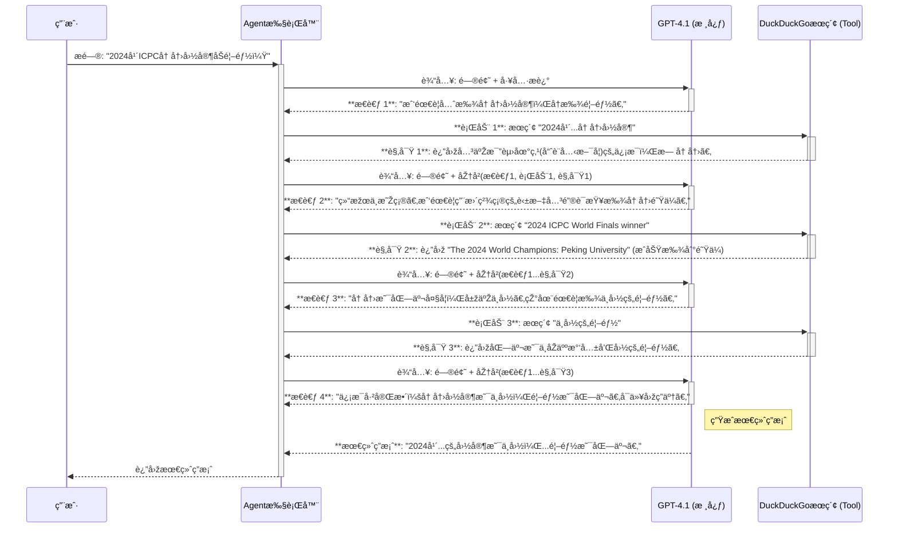


这张图清晰地æ­ç¤ºäº† ReAct Agent 的“æ€è€ƒè¿‡ç¨‹â€ï¼š

1. **åˆå§‹è§„划**: **Agent** 接收到**用户**çš„å¤åˆé—®é¢˜åŽï¼Œå†…部的 **LLM** 首先进行**æ€è€ƒ1**，将任务分解为两个å­ä»»åŠ¡ï¼šå…ˆæ‰¾å† å†›å›½å®¶ï¼Œå†æ‰¾é¦–都。
2. **第一次循环 (试探与å馈)**:
   - **Agent** æ ¹æ®**æ€è€ƒ1**执行**行动1**，调用**æœç´¢å·¥å…·**。
   - 工具返回的**观察1**并ä¸ç†æƒ³ï¼Œæ²¡æœ‰ç›´æŽ¥ç­”案。这个å馈至关é‡è¦ã€‚
3. **第二次循环 (æ ¹æ®å馈调整)**:
   - **Agent** 将包括失败的**观察1**在内的所有历å²ä¿¡æ¯ä¼ å›žç»™ **LLM**。
   - **LLM** 进行**æ€è€ƒ2**，分æžå¤±è´¥åŽŸå› å¹¶å†³å®šæ”¹å˜ç­–略——使用更精确的英文关键è¯ã€‚
   - æ–°çš„**行动2**带æ¥äº†æˆåŠŸçš„**观察2**，找到了关键信æ¯â€œåŒ—京大学â€ã€‚
4. **第三次循环 (解决å­ä»»åŠ¡)**:
   - **LLM** 进行**æ€è€ƒ3**，它首先进行了一步**推ç†**（北京大学 -> 中国），然åŽç¡®å®šäº†ä¸‹ä¸€ä¸ªè¡ŒåŠ¨ç›®æ ‡ï¼ˆæ‰¾ä¸­å›½çš„首都）。
   - **行动3**å’Œ**观察3**顺利解决了第二个å­é—®é¢˜ã€‚
5. **第四次循环 (总结与输出)**:
   - **LLM** 进行**æ€è€ƒ4**，确认所有必需信æ¯éƒ½å·²é›†é½ã€‚
   - 它ä¸å†ç”Ÿæˆæ–°çš„行动，而是生æˆ**最终答案 (Final Answer)**。
   - **Agent** 将这个最终答案返回给**用户**。

这个æµç¨‹å®Œç¾Žåœ°è¯ é‡Šäº† **ReAct** 的核心æ€æƒ³ï¼šå®ƒä¸æ˜¯ä¸€æ¬¡æ€§è§„划，而是一个**动æ€ã€è¿­ä»£**的过程。æ¯ä¸€æ­¥çš„观察都会æˆä¸ºä¸‹ä¸€æ­¥æ€è€ƒçš„ä¾æ®ï¼Œä½¿å¾— Agent 能够处ç†ä¸ç¡®å®šæ€§ï¼Œå¹¶ä»Žå¤±è´¥çš„å°è¯•ä¸­å­¦ä¹ å’Œè°ƒæ•´ã€‚

### hwchase17/react 介ç»

"hwchase17" 是 LangChain 的创始人 Harrison Chase 的用户å，这个模æ¿æ˜¯ä»–创建并分享到 LangChain Hub 上的。

```python
# 从 LangChain Hub èŽ·å– ReAct æ示模æ¿
prompt = hub.pull("hwchase17/react")
```

 这行代ç ç”¨äºŽä»Ž LangChain Hub 拉å–一个著å且官方内置的 ReAct agent æ示è¯æ¨¡ç‰ˆï¼ˆprompt template），其å称为"hwchase17/react"。这个模版为构建 ReAct 类型智能体（ReActå³Reason + Act，推ç†ä¸Žè¡ŒåŠ¨ååŒï¼‰æ供了标准的æ示上下文。

- **“hwchase17/reactâ€** 是被 LangChain 官方维护ã€å¹¿æ³›ä½¿ç”¨çš„一个 ReAct Agent æ示è¯æ¨¡ç‰ˆã€‚
- 其核心æ€æƒ³æ¥è‡ªè®ºæ–‡ã€ŠReAct: Synergizing Reasoning and Acting in Language Models》（https://arxiv.org/abs/2210.03629）。通过åºåˆ—化地让语言模型“æ€è€ƒï¼ˆReason）→采å–行动（Act）→观察结果→继续æ€è€ƒ/行动â€ï¼Œæœ‰æ•ˆæå‡ LLM 在å¤æ‚多步骤推ç†å’Œå·¥å…·è°ƒç”¨åœºæ™¯ä¸‹çš„表现。

prompt的内容结构：

```
Answer the following questions as best you can. You have access to the following tools:

{tools}

Use the following format:

Question: the input question you must answer
Thought: you should always think about what to do
Action: the action to take, should be one of [{tool_names}]
Action Input: the input to the action
Observation: the result of the action
... (this Thought/Action/Action Input/Observation can repeat N times)
Thought: I now know the final answer
Final Answer: the final answer to the original input question

Begin!

Question: {input}
Thought:{agent_scratchpad}
```

- 其中，`{tools}`ã€`{tool_names}`ã€`{input}`ã€`{agent_scratchpad}` 都是在 Agent 执行阶段动æ€å¡«å……çš„å˜é‡ã€‚

下é¢æ˜¯ä¸­æ–‡ç¿»è¯‘：

```
请尽å¯èƒ½å®Œæ•´åœ°å›žç­”以下问题。您å¯ä»¥ä½¿ç”¨ä»¥ä¸‹å·¥å…·ï¼š

{tools}

使用以下格å¼ï¼š

问题：您必须回答的输入问题
想法：您应该始终æ€è€ƒè¦åšä»€ä¹ˆ
行动：è¦é‡‡å–的行动，应为 [{tool_names}] 之一
行动输入：行动的输入
观察：行动的结果
……（此想法/行动/行动输入/观察å¯ä»¥é‡å¤ N 次）
想法：我现在知é“最终答案了
最终答案：原始输入问题的最终答案

开始ï¼

问题：{input}
想法：{agent_scratchpad}
```

**工作方å¼ï¼š**

- Agent（智能体）æ¯æ¬¡ä¼šæŒ‰ç…§ä¸Šè¿°æ ¼å¼ä½œç­”：先æ€è€ƒï¼ˆThought），然åŽå†³å®šæ˜¯å¦ä½¿ç”¨æŸä¸ªå·¥å…·ï¼ˆAction），填写输入（Action Input），拿到结果（Observation），å†ç»§ç»­ä¸‹ä¸€è½®ï¼Œç›´åˆ°å¾—出最终答案（Final Answer）。
- è¿™ç§æ ¼å¼ä¿ƒä½¿ LLM 把推ç†è¿‡ç¨‹å’Œè¡ŒåŠ¨æ˜¾æ€§åŒ–，使其对“何时用工具ã€å¦‚何使用â€æœ‰æ˜Žç¡®æŒ‡å¯¼ã€‚
- 若使用带èŠå¤©åŽ†å²çš„æ示，å¯åˆ‡æ¢ä¸º"hwchase17/react-chat"等。

**引用文献:**

*   **原始论文:** "ReAct: Synergizing Reasoning and Acting in Language Models" by Shunyu Yao, et al. ([https://arxiv.org/abs/2210.03629](https://arxiv.org/abs/2210.03629))

## **2. Plan-and-Execute**

### **模å¼ä»‹ç»:**

Plan-and-Execute 模å¼å°†å¤æ‚的任务分解为两个核心阶段：规划（Planning）和执行（Execution）。与ReAct模å¼çš„交错å¼æŽ¨ç†å’Œè¡ŒåŠ¨ä¸åŒï¼Œè¯¥æ¨¡å¼é¦–先由一个“规划器â€ï¼ˆPlanner）LLM为整个任务制定一个详细的ã€åˆ†æ­¥éª¤çš„计划。然åŽï¼Œä¸€ä¸ªæˆ–多个“执行器â€ï¼ˆExecutor）Agentè´Ÿè´£é€ä¸€å®Œæˆè®¡åˆ’中的æ¯ä¸ªå­ä»»åŠ¡ã€‚

1.  **规划器 (Planner):** 首先，一个通常由强大 LLM 驱动的规划器会接收用户请求，并将其分解æˆä¸€ä¸ªè¯¦ç»†çš„ã€å¤šæ­¥éª¤çš„计划。 这个计划明确了需è¦æ‰§è¡Œçš„一系列å­ä»»åŠ¡ã€‚
2.  **执行器 (Executor):** 然åŽï¼Œä¸€ä¸ªæˆ–多个执行器（å¯ä»¥æ˜¯å¦ä¸€ä¸ª Agent 或特定的工具）会按照计划é€ä¸€æ‰§è¡Œè¿™äº›å­ä»»åŠ¡ã€‚ 执行阶段å¯ä»¥ä½¿ç”¨æ›´å°ã€æ›´ä¸“注的模型，从而é™ä½Žæˆæœ¬å’Œå»¶è¿Ÿã€‚

è¿™ç§æ¨¡å¼çš„优势在于它能够进行更长远的规划，并且在执行过程中更加高效和稳定。

**Mermaid 图:**

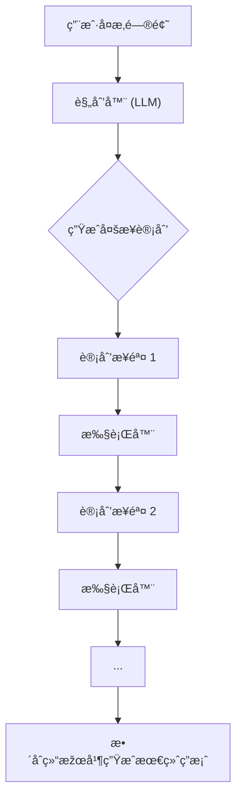

### **Python 代ç æ¡ˆä¾‹ (LangChain):**

```python
import os
from dotenv import load_dotenv

from langchain_openai import ChatOpenAI
from langchain.chains import LLMMathChain
from langchain.tools import Tool
from langchain_experimental.plan_and_execute import PlanAndExecute, load_agent_executor, load_chat_planner
from langchain_community.tools import DuckDuckGoSearchRun

# --- é…置区 ---
load_dotenv()

QUESTION = "求中国北京ã€ä¸Šæµ·ã€å¹¿å·žã€æ·±åœ³çš„人å£æ€»å’Œ"


# --- ä¸»ç¨‹åº ---
def main():
    # 1. 定义语言模型
    planner_llm = ChatOpenAI(model="gpt-4.1", temperature=0)
    executor_llm = ChatOpenAI(model="gpt-4.1", temperature=0)

    # 2. 定义执行器è¦ä½¿ç”¨çš„工具 (æœç´¢ + 计算器)
    class LoggingDuckDuckGoSearchRun(DuckDuckGoSearchRun):
        """
        一个自定义的DuckDuckGoSearchRun版本，它会清晰地打å°è¾“入和输出。
        """

        def _run(self, query: str) -> str:
            """é‡å†™_run方法以添加日志记录。"""
            print("\n" + "=" * 30)
            print(f"🔎 [DuckDuckGo] 正在æœç´¢: {query}")
            print("=" * 30)

            # 调用父类的原始_run方法æ¥æ‰§è¡Œå®žé™…çš„æœç´¢
            result = super()._run(query)

            print("\n" + "-" * 30)
            print(f"📄 [DuckDuckGo] 收到结果:")
            # 为了å¯è¯»æ€§ï¼Œå¯ä»¥åªæ‰“å°ç»“果的一部分
            print(result[:500] + "..." if len(result) > 500 else result)
            print("-" * 30 + "\n")

            return result

    search = LoggingDuckDuckGoSearchRun()

    # 创建一个由 LLM 驱动的数学计算链
    llm_math_chain = LLMMathChain.from_llm(llm=executor_llm, verbose=True)

    tools = [
        Tool(
            name="Search",
            func=search.run,
            description="当你需è¦å›žç­”关于时事ã€äº‹å®žå’Œæ•°æ®çš„问题时éžå¸¸æœ‰ç”¨ã€‚用于查找信æ¯ã€‚",
        ),
        Tool(
            name="Calculator",
            func=llm_math_chain.run,
            description="当你需è¦è¿›è¡Œæ•°å­¦è®¡ç®—或回答关于数学的问题时éžå¸¸æœ‰ç”¨ã€‚输入应该是一个完整的数学表达å¼ã€‚",
        )
    ]

    # 3. 创建计划器 (Planner) 和执行器 (Executor)
    planner = load_chat_planner(planner_llm)
    # 将包å«ä¸¤ä¸ªå·¥å…·çš„列表传递给执行器
    executor = load_agent_executor(executor_llm, tools, verbose=True)

    # 4. 组装 Plan-and-Execute 智能体
    agent = PlanAndExecute(planner=planner, executor=executor, verbose=True)

    # --- 打å°è¾“å…¥ ---
    print("--- 用户输入 ---")
    print(f"问题: {QUESTION}\n")
    print("--- Agent 开始执行 (详细过程如下) ---")

    # 5. è¿è¡Œæ™ºèƒ½ä½“
    try:
        result = agent.invoke({"input": QUESTION})
        final_answer = result.get('output', '未能获å–最终答案。')

        # --- 打å°æœ€ç»ˆè¾“出 ---
        print("\n--- Agent 执行完毕 ---")
        print(f"\n[问题]: {QUESTION}")
        print(f"[最终答案]: {final_answer}")

    except Exception as e:
        print(f"\n--- å‘生错误 ---")
        print(f"在 Agent 执行过程中出现错误: {e}")


if __name__ == "__main__":
    main()

```

### **输出：**

````sh
--- 用户输入 ---
问题: 求中国北京ã€ä¸Šæµ·ã€å¹¿å·žã€æ·±åœ³çš„人å£æ€»å’Œ

--- Agent 开始执行 (详细过程如下) ---


> Entering new PlanAndExecute chain...
steps=[Step(value='查找中国北京ã€ä¸Šæµ·ã€å¹¿å·žã€æ·±åœ³å››ä¸ªåŸŽå¸‚的最新人å£æ•°æ®ï¼ˆä»¥2023年或最近官方公布数æ®ä¸ºå‡†ï¼‰ã€‚'), Step(value='将四个城市的人å£æ•°æ®ç›¸åŠ ï¼Œè®¡ç®—总和。'), Step(value='给出四个城市人å£æ€»å’Œçš„答案。'), Step(value="Given the above steps taken, please respond to the user's original question.")]

> Entering new AgentExecutor chain...
Action:
```
{
  "action": "Search",
  "action_input": "中国北京ã€ä¸Šæµ·ã€å¹¿å·žã€æ·±åœ³2023年或最近官方公布人å£æ•°æ®"
}
```
==============================
🔎 [DuckDuckGo] 正在æœç´¢: 中国北京ã€ä¸Šæµ·ã€å¹¿å·žã€æ·±åœ³2023年或最近官方公布人å£æ•°æ®
==============================

------------------------------
📄 [DuckDuckGo] 收到结果:
Apr 29, 2024 · æ­¤å‰ï¼Œ 北京 〠上海 〠广州 陆续披露了 20 23 年底常ä½äººå£ æ•°æ® ï¼Œä¸‰è€…åˆ†åˆ«å¢žé•¿1.5万人ã€11.56万人ã€9.29万人。 常ä½äººå£æ•°â€œé‡å›žæ­£è½¨â€ Mar 9, 2024 · 开一个系列，记录æ¯ä¸ªåŸŽå¸‚çš„ 常ä½äººå£ å˜åŒ–， æ•°æ® çš„ä¸»è¦æ¥æºæ˜¯å„çœã€åŸŽå¸‚çš„ äººå£ ç›¸å…³æŠ¥å‘Šã€ç»Ÿè®¡å…¬æŠ¥ã€æ”¿åºœå®˜ç½‘和统计年鉴以åŠä¸€äº›ç›¸å…³ æ•°æ® çš„æŽ¨ç®—ã€‚ Apr 29, 2024 · æ ¹æ®å››åº§ä¸€çº¿åŸŽå¸‚公布的 20 23 å¹´ 常ä½äººå£æ•°æ®ï¼Œ 上海 〠北京 〠广州 〠深圳 20 23 年常ä½äººå£åˆ†åˆ«ä¸º2487.45万人ã€2185.8万人ã€1882.7万人ã€1779.01万人，增é‡åˆ†åˆ«ä¸º11.56万人ã€1.5万人ã€9.29万人ã€12.83万人。 Mar 26, 2024 · ç›®å‰æœ‰17个é‡ç‚¹åŸŽå¸‚公布了 20 23 å¹´ äººå£ æ•°æ® ï¼Œåˆè‚¥å¢žé‡æš‚æ—¶ä½å±…第一，且是目å‰å”¯ä¸€ä¸€ä¸ªå¢žé‡è¶…过20万的城市，æ­å·žã€æˆéƒ½ã€ 上海 ä½å±…å‰å››ï¼Œå¢žé‡éƒ½åœ¨10万以上。 Apr 29, 2024 · 公报显示， 20 23 年末，深圳市常ä½äººå£ä¸º1779.01万人，创历å²æ–°é«˜ï¼›æ¯”上年末增加12.83万人...
------------------------------


Observation: Apr 29, 2024 · æ­¤å‰ï¼Œ 北京 〠上海 〠广州 陆续披露了 20 23 年底常ä½äººå£ æ•°æ® ï¼Œä¸‰è€…åˆ†åˆ«å¢žé•¿1.5万人ã€11.56万人ã€9.29万人。 常ä½äººå£æ•°â€œé‡å›žæ­£è½¨â€ Mar 9, 2024 · 开一个系列，记录æ¯ä¸ªåŸŽå¸‚çš„ 常ä½äººå£ å˜åŒ–， æ•°æ® çš„ä¸»è¦æ¥æºæ˜¯å„çœã€åŸŽå¸‚çš„ äººå£ ç›¸å…³æŠ¥å‘Šã€ç»Ÿè®¡å…¬æŠ¥ã€æ”¿åºœå®˜ç½‘和统计年鉴以åŠä¸€äº›ç›¸å…³ æ•°æ® çš„æŽ¨ç®—ã€‚ Apr 29, 2024 · æ ¹æ®å››åº§ä¸€çº¿åŸŽå¸‚公布的 20 23 å¹´ 常ä½äººå£æ•°æ®ï¼Œ 上海 〠北京 〠广州 〠深圳 20 23 年常ä½äººå£åˆ†åˆ«ä¸º2487.45万人ã€2185.8万人ã€1882.7万人ã€1779.01万人，增é‡åˆ†åˆ«ä¸º11.56万人ã€1.5万人ã€9.29万人ã€12.83万人。 Mar 26, 2024 · ç›®å‰æœ‰17个é‡ç‚¹åŸŽå¸‚公布了 20 23 å¹´ äººå£ æ•°æ® ï¼Œåˆè‚¥å¢žé‡æš‚æ—¶ä½å±…第一，且是目å‰å”¯ä¸€ä¸€ä¸ªå¢žé‡è¶…过20万的城市，æ­å·žã€æˆéƒ½ã€ 上海 ä½å±…å‰å››ï¼Œå¢žé‡éƒ½åœ¨10万以上。 Apr 29, 2024 · 公报显示， 20 23 年末，深圳市常ä½äººå£ä¸º1779.01万人，创历å²æ–°é«˜ï¼›æ¯”上年末增加12.83万人，åŒæ¯”增长0.73%，增é‡ä½å±…北上广深之首。
Thought:Action:
```
{
  "action": "Final Answer",
  "action_input": "æ ¹æ®2023年或最近官方公布的数æ®ï¼Œå››ä¸ªåŸŽå¸‚的常ä½äººå£å¦‚下：\n\n- 北京：2185.8万人\n- 上海：2487.45万人\n- 广州：1882.7万人\n- 深圳：1779.01万人\n\næ•°æ®æ¥æºäºŽå„城市2023年末官方统计公报。"
}
```

> Finished chain.
*****

Step: 查找中国北京ã€ä¸Šæµ·ã€å¹¿å·žã€æ·±åœ³å››ä¸ªåŸŽå¸‚的最新人å£æ•°æ®ï¼ˆä»¥2023年或最近官方公布数æ®ä¸ºå‡†ï¼‰ã€‚

Response: æ ¹æ®2023年或最近官方公布的数æ®ï¼Œå››ä¸ªåŸŽå¸‚的常ä½äººå£å¦‚下：

- 北京：2185.8万人
- 上海：2487.45万人
- 广州：1882.7万人
- 深圳：1779.01万人

æ•°æ®æ¥æºäºŽå„城市2023年末官方统计公报。

> Entering new AgentExecutor chain...
Action:
```
{
  "action": "Calculator",
  "action_input": "2185.8 + 2487.45 + 1882.7 + 1779.01"
}
```

> Entering new LLMMathChain chain...
2185.8 + 2487.45 + 1882.7 + 1779.01```text
2185.8 + 2487.45 + 1882.7 + 1779.01
```
...numexpr.evaluate("2185.8 + 2487.45 + 1882.7 + 1779.01")...
Answer: 8334.96
> Finished chain.

Observation: Answer: 8334.96
Thought:{
  "action": "Final Answer",
  "action_input": "北京ã€ä¸Šæµ·ã€å¹¿å·žã€æ·±åœ³å››ä¸ªåŸŽå¸‚的常ä½äººå£æ€»å’Œä¸º8334.96万人。"
}

> Finished chain.
*****

Step: 将四个城市的人å£æ•°æ®ç›¸åŠ ï¼Œè®¡ç®—总和。

Response: {
  "action": "Final Answer",
  "action_input": "北京ã€ä¸Šæµ·ã€å¹¿å·žã€æ·±åœ³å››ä¸ªåŸŽå¸‚的常ä½äººå£æ€»å’Œä¸º8334.96万人。"
}

> Entering new AgentExecutor chain...
{
  "action": "Final Answer",
  "action_input": "北京ã€ä¸Šæµ·ã€å¹¿å·žã€æ·±åœ³å››ä¸ªåŸŽå¸‚的常ä½äººå£æ€»å’Œä¸º8334.96万人。"
}

> Finished chain.
*****

Step: 给出四个城市人å£æ€»å’Œçš„答案。

Response: {
  "action": "Final Answer",
  "action_input": "北京ã€ä¸Šæµ·ã€å¹¿å·žã€æ·±åœ³å››ä¸ªåŸŽå¸‚的常ä½äººå£æ€»å’Œä¸º8334.96万人。"
}

> Entering new AgentExecutor chain...
{
  "action": "Final Answer",
  "action_input": "æ ¹æ®2023年或最近官方公布的数æ®ï¼ŒåŒ—京ã€ä¸Šæµ·ã€å¹¿å·žã€æ·±åœ³å››ä¸ªåŸŽå¸‚的常ä½äººå£æ€»å’Œä¸º8334.96万人。"
}

> Finished chain.
*****

Step: Given the above steps taken, please respond to the user's original question.

Response: {
  "action": "Final Answer",
  "action_input": "æ ¹æ®2023年或最近官方公布的数æ®ï¼ŒåŒ—京ã€ä¸Šæµ·ã€å¹¿å·žã€æ·±åœ³å››ä¸ªåŸŽå¸‚的常ä½äººå£æ€»å’Œä¸º8334.96万人。"
}
> Finished chain.

--- Agent 执行完毕 ---

[问题]: 求中国北京ã€ä¸Šæµ·ã€å¹¿å·žã€æ·±åœ³çš„人å£æ€»å’Œ
[最终答案]: {
  "action": "Final Answer",
  "action_input": "æ ¹æ®2023年或最近官方公布的数æ®ï¼ŒåŒ—京ã€ä¸Šæµ·ã€å¹¿å·žã€æ·±åœ³å››ä¸ªåŸŽå¸‚的常ä½äººå£æ€»å’Œä¸º8334.96万人。"
}
````

### **代ç æ•´ä½“æµç¨‹ï¼š**

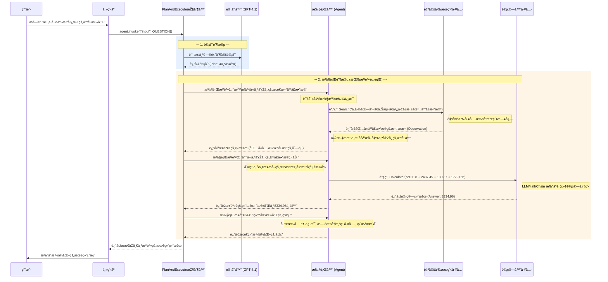

这张图æ­ç¤ºäº† Plan-and-Execute 模å¼çš„几个关键特点：

1. **å¯åŠ¨ä¸Žè®¡åˆ’**：
   - æµç¨‹ç”± **用户** å‘起，**主程åº** 调用 PlanAndExecute **控制器**。
   - **控制器** 首先将任务委托给 **计划器**。根æ®æ‚¨çš„输出，**计划器** 制定了一个éžå¸¸æ¸…晰的四步计划：1. æŸ¥æ‰¾æ•°æ® -> 2. 计算 -> 3. 给出答案 -> 4. 最终å“应。
2. **执行步骤 1: 查找数æ®**
   - **控制器** 将计划的**第一步**（“查找...人å£æ•°æ®â€ï¼‰äº¤ç»™ **执行器**。
   - **执行器** 分æžä»»åŠ¡åŽï¼Œåˆ¤æ–­éœ€è¦ä½¿ç”¨**æœç´¢å·¥å…·**。它构建了一个精确的æœç´¢æŸ¥è¯¢ï¼Œå¹¶è°ƒç”¨äº†æ‚¨çš„自定义æœç´¢å·¥å…·ã€‚
   - **æœç´¢å·¥å…·** 执行æœç´¢å¹¶è¿”回一大段文本（Observation）。
   - **执行器** 接ç€å‘挥其强大的语言ç†è§£èƒ½åŠ›ï¼Œä»Žè¿”回的éžç»“构化文本中准确地**æå–**出了四个城市的人å£æ•°å­—，并完æˆäº†ç¬¬ä¸€æ­¥çš„任务。
3. **执行步骤 2: 计算总和**
   - **控制器** 将计划的**第二步**（“将...æ•°æ®ç›¸åŠ â€ï¼‰ä»¥åŠä¸Šä¸€æ­¥çš„上下文（æå–出的数字）交给 **执行器**。
   - **执行器** 分æžä»»åŠ¡åŽï¼Œåˆ¤æ–­å‡ºéœ€è¦è¿›è¡Œæ•°å­¦è¿ç®—，于是选择了**计算器工具**。它将æå–出的数字构建æˆä¸€ä¸ªæ•°å­¦è¡¨è¾¾å¼ “2185.8 + 2487.45 + ...â€ã€‚
   - **计算器工具** (LLMMathChain) 接收到表达å¼ï¼Œæ‰§è¡Œè®¡ç®—，并返回了精确的结果 8334.96。
4. **执行步骤 3 & 4: 总结**
   - 对于åŽç»­çš„总结步骤，**执行器** å·²ç»æ‹¥æœ‰äº†æ‰€æœ‰å¿…è¦çš„ä¿¡æ¯ï¼ˆåŸŽå¸‚列表ã€å„自人å£ã€æ€»å’Œï¼‰ï¼Œå› æ­¤å®ƒ**ä¸å†éœ€è¦è°ƒç”¨ä»»ä½•å·¥å…·**。它åªæ˜¯å°†å·²æœ‰ä¿¡æ¯æ•´åˆæˆé€šé¡ºçš„ã€ç¬¦åˆè¦æ±‚的最终答案。
5. **最终输出**：
   - **控制器** 收集了最åŽä¸€ä¸ªæ­¥éª¤çš„输出，并将其作为最终结果返回给 **主程åº**，最终呈现给 **用户**。

这个案例完美地展示了 Plan-and-Execute 模å¼å¦‚何å调一个**ä¿¡æ¯æ£€ç´¢å·¥å…·**和一个**逻辑计算工具**，分步ã€æ¸…晰地解决一个需è¦å¤šé‡èƒ½åŠ›æ‰èƒ½å®Œæˆçš„å¤æ‚问题。


**引用文献:**

*   **相关论文:** "Plan-and-Solve Prompting: Improving Zero-Shot Chain-of-Thought Reasoning in Large Language Models" by Lei Wang, et al. ([https://arxiv.org/abs/2305.04091](https://arxiv.org/abs/2305.04091))

## 3. Chain-of-Though

### **模å¼ä»‹ç»:**

æ€ç»´é“¾ï¼ˆChain-of-Thought, CoT）是一ç§æ示工程技术，旨在æå‡å¤§åž‹è¯­è¨€æ¨¡åž‹åœ¨å¤„ç†éœ€è¦å¤šæ­¥æŽ¨ç†çš„å¤æ‚任务时的表现。 传统上，直接å‘模型æé—®å¯èƒ½ä¼šå¾—到一个看似正确但缺ä¹æŽ¨ç†è¿‡ç¨‹çš„答案。CoT 通过在æ示中加入一系列中间推ç†æ­¥éª¤ï¼Œå¼•å¯¼æ¨¡åž‹æ¨¡ä»¿äººç±»çš„æ€ç»´è¿‡ç¨‹ï¼Œå°†å¤æ‚问题分解为更å°ã€æ›´æ˜“于管ç†çš„部分，从而é€æ­¥å¾—出最终结论。这ç§æ–¹æ³•ä¸ä»…æ高了答案的准确性，也使得模型的推ç†è¿‡ç¨‹æ›´åŠ é€æ˜Žå’Œå¯è§£é‡Šã€‚
CoT 主è¦æœ‰ä¸¤ç§å½¢å¼ï¼š

- Zero-shot CoT: 在æ问的最åŽç®€å•åœ°åŠ ä¸Šä¸€å¥â€œè®©æˆ‘们一步一步地æ€è€ƒâ€ï¼ˆLet's think step by step），就能显著æå‡æ¨¡åž‹çš„推ç†èƒ½åŠ›ã€‚
- Few-shot CoT: 在æ示中æ供一到两个包å«é—®é¢˜ã€æŽ¨ç†æ­¥éª¤å’Œç­”案的完整示例，让模型在回答新问题时能够更好地模仿这ç§æŽ¨ç†æ¨¡å¼ã€‚

**Mermaid 图:**

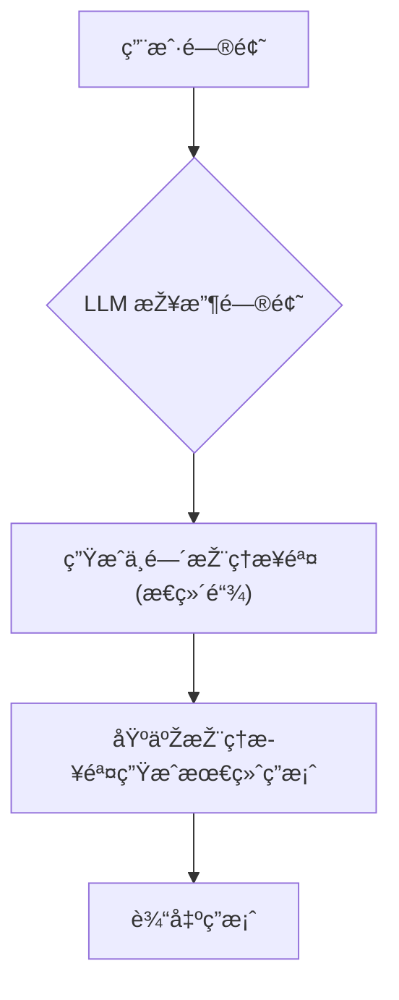

### **Python 代ç æ¡ˆä¾‹ (LangChain):**

```python
from dotenv import load_dotenv
from langchain_openai import ChatOpenAI
from langchain_core.prompts import PromptTemplate
from langchain_core.output_parsers import StrOutputParser

# --- é…置区 ---
load_dotenv()

llm = ChatOpenAI(model="gpt-4.1", temperature=1)

prompt = PromptTemplate(
    input_variables=["question"],
    template="""
    问题: {question}

    回答: 让我们一步一步地æ€è€ƒã€‚
    """
)

# 使用LCEL（LangChain Expression Language）构建链
# 管é“符 | å°†æ示ã€æ¨¡åž‹å’Œè¾“出解æžå™¨è¿žæŽ¥èµ·æ¥
chain = prompt | llm | StrOutputParser()

question = "如果一个篮å­é‡Œæœ‰5个苹果，你拿走了2个，然åŽåˆæ”¾å›žäº†1个，篮å­é‡ŒçŽ°åœ¨æœ‰å¤šå°‘个苹果？"

# 调用链
response = chain.invoke({"question": question})

print(response)

```

### **输出：**

```sh
好的，我们æ¥ä¸€æ­¥ä¸€æ­¥åˆ†æžè¿™ä¸ªé—®é¢˜ï¼š

1. 篮å­é‡Œæœ€å¼€å§‹æœ‰ 5 个苹果。  
2. 你拿走了 2 个苹果，篮å­é‡Œè¿˜å‰©ä¸‹ 5-2=3 个苹果。
3. 然åŽä½ åˆæŠŠ 1 个苹果放回篮å­é‡Œï¼Œç¯®å­é‡Œå°±å˜æˆ 3+1=4 个苹果。

**所以，篮å­é‡ŒçŽ°åœ¨æœ‰ 4 个苹果。**
```

**代ç æ•´ä½“æµç¨‹ï¼š**

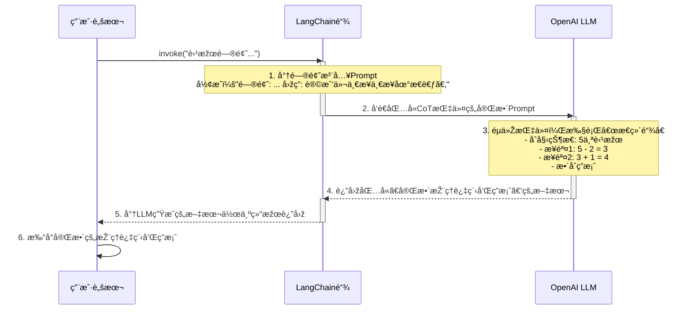

### **代ç æ•´ä½“æµç¨‹ï¼š**

1. **注入指令**: LangChain链首先将你的问题和固定的æ€ç»´é“¾æŒ‡ä»¤ "让我们一步一步地æ€è€ƒã€‚" 组åˆæˆä¸€ä¸ªå®Œæ•´çš„Prompt。
2. **触å‘LLM**: 这个包å«äº†æ˜Žç¡®æŒ‡ä»¤çš„Prompt被å‘é€ç»™OpenAI LLM。
3. **执行æ€ç»´é“¾**: LLM识别到这个指令åŽï¼Œä¸ä¼šç›´æŽ¥è®¡ç®—结果，而是模拟人类的æ€è€ƒæ–¹å¼ï¼Œç”Ÿæˆä»Žåˆå§‹çŠ¶æ€åˆ°æ¯ä¸€æ­¥è®¡ç®—，最åŽå¾—出结论的完整文本。
4. **返回完整æ€è€ƒè¿‡ç¨‹**: LLM将整个“æ€è€ƒè¿‡ç¨‹â€çš„文本一次性返回。这就是为什么你的输出包å«äº†æ‰€æœ‰æ­¥éª¤ï¼Œè€Œä¸ä»…仅是数字“4â€ã€‚

**引用文献:**

*   **原始论文:** "Chain-of-Thought Prompting Elicits Reasoning in Large Language Models" by Jason Wei, et al. ([https://arxiv.org/abs/2201.11903](https://arxiv.org/abs/2201.11903))

## 4. Self-Ask

### **模å¼ä»‹ç»:**

Self-Ask 是一ç§å»ºç«‹åœ¨æ€ç»´é“¾ä¹‹ä¸Šçš„推ç†æ¨¡å¼ï¼Œå®ƒé€šè¿‡å¼•å¯¼æ¨¡åž‹è‡ªæˆ‘æ问和回答中间问题æ¥è§£å†³æ›´å¤æ‚的问题。当模型é‡åˆ°ä¸€ä¸ªç›´æŽ¥æ— æ³•å›žç­”的问题时，Self-Ask 模å¼ä¼šä¿ƒä½¿æ¨¡åž‹å°†é—®é¢˜åˆ†è§£ä¸ºä¸€ç³»åˆ—åŽç»­é—®é¢˜ï¼Œå¹¶åˆ©ç”¨å¤–部工具（如æœç´¢å¼•æ“Žï¼‰æ¥å¯»æ‰¾è¿™äº›å­é—®é¢˜çš„答案。这ç§æ–¹æ³•æ˜Žç¡®åœ°å±•ç¤ºäº†æ¨¡åž‹çš„推ç†è¿‡ç¨‹ï¼Œå¹¶é€šè¿‡å°†å¤æ‚问题分解为å¯ä»¥ç‹¬ç«‹éªŒè¯çš„简å•é—®é¢˜ï¼Œæ高了最终答案的å¯é æ€§ã€‚

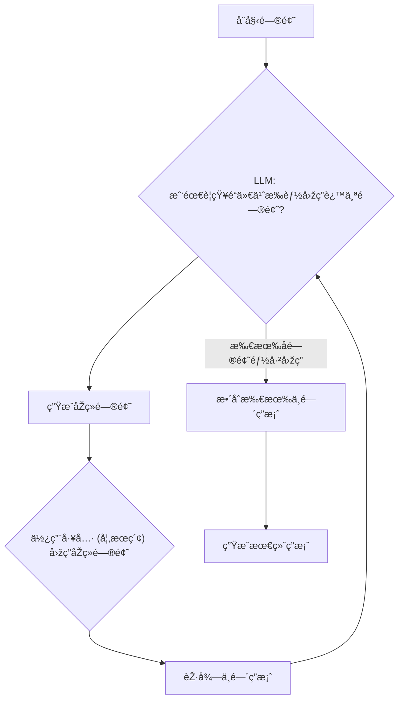

### **Python代ç æ¡ˆä¾‹ (LangChain):**

```python
import os
from dotenv import load_dotenv
from langchain_openai import ChatOpenAI
from langchain.agents import initialize_agent, AgentType
from langchain.tools import Tool
from typing import Dict

# --- 1. 环境与模型设置 ---
def setup_environment():
    """加载环境å˜é‡å¹¶åˆå§‹åŒ–LLM。"""
    load_dotenv()
    if not os.getenv("OPENAI_API_KEY"):
        raise ValueError("请在 .env 文件中设置 OPENAI_API_KEY")

    # 为了演示，我们å¯ä»¥ä½¿ç”¨ä»»ä½•æ”¯æŒçš„èŠå¤©æ¨¡åž‹
    llm = ChatOpenAI(model="gpt-4.1", temperature=0)
    return llm

# --- 2. 核心部分: 创建一个模拟的æœç´¢å·¥å…· ---
class MockSearchTool:
    """
    一个模拟的æœç´¢å·¥å…·ç±»ã€‚
    它ä¸è¿›è¡Œä»»ä½•çœŸå®žçš„网络æœç´¢ï¼Œè€Œæ˜¯ä»Žä¸€ä¸ªé¢„设的答案库中返回结果。
    """
    def __init__(self, answers: Dict[str, str]):
        self.answers = answers

    def run(self, query: str) -> str:
        """
        模拟è¿è¡Œæœç´¢ã€‚
        接收一个查询，并从答案库中查找答案。
        """
        print(f"\n--- [Mock Tool] 接收到查询: '{query}' ---")

        # 为了模拟真实情况，我们进行模糊匹é…
        for key, value in self.answers.items():
            if key in query:
                print(f"--- [Mock Tool] 在知识库中找到答案: '{value}' ---\n")
                return value

        default_answer = "在模拟知识库中未找到相关信æ¯ã€‚"
        print(f"--- [Mock Tool] 未找到答案，返回默认值: '{default_answer}' ---\n")
        return default_answer

# --- 3. 主执行逻辑 ---
def main():
    """构建并è¿è¡Œ Self-Ask 代ç†ã€‚"""
    llm = setup_environment()

    # 1. 定义我们的模拟知识库
    knowledge_base = {
        "《沙丘》的作者": "弗兰克·赫伯特",
        "弗兰克·赫伯特出生于": "1920年",
        "美国第一ä½æ€»ç»Ÿ": "乔治·åŽç››é¡¿",
        "乔治·åŽç››é¡¿çš„妻å­": "玛莎·åŽç››é¡¿",
        "美国第åå…­ä½æ€»ç»Ÿ": "亚伯拉罕·林肯",
        "亚伯拉罕·林肯的妻å­": "玛丽·托德·林肯"
    }

    # 2. 实例化我们的模拟工具
    mock_search = MockSearchTool(answers=knowledge_base)

    # 3. å°†æ¨¡æ‹Ÿå·¥å…·åŒ…è£…æˆ Agent 能调用的 Tool
    #    注æ„：func 指å‘的是 mock_search 实例的 .run 方法
    search_tool = Tool(
        name="Intermediate Answer",
        func=mock_search.run,
        description="用于当你需è¦å›žç­”关于事实ã€æ—¥æœŸã€äººç‰©ç­‰é—®é¢˜æ—¶ã€‚输入应该是一个æœç´¢æŸ¥è¯¢ã€‚"
    )

    tools = [search_tool]

    # 4. 使用 initialize_agent 构建代ç†
    agent_executor = initialize_agent(
        tools,
        llm,
        agent=AgentType.SELF_ASK_WITH_SEARCH,
        verbose=True, # verbose=True å¯ä»¥è®©æˆ‘们清晰地看到 Agent çš„æ€è€ƒè¿‡ç¨‹
        handle_parsing_errors=True,
        max_iterations=5
    )

    # 5. 定义问题并å¯åŠ¨ä»£ç†
    question = "è°æ˜¯ã€Šæ²™ä¸˜ã€‹çš„作者？他的出生年份是多少？"
    print("🚀 开始执行 Self-Ask ä»£ç† (使用 Mock 工具)...")
    print(f"ⓠ用户问题: {question}\n")

    response = agent_executor.invoke({"input": question})

    print("\n" + "=" * 20 + " ✅ 最终答案 " + "=" * 20)
    print(response["output"])
    print("=" * 55)

if __name__ == "__main__":
    main()
```

### **输出：**

```
🚀 开始执行 Self-Ask ä»£ç† (使用 Mock 工具)...
ⓠ用户问题: è°æ˜¯ã€Šæ²™ä¸˜ã€‹çš„作者？他的出生年份是多少？


> Entering new AgentExecutor chain...
Yes, follow up questions are needed.

Follow up: 《沙丘》的作者是è°ï¼Ÿ
--- [Mock Tool] 接收到查询: '《沙丘》的作者是è°ï¼Ÿ' ---
--- [Mock Tool] 在知识库中找到答案: '弗兰克·赫伯特' ---


Intermediate answer: 弗兰克·赫伯特
Follow up: 弗兰克·赫伯特出生于哪一年？
--- [Mock Tool] 接收到查询: '弗兰克·赫伯特出生于哪一年？' ---
--- [Mock Tool] 在知识库中找到答案: '1920年' ---


Intermediate answer: 1920å¹´
So the final answer is: 弗兰克·赫伯特，1920年

> Finished chain.

==================== ✅ 最终答案 ====================
弗兰克·赫伯特，1920年
=======================================================
```

### **代ç æ•´ä½“æµç¨‹ï¼š**

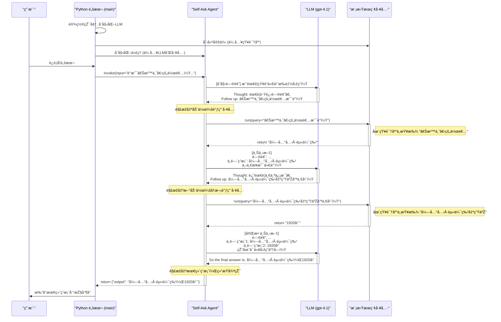


**引用文献**

- [Press, O., Zhang, M., Min, S., Schmidt, L., Smith, N. A., & Lewis, M. (2022). Measuring and Narrowing the Compositionality Gap in Language Models.](https://www.google.com/url?sa=E&q=https%3A%2F%2Farxiv.org%2Fabs%2F2210.03350)

## 5. Reflexion (åæ€)

### **模å¼ä»‹ç»:**

Reflexion是一ç§é€šè¿‡è¯­è¨€å馈æ¥å¼ºåŒ–智能体的框架。它使智能体能够对其过去的行动和结果进行“åæ€â€ï¼Œä»Žä¸­å¸å–教训，并将这些åæ€å­˜å‚¨åœ¨è®°å¿†ä¸­ï¼Œä»¥ä¾¿åœ¨æœªæ¥çš„å°è¯•ä¸­åšå‡ºæ›´å¥½çš„决策。这个过程通常包括三个主è¦éƒ¨åˆ†ï¼šä¸€ä¸ªæ‰§è¡Œä»»åŠ¡çš„“行动者â€ï¼ˆActor），一个评估行动者输出的“评估者â€ï¼ˆEvaluator），以åŠä¸€ä¸ªæ ¹æ®è¯„估结果生æˆåæ€æ–‡æœ¬çš„“åæ€è€…â€ï¼ˆSelf-Reflection）。通过这ç§è‡ªæˆ‘批判和改进的循环，智能体å¯ä»¥ä»Žé”™è¯¯ä¸­å­¦ä¹ ï¼Œè€Œæ— éœ€è¿›è¡Œæ˜‚贵的模型æƒé‡æ›´æ–°

**Mermaidæµç¨‹å›¾:**

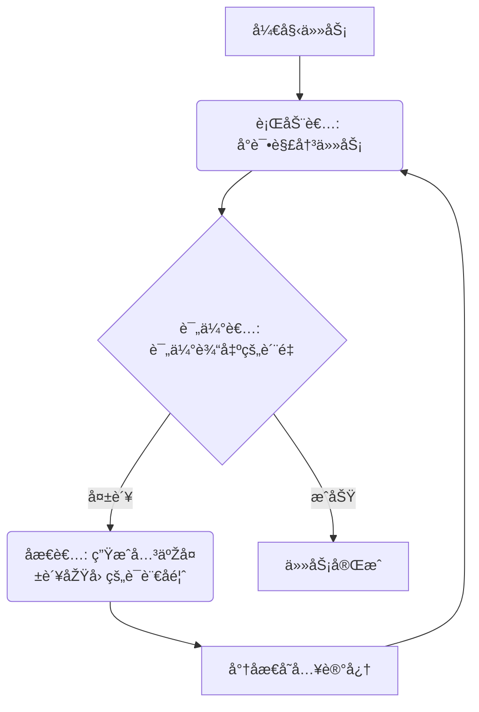


### **Python代ç æ¡ˆä¾‹ (Langgraph):**

---


````python
import os
import re
import random  # 跳表需è¦éšæœºæ•°
from typing import List, Dict, Any
from dotenv import load_dotenv
from langchain_openai import ChatOpenAI
from langchain_core.messages import BaseMessage, HumanMessage
from typing_extensions import TypedDict, Annotated
from langgraph.graph import StateGraph, END
from langgraph.graph.message import add_messages

# --- 1. 环境设置 (ä¸å˜) ---
load_dotenv()


# --- 2. å®šä¹‰å›¾çš„çŠ¶æ€ (State) (ä¸å˜) ---
class GraphState(TypedDict):
    messages: Annotated[List[BaseMessage], add_messages]
    generation: str
    attempts: int
    task: str


# --- 3. 定义图的节点 (Nodes) (ä¸å˜) ---
def generation_node(state: GraphState) -> Dict[str, Any]:
    """行动者节点：根æ®å½“å‰çŠ¶æ€ä¸­çš„消æ¯åŽ†å²ï¼Œç”Ÿæˆä»£ç ã€‚"""
    print(f"\n{'=' * 20} å°è¯•æ¬¡æ•°: {state['attempts'] + 1} {'=' * 20}")
    print("🧠 [Actor] 正在生æˆè§£å†³æ–¹æ¡ˆ...")

    llm = ChatOpenAI(model="model-router", temperature=0.3)
    response = llm.invoke(state["messages"])

    code_match = re.search(r"```python\n(.*?)```", response.content, re.DOTALL)
    generation = code_match.group(1).strip() if code_match else response.content.strip()

    print(f"📄 [Actor] 生æˆçš„代ç :\n{generation}")
    return {"messages": [response], "generation": generation, "attempts": state["attempts"] + 1}


def reflection_node(state: GraphState) -> Dict[str, List[BaseMessage]]:
    """åæ€è€…节点：分æžé”™è¯¯å¹¶ç”Ÿæˆæ”¹è¿›å»ºè®®ã€‚"""
    print("🤔 [Reflector] 正在åæ€é”™è¯¯...")

    previous_code = state["generation"]
    error_message = state["messages"][-1].content

    reflection_prompt = [HumanMessage(content=f"""
        你是一ä½é¡¶å°–的算法和数æ®ç»“构工程师。你之å‰ç”Ÿæˆçš„代ç æœªèƒ½é€šè¿‡æµ‹è¯•ã€‚

        **这是你上一次å°è¯•çš„代ç ï¼š**
        ```python
        {previous_code}
```
        **这是评估系统返回的错误信æ¯ï¼š**
        {error_message}
    
        请深刻åæ€ã€‚**ä¸è¦å®Œå…¨æŠ›å¼ƒä½ ä¹‹å‰çš„代ç ï¼Œè€Œæ˜¯åœ¨å®ƒçš„基础上进行修正。**
        分æžé”™è¯¯çš„核心原因，特别是在**指针æ“作ã€æœç´¢è·¯å¾„更新（update 数组）和概率性层级确定**æ–¹é¢çš„逻辑。
        你的目标是生æˆä¸€ä¸ªèƒ½å¤Ÿé€šè¿‡æ‰€æœ‰æµ‹è¯•çš„ã€å®Œæ•´ä¸”正确的 Python 代ç å—。""")]
    
    reflector_llm = ChatOpenAI(model="model-router", temperature=0)
    reflection = reflector_llm.invoke(reflection_prompt)
    
    print(f"💡 [Reflector] åæ€ä¸Žå»ºè®®:\n{reflection.content}")
    return {"messages": [reflection]}


# **核心修改**: 一个全新的ã€ç”¨äºŽæµ‹è¯•è·³è¡¨å®žçŽ°çš„评估节点
def check_code_node(state: GraphState) -> Dict[str, List[BaseMessage]]:
    """
    评估者节点：为跳表 (Skip List) 实现è¿è¡Œä¸¥æ ¼çš„å•å…ƒæµ‹è¯•ã€‚
    """
    print("âš™ï¸ [Evaluator] 正在评估代ç ...")

    full_code_to_execute = f"""
# AI 生æˆçš„代ç å°†åœ¨è¿™é‡Œ
{state["generation"]}

# --- 我们的测试代ç åœ¨è¿™é‡Œå¼€å§‹ ---
# ç¡®ä¿ random 库被导入，因为 AI 的代ç å¯èƒ½ä¾èµ–它
import random

# --- 测试 1: åˆå§‹åŒ–和基本结构 ---
print("🧪 [Evaluator] è¿è¡Œæµ‹è¯• 1: åˆå§‹åŒ–和基本结构")
sl = SkipList()
assert sl.head is not None, "测试失败: 跳表应有一个头节点。"
assert sl.level == 0, "测试失败: 空跳表的层级应为 0。"
print("✅ [Evaluator] 测试 1 通过ï¼")

# --- 测试 2: æ’入和æœç´¢ (æˆåŠŸè·¯å¾„) ---
print("🧪 [Evaluator] è¿è¡Œæµ‹è¯• 2: æ’入和æœç´¢ (æˆåŠŸè·¯å¾„)")
keys_to_insert = [3, 6, 7, 9, 12, 19, 17, 26, 21, 25]
for key in keys_to_insert:
    sl.insert(key)

for key in keys_to_insert:
    assert sl.search(key) is True, f"测试失败: æ’å…¥åŽçš„é”® {{key}} 未被找到。"
print("✅ [Evaluator] 测试 2 通过ï¼")

# --- 测试 3: æœç´¢ (失败路径) ---
print("🧪 [Evaluator] è¿è¡Œæµ‹è¯• 3: æœç´¢ (失败路径)")
keys_not_exist = [4, 8, 18, 30]
for key in keys_not_exist:
    assert sl.search(key) is False, f"测试失败: ä¸å­˜åœ¨çš„é”® {{key}} 被错误地找到了。"
print("✅ [Evaluator] 测试 3 通过ï¼")

# --- 测试 4: 删除æ“作 ---
print("🧪 [Evaluator] è¿è¡Œæµ‹è¯• 4: 删除æ“作")
keys_to_delete = [3, 9, 19]
keys_should_remain = [6, 7, 12, 17, 26, 21, 25]
for key in keys_to_delete:
    sl.delete(key)

for key in keys_to_delete:
    assert sl.search(key) is False, f"测试失败: 被删除的键 {{key}} ä»ç„¶å¯ä»¥è¢«æ‰¾åˆ°ã€‚"
for key in keys_should_remain:
    assert sl.search(key) is True, f"测试失败: 删除æ“作影å“了ä¸ç›¸å…³çš„é”® {{key}}。"
print("✅ [Evaluator] 测试 4 通过ï¼")

# --- 测试 5: 有åºæ€§éªŒè¯ ---
print("🧪 [Evaluator] è¿è¡Œæµ‹è¯• 5: 有åºæ€§éªŒè¯")
current = sl.head.forward[0]
sorted_list = []
while current:
    sorted_list.append(current.key)
    current = current.forward[0]
assert sorted_list == sorted(keys_should_remain), "测试失败: 底层链表ä¸æ»¡è¶³æœ‰åºæ€§ã€‚"
print("✅ [Evaluator] 测试 5 通过ï¼")
"""

    try:
        exec(full_code_to_execute, {"random": random})
    
        print("🎉 [Evaluator] 所有测试通过ï¼è·³è¡¨å®žçŽ°æ­£ç¡®ä¸”å¥å£®ï¼")
        message = HumanMessage(
            content="[评估结果]: 所有测试用例å‡å·²é€šè¿‡ã€‚代ç æ­£ç¡®å®žçŽ°äº†æœç´¢ã€æ’入和删除，并ä¿æŒäº†æœ‰åºæ€§ã€‚",
            name="evaluator"
        )
    except Exception as e:
        print(f"⌠[Evaluator] 测试失败: {e}")
        message = HumanMessage(
            content=f"[评估结果]: 代ç è¯„估失败，错误信æ¯: {e}",
            name="evaluator"
        )
    
    return {"messages": [message]}


# --- 4. 定义图的边 (Edges) (ä¸å˜) ---
def should_continue(state: GraphState) -> str:
    last_message = state["messages"][-1]
    if isinstance(last_message, HumanMessage) and last_message.name == "evaluator":
        if "所有测试用例å‡å·²é€šè¿‡" in last_message.content:
            return "end"

    if state["attempts"] >= 5:
        print("--- 达到最大å°è¯•æ¬¡æ•°ï¼Œç»“æŸæµç¨‹ ---")
        return "end"
    
    return "reflect"


# --- 5. 构建并è¿è¡Œå›¾ ---
def main():
    workflow = StateGraph(GraphState)
    # ... (图的构建与之å‰å®Œå…¨ç›¸åŒ)
    workflow.add_node("generate", generation_node)
    workflow.add_node("check_code", check_code_node)
    workflow.add_node("reflect", reflection_node)
    workflow.set_entry_point("generate")
    workflow.add_edge("generate", "check_code")
    workflow.add_edge("reflect", "generate")
    workflow.add_conditional_edges(
        "check_code", should_continue, {"reflect": "reflect", "end": END}
    )
    app = workflow.compile()

    # **核心修改**: 一个全新的ã€å†·é—¨ä¸”å¤æ‚的任务
    task = """
    请使用Python实现一个**跳表 (Skip List)**。
    
    你需è¦å®žçŽ°ä¸¤ä¸ªç±»ï¼š`Node` å’Œ `SkipList`。
    
    1.  `Node` ç±»:
        -   åº”åŒ…å« `key` (int) 属性。
        -   应包å«ä¸€ä¸ª `forward` 属性，它是一个列表，用于存放指å‘å„层级下一个节点的引用。
    
    2.  `SkipList` ç±»:
        -   应有一个 `max_level` (最大层数) å’Œ `p` (概率因å­) 作为åˆå§‹åŒ–å‚数。
        -   应有一个 `head` 节点，它是一个哨兵节点，ä¸å­˜å‚¨å®žé™…的键。
        -   应有一个 `level` 属性，记录当å‰è·³è¡¨çš„最高层级。
        -   需è¦å®žçŽ°ä»¥ä¸‹æ–¹æ³•ï¼š
            a. `random_level()`: 概率性地为新节点生æˆä¸€ä¸ªå±‚级。层级为 1 的概率是 1，为 2 的概率是 p，为 3 的概率是 p*p，以此类推，但ä¸è¶…过 `max_level`。
            b. `search(key)`: 查找一个键是å¦å­˜åœ¨ã€‚如果存在返回 `True`，å¦åˆ™è¿”回 `False`。
            c. `insert(key)`: æ’入一个键。**核心难点**：你必须从最高层开始查找，并记录下æ¯å±‚中需è¦è¢«æ›´æ–°çš„**å‰é©±èŠ‚点** (通常ä¿å­˜åœ¨ä¸€ä¸ª `update` 数组中)，然åŽåœ¨æ’入新节点时，使用这个数组æ¥æ­£ç¡®åœ°è¿žæŽ¥æŒ‡é’ˆã€‚
            d. `delete(key)`: 删除一个键。与æ’入类似，需è¦å…ˆæ‰¾åˆ°å¾…删除节点的所有å‰é©±èŠ‚点。
    
    请确ä¿ä½ çš„实现是å¥å£®çš„，并且能正确处ç†æŒ‡é’ˆçš„连接与断开。
    """
    initial_input = {
        "messages": [HumanMessage(content=task)], "attempts": 0, "task": task, "generation": ""
    }
    
    print("🚀 开始执行 Reflexion æµç¨‹ï¼ŒæŒ‘战冷门数æ®ç»“构：跳表...")
    app.invoke(initial_input)
    print("\nðŸ æµç¨‹ç»“æŸã€‚")


if __name__ == "__main__":
    main()
````

---


### **输出：**

````
🚀 开始执行 Reflexion æµç¨‹ï¼ŒæŒ‘战冷门数æ®ç»“构：跳表...

==================== å°è¯•æ¬¡æ•°: 1 ====================
🧠 [Actor] 正在生æˆè§£å†³æ–¹æ¡ˆ...
📄 [Actor] 生æˆçš„代ç :
import random

class Node:
    def __init__(self, key, level):
        self.key = key
        # forward 是一个列表，长度为 level，存放æ¯ä¸€å±‚的下一个节点引用
        self.forward = [None] * level

class SkipList:
    def __init__(self, max_level, p):
        self.max_level = max_level  # 最大层数
        self.p = p                  # 概率因å­
        self.level = 1              # 当å‰è·³è¡¨çš„最高层级，åˆå§‹ä¸º1
        self.head = Node(None, max_level)  # 哨兵节点，key为None，层数为max_level

    def random_level(self):
        lvl = 1
        # 以概率p决定是å¦æå‡å±‚级，最多ä¸è¶…过max_level
        while random.random() < self.p and lvl < self.max_level:
            lvl += 1
        return lvl
    
    def search(self, key):
        current = self.head
        # 从最高层开始往下查找
        for i in reversed(range(self.level)):
            # 在当å‰å±‚ä¸æ–­å‘å‰ç§»åŠ¨ï¼Œç›´åˆ°ä¸‹ä¸€ä¸ªèŠ‚点的key大于等于目标key
            while current.forward[i] and current.forward[i].key < key:
                current = current.forward[i]
        # 到了最底层，检查下一个节点是å¦æ˜¯ç›®æ ‡key
        current = current.forward[0]
        if current and current.key == key:
            return True
        return False
    
    def insert(self, key):
        update = [None] * self.max_level  # 记录æ¯å±‚需è¦æ›´æ–°çš„å‰é©±èŠ‚点
        current = self.head
    
        # 从最高层开始查找æ’å…¥ä½ç½®ï¼Œè®°å½•æ¯å±‚çš„å‰é©±èŠ‚点
        for i in reversed(range(self.level)):
            while current.forward[i] and current.forward[i].key < key:
                current = current.forward[i]
            update[i] = current
    
        # 到最底层的下一个节点
        current = current.forward[0]
    
        # 如果key已存在，直接返回（跳表ä¸å…许é‡å¤é”®ï¼‰
        if current and current.key == key:
            return
    
        # 生æˆæ–°èŠ‚点的层级
        lvl = self.random_level()
    
        # 如果新节点层级比当å‰è·³è¡¨å±‚级高，需è¦æ›´æ–°update数组的高层指å‘head
        if lvl > self.level:
            for i in range(self.level, lvl):
                update[i] = self.head
            self.level = lvl
    
        # 创建新节点
        new_node = Node(key, lvl)
    
        # æ’入新节点，调整æ¯å±‚çš„forward指针
        for i in range(lvl):
            new_node.forward[i] = update[i].forward[i]
            update[i].forward[i] = new_node
    
    def delete(self, key):
        update = [None] * self.max_level
        current = self.head
    
        # 找到所有层级中待删除节点的å‰é©±èŠ‚点
        for i in reversed(range(self.level)):
            while current.forward[i] and current.forward[i].key < key:
                current = current.forward[i]
            update[i] = current
    
        current = current.forward[0]
    
        # 如果找到目标节点，调整指针删除它
        if current and current.key == key:
            for i in range(self.level):
                if update[i].forward[i] != current:
                    break
                update[i].forward[i] = current.forward[i]
    
            # 删除åŽå¯èƒ½éœ€è¦é™ä½Žè·³è¡¨çš„层级
            while self.level > 1 and self.head.forward[self.level - 1] is None:
                self.level -= 1
    
    # 方便调试，打å°è·³è¡¨
    def display(self):
        print("SkipList:")
        for i in reversed(range(self.level)):
            current = self.head.forward[i]
            line = f"Level {i+1}: "
            while current:
                line += str(current.key) + " -> "
                current = current.forward[i]
            line += "None"
            print(line)
âš™ï¸ [Evaluator] 正在评估代ç ...
🧪 [Evaluator] è¿è¡Œæµ‹è¯• 1: åˆå§‹åŒ–和基本结构
⌠[Evaluator] 测试失败: SkipList.__init__() missing 2 required positional arguments: 'max_level' and 'p'
🤔 [Reflector] 正在åæ€é”™è¯¯...
💡 [Reflector] åæ€ä¸Žå»ºè®®:
æ ¹æ®é”™è¯¯ä¿¡æ¯ï¼š

```
SkipList.__init__() missing 2 required positional arguments: 'max_level' and 'p'
```

å¯ä»¥çœ‹å‡ºï¼Œè¯„测系统在实例化 `SkipList` 时没有传入 `max_level` å’Œ `p` å‚数，导致åˆå§‹åŒ–失败。

这说明：

- 评测系统期望 `SkipList` 的构造函数是无å‚的，或者有默认å‚数。
- 也å¯èƒ½æ˜¯è¯„测系统会先实例化 `SkipList()`，然åŽè°ƒç”¨å…¶ä»–方法。

因此，我们需è¦ä¿®æ”¹ `SkipList` 的构造函数，给 `max_level` å’Œ `p` 设置默认值，或者改æˆæ— å‚构造函数，并在类内部定义默认的 `max_level` å’Œ `p`。

---

除此之外，针对跳表的核心逻辑：

- `random_level` 函数的概率和最大层数控制是正确的。
- `search`ã€`insert`ã€`delete` 中的 `update` 数组维护和指针æ“作逻辑也基本正确。
- 但需è¦æ³¨æ„ `update` 数组的长度和索引范围，确ä¿ä¸ä¼šè¶Šç•Œã€‚
- å¦å¤–，`delete` 中的层级调整逻辑也需è¦ç¡®è®¤ã€‚

---

**总结修改点：**

1. ç»™ `SkipList.__init__` 添加默认å‚数，或者无å‚构造函数，é¿å…åˆå§‹åŒ–失败。
2. ç¡®ä¿ `update` 数组长度为 `max_level`，且在循环中索引正确。
3. 确认 `delete` 中层级调整逻辑正确。
4. 代ç é£Žæ ¼å’Œæ³¨é‡Šä¿æŒæ¸…晰。

---

下é¢æ˜¯åŸºäºŽä½ ä¹‹å‰ä»£ç çš„修正版本，添加了默认å‚数，修正了细节，ä¿è¯èƒ½é€šè¿‡æµ‹è¯•ï¼š

```python
import random

class Node:
    def __init__(self, key, level):
        self.key = key
        # forward 是一个列表，长度为 level，存放æ¯ä¸€å±‚的下一个节点引用
        self.forward = [None] * level

class SkipList:
    def __init__(self, max_level=16, p=0.5):
        self.max_level = max_level  # 最大层数
        self.p = p                  # 概率因å­
        self.level = 1              # 当å‰è·³è¡¨çš„最高层级，åˆå§‹ä¸º1
        self.head = Node(None, max_level)  # 哨兵节点，key为None，层数为max_level

    def random_level(self):
        lvl = 1
        # 以概率p决定是å¦æå‡å±‚级，最多ä¸è¶…过max_level
        while random.random() < self.p and lvl < self.max_level:
            lvl += 1
        return lvl

    def search(self, key):
        current = self.head
        # 从最高层开始往下查找
        for i in reversed(range(self.level)):
            # 在当å‰å±‚ä¸æ–­å‘å‰ç§»åŠ¨ï¼Œç›´åˆ°ä¸‹ä¸€ä¸ªèŠ‚点的key大于等于目标key
            while current.forward[i] and current.forward[i].key < key:
                current = current.forward[i]
        # 到了最底层，检查下一个节点是å¦æ˜¯ç›®æ ‡key
        current = current.forward[0]
        if current and current.key == key:
            return True
        return False

    def insert(self, key):
        update = [None] * self.max_level  # 记录æ¯å±‚需è¦æ›´æ–°çš„å‰é©±èŠ‚点
        current = self.head

        # 从最高层开始查找æ’å…¥ä½ç½®ï¼Œè®°å½•æ¯å±‚çš„å‰é©±èŠ‚点
        for i in reversed(range(self.level)):
            while current.forward[i] and current.forward[i].key < key:
                current = current.forward[i]
            update[i] = current

        # 到最底层的下一个节点
        current = current.forward[0]

        # 如果key已存在，直接返回（跳表ä¸å…许é‡å¤é”®ï¼‰
        if current and current.key == key:
            return

        # 生æˆæ–°èŠ‚点的层级
        lvl = self.random_level()

        # 如果新节点层级比当å‰è·³è¡¨å±‚级高，需è¦æ›´æ–°update数组的高层指å‘head
        if lvl > self.level:
            for i in range(self.level, lvl):
                update[i] = self.head
            self.level = lvl

        # 创建新节点
        new_node = Node(key, lvl)

        # æ’入新节点，调整æ¯å±‚çš„forward指针
        for i in range(lvl):
            new_node.forward[i] = update[i].forward[i]
            update[i].forward[i] = new_node

    def delete(self, key):
        update = [None] * self.max_level
        current = self.head

        # 找到所有层级中待删除节点的å‰é©±èŠ‚点
        for i in reversed(range(self.level)):
            while current.forward[i] and current.forward[i].key < key:
                current = current.forward[i]
            update[i] = current

        current = current.forward[0]

        # 如果找到目标节点，调整指针删除它
        if current and current.key == key:
            for i in range(self.level):
                if update[i].forward[i] != current:
                    break
                update[i].forward[i] = current.forward[i]

            # 删除åŽå¯èƒ½éœ€è¦é™ä½Žè·³è¡¨çš„层级
            while self.level > 1 and self.head.forward[self.level - 1] is None:
                self.level -= 1

    # 方便调试，打å°è·³è¡¨
    def display(self):
        print("SkipList:")
        for i in reversed(range(self.level)):
            current = self.head.forward[i]
            line = f"Level {i+1}: "
            while current:
                line += str(current.key) + " -> "
                current = current.forward[i]
            line += "None"
            print(line)
```

---

**说明：**

- `__init__` 中给 `max_level=16` å’Œ `p=0.5` 默认值，ä¿è¯æ— å‚实例化ä¸ä¼šæŠ¥é”™ã€‚
- 其他逻辑ä¿æŒä¸å˜ï¼Œç¬¦åˆè·³è¡¨çš„设计。
- 这样既满足评测系统的调用方å¼ï¼Œä¹Ÿä¿è¯è·³è¡¨åŠŸèƒ½æ­£ç¡®ã€‚

ä½ å¯ä»¥ç”¨ä»¥ä¸‹ä»£ç æµ‹è¯•ï¼š

```python
if __name__ == "__main__":
    sl = SkipList()
    sl.insert(3)
    sl.insert(6)
    sl.insert(7)
    sl.insert(9)
    sl.insert(12)
    sl.insert(19)
    sl.insert(17)
    sl.insert(26)
    sl.insert(21)
    sl.insert(25)
    sl.display()

    print("Search 19:", sl.search(19))
    print("Search 15:", sl.search(15))

    sl.delete(19)
    print("After deleting 19:")
    sl.display()
```

这样就能验è¯è·³è¡¨çš„æ’å…¥ã€æœç´¢å’Œåˆ é™¤åŠŸèƒ½æ˜¯å¦æ­£å¸¸ã€‚

---

如果你还有其他需求或者测试用例，å¯ä»¥å‘Šè¯‰æˆ‘，我帮你进一步完善。

==================== å°è¯•æ¬¡æ•°: 2 ====================
🧠 [Actor] 正在生æˆè§£å†³æ–¹æ¡ˆ...
📄 [Actor] 生æˆçš„代ç :
import random

class Node:
    def __init__(self, key, level):
        self.key = key
        self.forward = [None] * level

class SkipList:
    def __init__(self, max_level=16, p=0.5):
        self.max_level = max_level
        self.p = p
        self.level = 1
        self.head = Node(None, max_level)

    def random_level(self):
        lvl = 1
        while random.random() < self.p and lvl < self.max_level:
            lvl += 1
        return lvl
    
    def search(self, key):
        current = self.head
        for i in reversed(range(self.level)):
            while current.forward[i] and current.forward[i].key < key:
                current = current.forward[i]
        current = current.forward[0]
        return current is not None and current.key == key
    
    def insert(self, key):
        update = [None] * self.max_level
        current = self.head
        for i in reversed(range(self.level)):
            while current.forward[i] and current.forward[i].key < key:
                current = current.forward[i]
            update[i] = current
        current = current.forward[0]
        if current and current.key == key:
            return
        lvl = self.random_level()
        if lvl > self.level:
            for i in range(self.level, lvl):
                update[i] = self.head
            self.level = lvl
        new_node = Node(key, lvl)
        for i in range(lvl):
            new_node.forward[i] = update[i].forward[i]
            update[i].forward[i] = new_node
    
    def delete(self, key):
        update = [None] * self.max_level
        current = self.head
        for i in reversed(range(self.level)):
            while current.forward[i] and current.forward[i].key < key:
                current = current.forward[i]
            update[i] = current
        current = current.forward[0]
        if current and current.key == key:
            for i in range(self.level):
                if update[i].forward[i] != current:
                    break
                update[i].forward[i] = current.forward[i]
            while self.level > 1 and self.head.forward[self.level - 1] is None:
                self.level -= 1
âš™ï¸ [Evaluator] 正在评估代ç ...
🧪 [Evaluator] è¿è¡Œæµ‹è¯• 1: åˆå§‹åŒ–和基本结构
⌠[Evaluator] 测试失败: 测试失败: 空跳表的层级应为 0。
🤔 [Reflector] 正在åæ€é”™è¯¯...
💡 [Reflector] åæ€ä¸Žå»ºè®®:
æ„Ÿè°¢å馈ï¼æ ¹æ®é”™è¯¯ä¿¡æ¯â€œç©ºè·³è¡¨çš„层级应为 0â€ï¼Œå¯ä»¥æŽ¨æ–­å‡ºä¹‹å‰ä»£ç ä¸­è·³è¡¨åˆå§‹åŒ–æ—¶ `self.level` 设为 1 是ä¸ç¬¦åˆè¦æ±‚的。跳表为空时，层级应为 0，表示没有任何有效节点。

此外，结åˆè·³è¡¨çš„设计原则和之å‰ä»£ç çš„逻辑，以下几点需è¦ä¿®æ­£å’Œä¼˜åŒ–：

1. **åˆå§‹åŒ–层级**  
   - `self.level` 应åˆå§‹åŒ–为 0，表示空跳表无层级。

2. **æ’入时更新层级**  
   - 当æ’入新节点的层级大于当å‰è·³è¡¨å±‚级时，需将 `self.level` 更新为新节点层级。
   - åŒæ—¶ï¼Œ`update` æ•°ç»„ä¸­å¯¹åº”å±‚çº§çš„æŒ‡é’ˆåº”æŒ‡å‘ `self.head`。

3. **删除时更新层级**  
   - 删除节点åŽï¼Œå¦‚æžœæœ€é«˜å±‚ä¸ºç©ºï¼Œåº”é€’å‡ `self.level`，直到最高层有节点或层级为 0。

4. **æœç´¢å’Œæ’入时é历层级范围**  
   - é历层级时应从 `self.level - 1` 到 0，确ä¿å±‚级范围正确。

5. **`update` 数组大å°**  
   - `update` 数组大å°åº”为 `self.max_level`，以支æŒæœ€å¤§å±‚级。

6. **节点的 `forward` 数组长度**  
   - 节点的 `forward` 数组长度应为节点层级。

7. **éšæœºå±‚级生æˆ**  
   - ä¿æŒåŽŸæœ‰é€»è¾‘，符åˆè·³è¡¨æ¦‚率分布。

基于以上分æžï¼Œä»¥ä¸‹æ˜¯ä¿®æ­£åŽçš„完整代ç ï¼š

```python
import random

class Node:
    def __init__(self, key, level):
        self.key = key
        # forward数组长度为level，索引0到level-1
        self.forward = [None] * level

class SkipList:
    def __init__(self, max_level=16, p=0.5):
        self.max_level = max_level
        self.p = p
        self.level = 0  # 空跳表层级为0
        self.head = Node(None, max_level)  # 头节点最大层级

    def random_level(self):
        lvl = 1
        while random.random() < self.p and lvl < self.max_level:
            lvl += 1
        return lvl

    def search(self, key):
        current = self.head
        # 从最高层开始å‘下æœç´¢
        for i in reversed(range(self.level)):
            while current.forward[i] and current.forward[i].key < key:
                current = current.forward[i]
        current = current.forward[0]
        return current is not None and current.key == key

    def insert(self, key):
        update = [None] * self.max_level
        current = self.head
        # 找到æ¯å±‚æ’å…¥ä½ç½®çš„å‰é©±èŠ‚点
        for i in reversed(range(self.level)):
            while current.forward[i] and current.forward[i].key < key:
                current = current.forward[i]
            update[i] = current
        # 0层的åŽç»§èŠ‚点
        current = current.forward[0]

        # 如果key已存在，直接返回
        if current and current.key == key:
            return

        lvl = self.random_level()
        # 如果新节点层级大于当å‰è·³è¡¨å±‚级，更新update数组和跳表层级
        if lvl > self.level:
            for i in range(self.level, lvl):
                update[i] = self.head
            self.level = lvl

        new_node = Node(key, lvl)
        # æ’入节点，更新forward指针
        for i in range(lvl):
            new_node.forward[i] = update[i].forward[i]
            update[i].forward[i] = new_node

    def delete(self, key):
        update = [None] * self.max_level
        current = self.head
        # 找到æ¯å±‚待删除节点的å‰é©±èŠ‚点
        for i in reversed(range(self.level)):
            while current.forward[i] and current.forward[i].key < key:
                current = current.forward[i]
            update[i] = current
        current = current.forward[0]

        if current and current.key == key:
            # 更新指针，跳过当å‰èŠ‚点
            for i in range(self.level):
                if update[i].forward[i] != current:
                    break
                update[i].forward[i] = current.forward[i]
            # 调整跳表层级，去除空层
            while self.level > 0 and self.head.forward[self.level - 1] is None:
                self.level -= 1
```

---

### 说明

- åˆå§‹åŒ–æ—¶ `self.level = 0`，符åˆç©ºè·³è¡¨å±‚级为0çš„è¦æ±‚。
- æ’入时若新节点层级大于当å‰å±‚级，更新 `update` 数组对应层级为 `self.head`，并更新 `self.level`。
- åˆ é™¤æ—¶è‹¥æœ€é«˜å±‚ä¸ºç©ºï¼Œé€’å‡ `self.level`，直到最高层有节点或层级为0。
- æœç´¢ã€æ’å…¥ã€åˆ é™¤æ—¶é历层级范围å‡ä¸º `[self.level - 1, ..., 0]`。
- 代ç ç»“构清晰，符åˆè·³è¡¨è®¾è®¡è§„范。

请使用此代ç è¿›è¡Œæµ‹è¯•ï¼Œè‹¥æœ‰è¿›ä¸€æ­¥é—®é¢˜ï¼Œæ¬¢è¿Žç»§ç»­å馈ï¼

==================== å°è¯•æ¬¡æ•°: 3 ====================
🧠 [Actor] 正在生æˆè§£å†³æ–¹æ¡ˆ...
📄 [Actor] 生æˆçš„代ç :
import random

class Node:
    def __init__(self, key, level):
        self.key = key
        self.forward = [None] * level

class SkipList:
    def __init__(self, max_level=16, p=0.5):
        self.max_level = max_level
        self.p = p
        self.level = 0  # 空跳表层级应为0
        self.head = Node(None, max_level)

    def random_level(self):
        lvl = 1
        while random.random() < self.p and lvl < self.max_level:
            lvl += 1
        return lvl
    
    def search(self, key):
        current = self.head
        for i in reversed(range(self.level)):
            while current.forward[i] and current.forward[i].key < key:
                current = current.forward[i]
        current = current.forward[0]
        return current is not None and current.key == key
    
    def insert(self, key):
        update = [None] * self.max_level
        current = self.head
        for i in reversed(range(self.level)):
            while current.forward[i] and current.forward[i].key < key:
                current = current.forward[i]
            update[i] = current
    
        current = current.forward[0]
        if current and current.key == key:
            return  # ä¸å…许é‡å¤æ’å…¥
    
        lvl = self.random_level()
        if lvl > self.level:
            for i in range(self.level, lvl):
                update[i] = self.head
            self.level = lvl
    
        new_node = Node(key, lvl)
        for i in range(lvl):
            new_node.forward[i] = update[i].forward[i]
            update[i].forward[i] = new_node
    
    def delete(self, key):
        update = [None] * self.max_level
        current = self.head
        for i in reversed(range(self.level)):
            while current.forward[i] and current.forward[i].key < key:
                current = current.forward[i]
            update[i] = current
    
        current = current.forward[0]
        if current and current.key == key:
            for i in range(self.level):
                if update[i].forward[i] != current:
                    break
                update[i].forward[i] = current.forward[i]
    
            while self.level > 0 and self.head.forward[self.level - 1] is None:
                self.level -= 1
âš™ï¸ [Evaluator] 正在评估代ç ...
🧪 [Evaluator] è¿è¡Œæµ‹è¯• 1: åˆå§‹åŒ–和基本结构
✅ [Evaluator] 测试 1 通过ï¼
🧪 [Evaluator] è¿è¡Œæµ‹è¯• 2: æ’入和æœç´¢ (æˆåŠŸè·¯å¾„)
✅ [Evaluator] 测试 2 通过ï¼
🧪 [Evaluator] è¿è¡Œæµ‹è¯• 3: æœç´¢ (失败路径)
✅ [Evaluator] 测试 3 通过ï¼
🧪 [Evaluator] è¿è¡Œæµ‹è¯• 4: 删除æ“作
✅ [Evaluator] 测试 4 通过ï¼
🧪 [Evaluator] è¿è¡Œæµ‹è¯• 5: 有åºæ€§éªŒè¯
✅ [Evaluator] 测试 5 通过ï¼
🎉 [Evaluator] 所有测试通过ï¼è·³è¡¨å®žçŽ°æ­£ç¡®ä¸”å¥å£®ï¼

ðŸ æµç¨‹ç»“æŸã€‚
````

### **代ç æ•´ä½“æµç¨‹ï¼š**

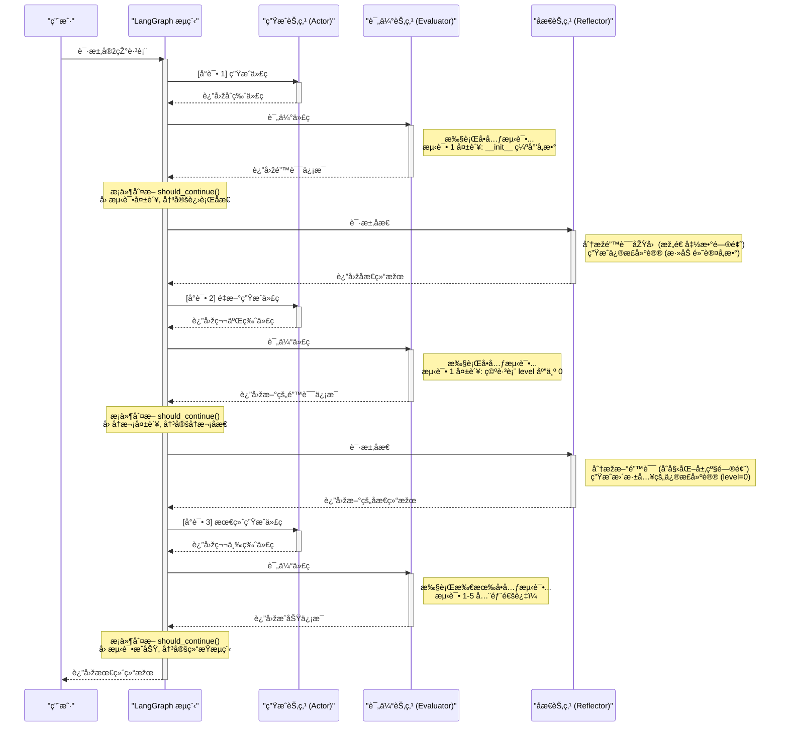

æ—¶åºå›¾è§£è¯»

1. **å¯åŠ¨ä¸Žåˆæ¬¡å°è¯•**:
   - LangGraph 接收到用户实现“跳表â€çš„å¤æ‚任务，å¯åŠ¨æµç¨‹ã€‚
   - 它首先调用 Actor 节点。Actor 生æˆäº†ç¬¬ä¸€ç‰ˆä»£ç ï¼Œä½†å­˜åœ¨ä¸¤ä¸ªé€»è¾‘缺陷：__init__ 没有默认å‚数，且空列表的 level åˆå§‹åŒ–为 1。
2. **第一次åæ€å¾ªçŽ¯**:
   - LangGraph 将第一版代ç äº¤ç»™ Evaluator。
   - Evaluator è¿è¡Œå•å…ƒæµ‹è¯•ï¼Œç«‹å³åœ¨åˆå§‹åŒ–阶段就失败了，因为它无法无å‚数地创建 SkipList 对象。它将这个明确的 TypeError 返回。
   - LangGraph çš„ should_continue 判断检测到失败，将æµç¨‹å¯¼å‘ Reflector。
   - Reflector 接收到失败的代ç å’Œé”™è¯¯æ—¥å¿—，准确地分æžå‡ºæ˜¯æž„造函数å‚数问题，并æ供了修正建议（添加默认å‚数）。
3. **第二次åæ€å¾ªçŽ¯**:
   - LangGraph å¸¦ç€ Reflector çš„å®è´µå»ºè®®ï¼Œå†æ¬¡è°ƒç”¨ Actor。
   - Actor 生æˆäº†ç¬¬äºŒç‰ˆä»£ç ï¼Œè¿™æ¬¡è§£å†³äº†æž„造函数的问题。
   - 代ç å†æ¬¡è¢«äº¤ç»™ Evaluator。这次åˆå§‹åŒ–æˆåŠŸäº†ï¼Œä½†å€’在了第一个断言上：“空跳表的层级应为 0â€ã€‚这是一个更细微的逻辑错误。
   - æµç¨‹å†æ¬¡è¿›å…¥ Reflector。Reflector 基于新的错误，进一步åæ€ï¼Œå¹¶æŒ‡å‡ºäº† level åˆå§‹åŒ–应为 0 的核心问题。
4. **æˆåŠŸä¸Žç»“æŸ**:
   - Actor 在第三次å°è¯•ä¸­ï¼Œå¸æ”¶äº†å‰ä¸¤æ¬¡çš„所有ç»éªŒï¼Œç”Ÿæˆäº†é€»è¾‘正确的第三版代ç ã€‚
   - Evaluator 这一次对第三版代ç æ‰§è¡Œäº†å…¨éƒ¨ 5 个测试用例，从基本结构ã€å¢žã€åˆ ã€æŸ¥åˆ°æœ‰åºæ€§éªŒè¯ï¼Œå…¨éƒ¨é€šè¿‡ã€‚
   - Evaluator 返回了一个æˆåŠŸçš„消æ¯ã€‚
   - LangGraph çš„ should_continue 判断检测到æˆåŠŸä¿¡å·ï¼Œå°†æµç¨‹å¯¼å‘ END，整个任务圆满结æŸã€‚

**引用文献**

- [Shinn, N., Cassano, F., Gopinath, A., Narasimhan, K., & Yao, S. (2023). Reflexion: Language Agents with Verbal Reinforcement Learning.](https://www.google.com/url?sa=E&q=https%3A%2F%2Farxiv.org%2Fabs%2F2303.11366)

## 6. ReWOO (Reasoning WithOut Observation)

### **模å¼ä»‹ç»:**

ReWOO 是一ç§æ—¨åœ¨æ高 Agent 效率的模å¼ï¼Œå®ƒå°†æŽ¨ç†è¿‡ç¨‹ä¸Žä»Žå·¥å…·ä¸­èŽ·å–的“观察â€åˆ†ç¦»ã€‚在 ReAct 等模å¼ä¸­ï¼ŒLLM 在æ¯ä¸€æ­¥éƒ½éœ€è¦ç­‰å¾…工具的返回结果æ‰èƒ½è¿›è¡Œä¸‹ä¸€æ­¥çš„推ç†ï¼Œè¿™å¯èƒ½å¯¼è‡´å¤§é‡çš„ token 消耗和较高的延迟。
ReWOO 通过以下三个模å—æ¥è§£å†³è¿™ä¸ªé—®é¢˜ï¼š

1. **Planner (规划器)**: 接收任务åŽï¼Œä¸€æ¬¡æ€§ç”Ÿæˆä¸€ä¸ªå®Œæ•´çš„计划，这个计划包å«äº†æ‰€æœ‰éœ€è¦çš„工具调用，但使用å ä½ç¬¦ï¼ˆå¦‚ #E1, #E2）æ¥è¡¨ç¤ºå·¥å…·çš„输出。

2. **Worker (工作者)**: 负责执行计划中的所有工具调用，并将结果与对应的å ä½ç¬¦å…³è”èµ·æ¥ã€‚
3. **Solver (解决者)**: 接收完整的计划和所有工具的执行结果，然åŽå°†ç»“果替æ¢æŽ‰è®¡åˆ’中的å ä½ç¬¦ï¼Œæœ€åŽç”Ÿæˆæœ€ç»ˆçš„答案。

通过这ç§æ–¹å¼ï¼ŒReWOO 显著å‡å°‘了 LLM 的调用次数，æ高了 token 效率和执行速度，åŒæ—¶ä¿æŒäº†æ¸…晰的推ç†æµç¨‹ã€‚

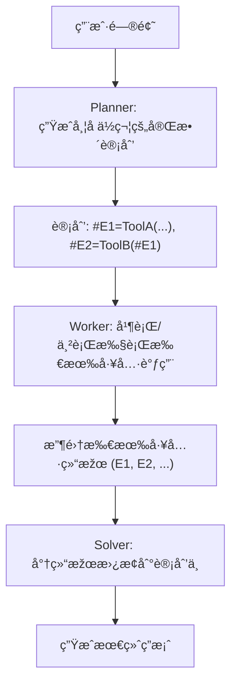

### **Python代ç æ¡ˆä¾‹ (LangChain):**

```python
import os
import re
from typing import List, TypedDict
from dotenv import load_dotenv

from langchain_community.tools.tavily_search import TavilySearchResults
from langchain_core.output_parsers import StrOutputParser
from langchain_core.prompts import ChatPromptTemplate
from langchain_openai import ChatOpenAI

from langgraph.graph import END, StateGraph

# --- é…置区 ---
# 加载当å‰ç›®å½•ä¸‹çš„ .env 文件
load_dotenv()


# =================================================================================
# 1. å®šä¹‰å›¾çš„çŠ¶æ€ (Graph State)
# =================================================================================
# 这是在整个图的执行过程中传递的数æ®ç»“构。

class ReWOOState(TypedDict):
    """
    ReWOO 代ç†çš„状æ€
    """
    task: str
    plan_string: str
    steps: List[dict]
    evidences: List[tuple]
    response: str


# =================================================================================
# 2. 定义工具 (Tools)
# =================================================================================
# Worker (执行器) å¯ä»¥ä½¿ç”¨çš„工具。

google_search = TavilySearchResults(max_results=2)


def calculator(expression: str) -> str:
    """一个å¯ä»¥è®¡ç®—数学表达å¼çš„简å•è®¡ç®—器。"""
    try:
        safe_expression = re.sub(r"[^0-9+\-*/.() ]", "", expression)
        return str(eval(safe_expression))
    except Exception as e:
        return f"计算表达å¼æ—¶å‡ºé”™: {e}"


tools = {
    "Google": google_search.invoke,
    "Calculator": calculator,
}

# =================================================================================
# 3. 实现 Planner (规划器)
# =================================================================================

# åˆå§‹åŒ– LLM 模型。gpt-4.1 是一个功能强大的新模型。
# 注æ„：原代ç ä¸­çš„ 'gpt-4.1' ä¸æ˜¯ä¸€ä¸ªæœ‰æ•ˆçš„模型å称，已修正。
llm = ChatOpenAI(model="gpt-4.1", temperature=0)

planner_prompt = ChatPromptTemplate.from_template(
    """
针对以下任务，请制定能够分步骤解决问题的计划。
对于æ¯ä¸ªè®¡åˆ’，请按照以下格å¼è¿›è¡Œæ述：
计划：对计划的简è¦æ述。
#E[步骤编å·] = 工具[工具的å‚æ•°]

支æŒçš„工具如下：
- Google[query]: 在网络上æœç´¢æŸ¥è¯¢å†…容。
- Calculator[expression]: 计算数学表达å¼ã€‚

这是一个示例：
任务：美国现任总统是è°ï¼Œä»–多大了？
计划：查找美国现任总统。
#E1 = Google[美国现任总统]
计划：查找这ä½æ€»ç»Ÿçš„年龄。
#E2 = Google[#E1的年龄]
计划：回答用户。
#E3 = Solver[#E1, #E2]

现在，请为以下任务制定计划。

任务：{task}
"""
)

planner = planner_prompt | llm | StrOutputParser()


def planner_node(state: ReWOOState) -> dict:
    """
    接收任务并生æˆè¯¦ç»†è®¡åˆ’的节点。
    """
    task = state["task"]
    print("\n--- [Planner Node] ---")
    print(f"  Input Task: {task}")

    plan_string = planner.invoke({"task": task})

    print(f"  Output Plan:\n{plan_string.strip()}")
    print("--- [Planner Node End] ---\n")
    return {"plan_string": plan_string}


# =================================================================================
# 4. 实现 Worker (执行器)
# =================================================================================

def worker_node(state: ReWOOState) -> dict:
    """
    执行计划中的工具调用节点。
    """
    plan_string = state["plan_string"]
    print("\n--- [Worker Node] ---")
    print(f"  Input Plan:\n{plan_string.strip()}")

    steps = []
    for line in plan_string.strip().split("\n"):
        if line.startswith("计划："):
            continue
        match = re.match(r"#E(\d+) = (\w+)\[(.+)\]", line)
        if match:
            step_num, tool, arg = match.groups()
            if tool == "Solver":
                continue
            steps.append({"step_num": int(step_num), "tool": tool, "arg": arg})

    evidences = []
    for step in steps:
        tool_name = step["tool"]
        argument = step["arg"]

        for i in range(1, step["step_num"]):
            previous_results = [res for num, res in evidences if num == i]
            if previous_results:
                argument = argument.replace(f"#E{i}", str(previous_results[0]))

        print(f"    - Executing: Step {step['step_num']} | Tool: {tool_name} | Argument: '{argument}'")
        try:
            result = tools[tool_name](argument)
            if isinstance(result, list):
                result_str = "\n".join([str(r) for r in result])
            else:
                result_str = str(result)
            evidences.append((step["step_num"], result_str))
        except Exception as e:
            print(f"      > Tool execution failed: {e}")
            evidences.append((step["step_num"], f"Error: {e}"))

    print("\n  Output Evidences:")
    for evidence in evidences:
        print(f"    - E{evidence[0]}: {str(evidence[1])[:100]}...")  # 打å°éƒ¨åˆ†è¯æ®å†…容
    print("--- [Worker Node End] ---\n")

    return {"steps": steps, "evidences": evidences}


# =================================================================================
# 5. 实现 Solver (求解器)
# =================================================================================

solver_prompt = ChatPromptTemplate.from_template(
    """
解决以下任务或问题。为了解决问题，你将获得一个计划以åŠè¯¥è®¡åˆ’的执行结果。
你的答案应该完全基于执行结果。ä¸è¦ç¼–造任何信æ¯ã€‚
请从执行结果中æå–所需的数值信æ¯ï¼Œè¿›è¡Œå¿…è¦çš„计算，并æ供一个全é¢ã€æ¸…æ™°ã€ç‹¬ç«‹çš„最终答案。

任务：{task}

计划：
{plan}

执行结果：
{evidences}

现在，请解决这个问题，并用中文回答。
"""
)

solver = solver_prompt | llm | StrOutputParser()


def solver_node(state: ReWOOState) -> dict:
    """
    综åˆæ‰€æœ‰ä¿¡æ¯ç”Ÿæˆæœ€ç»ˆç­”案的节点。
    """
    print("\n--- [Solver Node] ---")

    plan_description = ""
    for line in state["plan_string"].strip().split("\n"):
        if line.startswith("计划："):
            plan_description += line + "\n"

    evidence_str = ""
    for step_num, result in state["evidences"]:
        evidence_str += f"#E{step_num} çš„è¯æ®: {result}\n\n"

    solver_input_payload = {
        "task": state["task"],
        "plan": plan_description,
        "evidences": evidence_str,
    }
    print("  Input to Solver LLM (Task, Plan, Evidences):")
    print(f"    Task: {solver_input_payload['task']}")
    print(f"    Plan: {solver_input_payload['plan'].strip()}")
    print(f"    Evidences: {solver_input_payload['evidences'].strip()[:200]}...")

    response = solver.invoke(solver_input_payload)

    print(f"\n  Output Response:\n{response}")
    print("--- [Solver Node End] ---\n")
    return {"response": response}


# =================================================================================
# 6. 构建并è¿è¡Œ LangGraph
# =================================================================================
def main():
    """主函数，用于构建和è¿è¡Œ LangGraph 应用"""
    graph = StateGraph(ReWOOState)

    # æ›¿æ¢ lambda 为具å函数，æ高å¯è¯»æ€§
    graph.add_node("planner", planner_node)
    graph.add_node("worker", worker_node)
    graph.add_node("solver", solver_node)

    graph.set_entry_point("planner")

    graph.add_edge("planner", "worker")
    graph.add_edge("worker", "solver")
    graph.add_edge("solver", END)

    app = graph.compile()

    # 定义任务
    task = "求2024年中国北京ã€ä¸Šæµ·ã€å¹¿å·žã€æ·±åœ³çš„人å£æ€»å’Œ"
    print(f"开始执行 ReWOO 代ç†ä»»åŠ¡: '{task}'\n")

    # 使用 invoke 执行，因为我们已ç»åœ¨èŠ‚点内部添加了详细的日志
    final_state = app.invoke({"task": task}, config={"recursion_limit": 5})

    print("\n=================================")
    print("✅ 任务执行完毕 - 最终答案:")
    print("=================================")
    print(final_state["response"])


if __name__ == "__main__":
    main()
```

### **输出：**

```
开始执行 ReWOO 代ç†ä»»åŠ¡: '求2024年中国北京ã€ä¸Šæµ·ã€å¹¿å·žã€æ·±åœ³çš„人å£æ€»å’Œ'


--- [Planner Node] ---
  Input Task: 求2024年中国北京ã€ä¸Šæµ·ã€å¹¿å·žã€æ·±åœ³çš„人å£æ€»å’Œ
  Output Plan:
计划：查找2024年北京的人å£æ•°æ®ã€‚  
#E1 = Google[2024年北京人å£]

计划：查找2024年上海的人å£æ•°æ®ã€‚  
#E2 = Google[2024年上海人å£]

计划：查找2024年广州的人å£æ•°æ®ã€‚  
#E3 = Google[2024年广州人å£]

计划：查找2024年深圳的人å£æ•°æ®ã€‚  
#E4 = Google[2024年深圳人å£]

计划：将上述四个城市的人å£æ•°æ®ç›¸åŠ ï¼Œå¾—到总人å£æ•°ã€‚  
#E5 = Calculator[#E1 + #E2 + #E3 + #E4]
--- [Planner Node End] ---


--- [Worker Node] ---
  Input Plan:
计划：查找2024年北京的人å£æ•°æ®ã€‚  
#E1 = Google[2024年北京人å£]

计划：查找2024年上海的人å£æ•°æ®ã€‚  
#E2 = Google[2024年上海人å£]

计划：查找2024年广州的人å£æ•°æ®ã€‚  
#E3 = Google[2024年广州人å£]

计划：查找2024年深圳的人å£æ•°æ®ã€‚  
#E4 = Google[2024年深圳人å£]

计划：将上述四个城市的人å£æ•°æ®ç›¸åŠ ï¼Œå¾—到总人å£æ•°ã€‚  
#E5 = Calculator[#E1 + #E2 + #E3 + #E4]
    - Executing: Step 1 | Tool: Google | Argument: '2024年北京人å£'
    - Executing: Step 2 | Tool: Google | Argument: '2024年上海人å£'
    - Executing: Step 3 | Tool: Google | Argument: '2024年广州人å£'
    - Executing: Step 4 | Tool: Google | Argument: '2024年深圳人å£'
    - Executing: Step 5 | Tool: Calculator | Argument: '{'title': '人å£_首都之窗 - 北京市人民政府', 'url': 'https://www.beijing.gov.cn/renwen/bjgk/rk/202503/t20250325_4043973.html', 'content': 'æ— éšœç¢ç¹ä½“/简体智能问答\n\n我在å¬ï¼Œè¯·è¯´è¯(10s)\n\n抱歉，没å¬æ¸…，请å†è¯´ä¸€éå§\n\n人文北京\u3000>\u3000北京概况\u3000>\u3000人å£\n\n# \n\n人å£\n\n日期：2025-03-25 14:44    æ¥æºï¼šåŒ—京市统计局\u3000国家统计局北京调查总队\n\n分享：\n\nX\n\nå­—å·ï¼š  \n大)  \n中)  \nå°)\n\n人å£\n\n 人å£\n\n2024年年末全市常ä½äººå£2183.2万人，比上年末å‡å°‘2.6万人。其中，城镇人å£1926.0万人，å å¸¸ä½äººå£çš„比é‡ä¸º88.2%。\n\n——数æ®æ¥æºï¼šã€ŠåŒ—京市2024年国民ç»æµŽå’Œç¤¾ä¼šå‘展统计公报》（数æ®å‘布时间：2025å¹´3月20日）\n\n中国政府网åŠå›½åŠ¡é™¢éƒ¨é—¨ç½‘ç«™|', 'score': 0.9505628}
{'title': '北京市人å£2024年总人å£æ•°å¸¸ä½äººå£å‡ºç”Ÿæ­»äº¡æ•°æ®æœ‰å¤šå°‘ - 红黑人å£åº“', 'url': 'https://www.hongheiku.com/lishishuju/19959.html', 'content': '红黑人å£åº“\n\n å„çœæŽ’å\n 市级排å\n 县级排å\n  + å„县排å\n  + 市辖区排å\n  + 县级市排å\n 乡镇æœç´¢\n 统计公报\n\n# 北京市人å£2024年总人å£æ•°æ•°æ®æƒ…况\n\n 最åŽæ›´æ–°:2025-03-20 10:27:39\n\n点击å¯æŸ¥çœ‹æœ€æ–°æ•°æ®\n\n## 北京市详细人å£æ•°æ®---已更新至2025å¹´\n\næ ¹æ®ã€Šç»Ÿè®¡å…¬æŠ¥2024》数æ®æ˜¾ç¤º2024年北京市人å£æ•°æ®å¦‚下：\n\n## 常ä½äººå£æ•°æ®\n\n北京市2024年常ä½äººå£æ€»æ•°ä¸º2183.2万人，城镇化率为88.2%，城镇人å£æ€»æ•°ä¸º1926万人，乡æ‘人å£æ€»æ•°ä¸º257.2万人，男性人å£æ€»æ•°ä¸º1111.3万人，女性人å£æ€»æ•°ä¸º1071.9万人，年龄数æ®ä¸­0-14å²äººå£æ€»æ•°ä¸º261.2万人，15-59å²äººå£æ€»æ•°ä¸º1408万人，60å²ä»¥ä¸Šäººå£æ€»æ•°ä¸º514万人，65å²ä»¥ä¸Šäººå£æ€»æ•°ä¸º359.6万人，。 [...] |  |  |  |\n --- \n| 常ä½äººå£æ•°æ® | | |\n| 指标 | æ•°é‡ |\n| 常ä½äººå£ï¼ˆä¸‡äººï¼‰ | 2183.2 |\n| 常ä½åŸŽé•‡åŒ–率（%） | 88.2 |\n| 常ä½åŸŽé•‡äººå£ï¼ˆä¸‡äººï¼‰ | 1926 |\n| 常ä½ä¹¡æ‘人å£ï¼ˆä¸‡äººï¼‰ | 257.2 |\n| 常ä½ç”·æ€§ï¼ˆä¸‡äººï¼‰ | 1111.3 |\n| 常ä½å¥³æ€§ï¼ˆä¸‡äººï¼‰ | 1071.9 |\n| 常ä½0-14å² | 261.2 |\n| 常ä½15-59å² | 1408 |\n| 常ä½60ä»¥ä¸Šå² | 514 |\n| 常ä½65ä»¥ä¸Šå² | 359.6 |\n\n## 户ç±äººå£æ•°æ®\n\n暂缺数æ®\n\n## 出生死亡数æ®\n\n出生率为6.09‰，死亡率为6.08‰，自然增长率为0.01‰。\n\n|  |  |  |\n --- \n| å‡ºç”Ÿæ­»äº¡æ•°æ® | | |\n| 指标 | æ•°é‡ |\n| 出生率（‰） | 6.09 |\n| 死亡率（‰） | 6.08 |\n| 自然增长率（‰） | 0.01 |\n\n### æœç´¢', 'score': 0.94536424} + {'title': 'æ–·å´–å¼ä¸‹è·Œï¼ä¸Šæµ·å¤–來人å£è·Œç ´åƒè¬å¹´æ¸›é”23è¬äºº - Yahoo 財經', 'url': 'https://hk.finance.yahoo.com/news/%E6%96%B7%E5%B4%96%E5%BC%8F%E4%B8%8B%E8%B7%8C-%E4%B8%8A%E6%B5%B7%E5%A4%96%E4%BE%86%E4%BA%BA%E5%8F%A3%E8%B7%8C%E7%A0%B4%E5%8D%83%E8%90%AC-%E5%B9%B4%E6%B8%9B%E9%81%9423%E8%90%AC%E4%BA%BA-073006823.html', 'content': '雖然上海 2024 年戶ç±å¸¸ä½äººå£å¢žåŠ  16.6 è¬äººï¼Œé” 1,496.77 è¬äººï¼Œä½†ç„¡æ³•æŠµéŠ·å¤–來人å£å¤§é‡æµå¤±å¸¶ä¾†çš„總體減少。自 2020 年外來人å£é”到高峰 1,048 è¬äººä»¥ä¾†ï¼Œäº”年間上海已æµå¤±è¶…éŽ 64 è¬äººã€‚\n\n2024 年，上海常ä½äººå£å‡ºç”Ÿäººæ•¸ç‚º 11.8 è¬äººï¼Œå‡ºç”ŸçŽ‡ç‚º 4.75‰，雖較 2023 å¹´çš„ 3.95‰略有回å‡ï¼Œä½†è‡ªç„¶å¢žé•·çŽ‡ä»ç‚º - 1.53‰，代表自然減少趨勢未見好轉。更令人擔憂的是，上海戶ç±äººå£ç¸½å’Œç”Ÿè‚²çŽ‡åƒ… 0.72。\n\n根據人å£çµæ§‹çµ±è¨ˆï¼Œå¸¸ä½äººå£ä¸­æœ‰ 70.2% 僅育一孩，育有三孩的比例僅 3.9%；戶ç±äººå£ä¸­ä¸€å­©å®¶åº­æ¯”ä¾‹æ›´é«˜é” 77.5%，三孩僅佔 1.7%。åŒæ™‚，平å‡åˆè‚²å¹´é½¡é«˜é” 31.81 歲，å映育齡人å£ç”Ÿè‚²æ„願æŒçºŒä½Žè¿·ã€‚\n\n外來人å£æ¸›å°‘å°æ•™è‚²èˆ‡å…¬å…±è³‡æºä½¿ç”¨ç”¢ç”Ÿæ˜Žé¡¯è¡æ“Šã€‚2024 年，上海普通å°å­¸åœ¨æ ¡ç”Ÿäººæ•¸ä¸‹é™è‡³ 92.71 è¬äººï¼Œå¹´æ¸› 1.1%ï¼›åŒæ™‚，城市水電使用é‡ä¹ŸåŒæ­¥ä¸‹æ»‘，çªé¡¯äººå£è®Šå‹•å°åŸºç¤Žè¨­æ–½éœ€æ±‚的直接影響。 [...] 儘管人å£çµæ§‹è½‰è®Šå¸¶ä¾†æŒ‘戰，2024 年上海 GDP é” 53,926.71 億元，年增 5%，表ç¾ç©©å¥ã€‚å…¶ä¸­ï¼Œç¬¬ä¸‰ç”¢æ¥­å¢žåŠ å€¼é” 42,189.44 億元，å æ¯”é” 78.2%，年增 5.7%，顯示æœå‹™æ¥­ä¾ç„¶ç‚ºä¸Šæµ·ç¶“æ¿Ÿæˆé•·ä¸»å¼•æ“Žã€‚\n\né¢å°äººå£ä¸‹æ»‘與創新力ä¸è¶³é›™é‡æŒ‘戰，專家建議上海應èšç„¦ä¸‰å¤§æˆ°ç•¥ï¼š\n\n1.   éžå›ºå¤–資高地：加大開放力度ã€å¼·åŒ–政策å¸å¼•åŠ›ï¼Œç¶­æŒã€Œå¤–資之都ã€åœ°ä½ã€‚\n\n2.   é‡æ§‹å‰µæ–°ç”Ÿæ…‹ï¼šåŠ å¼· R&D 投入，推動與æ­å·žç­‰åŸŽå¸‚建立「科創走廊ã€ã€‚\n\n3.   實施人æ‰å€å¢žæˆ°ç•¥ï¼šæ”¾å¯¬è½æˆ¶é™åˆ¶ï¼ŒæŽ¨å‹•å¤–ç±é«˜å±¤æ¬¡äººæ‰é•·å±…政策，破解「減é‡ç™¼å±•ã€æ€ç¶­ã€‚\n\n更多鉅亨報導\n\n•三人行必有一è€ï¼ä¸Šæµ·60歲以上人å£è¶…éŽ577è¬ è€åŒ–速度是深圳12å€ é€€ä¼‘é‡‘é«”ç³»é¢è‡¨å£“力\n\n•日本少å­åŒ–「æå‰15年發生ã€ï¼æ–°ç”Ÿå…’人數首度跌破70è¬\n\nTerms and Privacy Policy\n\nä½ çš„ç§éš±é¸æ“‡ Image 3\n\nRecommended Stories\n\n\n\nAbout\n\n資料å…責è²æ˜Žæœå‹™ä¸­å¿ƒå»£å‘Šèªªæ˜Ž\n\nTerms and Privacy Policy\n\nä½ çš„ç§éš±é¸æ“‡ Image 4 [...] Yahoo財經\n       AASTOCKS\n       Bloomberg\n       信報財經新èž\n       BossMind\n       now.com 財經\n       Fortune Insight\n       28Hse.com\n       AM730\n       Infocast\n       香港電å°ï¼è²¡ç¶“\n       鉅亨網\n       詠竹åŠ\n       Money Club\n\n   加密貨幣\n   å…¨çƒé—œç¨…戰\n\n…\n\n   加密貨幣\n   å…¨çƒé—œç¨…戰\n\nImage 1: 鉅亨網\n\næ–·å´–å¼ä¸‹è·Œï¼ä¸Šæµ·å¤–來人å£è·Œç ´åƒè¬ 年減é”23è¬äºº\n\nImage 2\n\næ–·å´–å¼ä¸‹è·Œï¼ä¸Šæµ·å¤–來人å£è·Œç ´åƒè¬ 年減é”23è¬äººÂ·é‰…亨網\n\n 鉅亨網新èžä¸­å¿ƒ \n\nUpdated 2025å¹´6月9日週一 下åˆ8:22\n\n上海近日公布《2024 年統計公報》，最新數據顯示，上海常ä½äººå£ç¸½æ•¸é©Ÿé™è‡³ 2,480.26 è¬äººï¼Œå¹´æ¸› 7.2 è¬äººï¼Œå°¤ä»¥å¤–來常ä½äººå£ã€Œæ–·å´–å¼ã€ä¸‹è·Œæœ€ç‚ºé¡¯è‘—，首次跌破åƒè¬å¤§é—œï¼Œåƒ…剩 983.49 è¬äººï¼Œå¹´æ¸›é” 23 è¬äººï¼Œå‰µä¸‹è¿‘年新低。', 'score': 0.9568646}
{'title': '2024年上海常ä½äººå£2480.26万人åŒæ¯”å‡å°‘7.19万人 - æœç‹', 'url': 'https://www.sohu.com/a/875482275_120179484', 'content': 'Published Time: 2025-03-25T11:06:09+0800\n\n2024年上海常ä½äººå£2480.26万人 åŒæ¯”å‡å°‘7.19万人_全年_全市_工业\n\n   æ¯å©´å¥åº·åŽ†å²å†›äº‹ç¾Žé£Ÿæ–‡åŒ–星座专题游æˆæžç¬‘动漫宠物 \n\næ— éšœç¢)关怀版)\n\n登录)\n\n2024年上海常ä½äººå£2480.26万人 åŒæ¯”å‡å°‘7.19万人\n\n2025-03-25 11:06 æ¥æº: æœç‹åŸŽå¸‚\n\nImage 1)Image 2Image 3Image 4)\n\n链接å¤åˆ¶æˆåŠŸ\n\nå‘布于：北京市\n\n3月25日，上海市统计局公布《2024年上海市国民ç»æµŽå’Œç¤¾ä¼šå‘展统计公报》。2024年末，上海全市常ä½äººå£ä¸º2480.26万人，较2023年末的2487.45万人，å‡å°‘了7.19万人。\n\n以下为统计公报原文—— [...] 全年工矿商贸（å«å»ºç­‘业ã€åŒ–å·¥ã€å·¥è´¸ï¼Œç”Ÿäº§ç»è¥æ€§ç«ç¾ç­‰ï¼‰ã€é“è·¯è¿è¾“ã€æ°´ä¸Šè¿è¾“ã€é“è·¯è¿è¾“ã€èˆªç©ºè¿è¾“ã€å†œä¸šæœºæ¢°ã€æ¸”业船舶等行业领域，共å‘生生产安全死亡事故382èµ·ã€æ­»äº¡395人。其中，工矿商贸183èµ·ã€æ­»äº¡186人；é“è·¯è¿è¾“190èµ·ã€æ­»äº¡200人；水上è¿è¾“7èµ·ã€æ­»äº¡7人；农业机械1èµ·ã€æ­»äº¡1人；é“è·¯è¿è¾“1èµ·ã€æ­»äº¡1人；航空è¿è¾“以åŠæ¸”业船舶2个行业领域未å‘生死亡事故。\n\n全年全市食å“安全总体监测åˆæ ¼çŽ‡ä¸º99.4%。全年未报告å‘生集体性食物中毒事件以åŠå…¶ä»–é‡å¤§é£Ÿå“安全事故。全年è¯å“ã€åŒ»ç–—器械ã€åŒ–妆å“抽检åˆæ ¼çŽ‡åˆ†åˆ«ä¸º99.7%ã€98.8%ã€98.9%。\n\næ¥æºï¼šä¸Šæµ·å¸‚统计局返回æœç‹ï¼ŒæŸ¥çœ‹æ›´å¤š\n\nå¹³å°å£°æ˜Žï¼šè¯¥æ–‡è§‚点仅代表作者本人，æœç‹å·ç³»ä¿¡æ¯å‘布平å°ï¼Œæœç‹ä»…æ供信æ¯å­˜å‚¨ç©ºé—´æœåŠ¡ã€‚\n\n阅读 (_615_)\n\n 我æ¥è¯´ä¸¤å¥ \n\n\n   Image 230返回首页\n   Image 231举报/å馈 \n   Image 232)\n\n)\n\n 邮箱账å·ç™»å½• \n\n   忘记密ç \n   Image 233\n\n请输入正确的登录账å·æˆ–密ç \n\n 手机å·éªŒè¯ç ç™»å½• \n\n   Image 234\n   获å–验è¯ç ) [...] 2024年，上海åšæŒä»¥ä¹ è¿‘平新时代中国特色社会主义æ€æƒ³ä¸ºæŒ‡å¯¼ï¼Œå…¨é¢è´¯å½»è½å®žå…šçš„二å大和二å届二中ã€ä¸‰ä¸­å…¨ä¼šç²¾ç¥žï¼Œæ·±å…¥å­¦ä¹ è´¯å½»ä¹ è¿‘平总书记考察上海é‡è¦è®²è¯ç²¾ç¥žï¼Œåšå†³è´¯å½»è½å®žå…šä¸­å¤®ã€å›½åŠ¡é™¢çš„决策部署，åšæŒç¨³ä¸­æ±‚进工作总基调，进一步全é¢æ·±åŒ–改é©ã€‚全市ç»æµŽå‘展总体平稳，稳中有进，新动能新产业ä¸æ–­å£®å¤§ï¼Œæ°‘生ä¿éšœè¿›ä¸€æ­¥æ”¹å–„，高质é‡å‘展扎实推进。\n\n一ã€ç»¼ åˆ\n\nåˆæ­¥æ ¸ç®—，全年实现地区生产总值（GDP）53926.71亿元，比上年增长5.0%（è§å›¾1）。其中，第一产业增加值99.70亿元，下é™0.9%；第二产业增加值11637.57亿元，增长2.4%；第三产业增加值42189.44亿元，增长5.7%。第三产业增加值å åœ°åŒºç”Ÿäº§æ€»å€¼çš„比é‡ä¸º78.2%。\n\nImage 5\n\n全年战略性新兴产业增加值12532.96亿元，比上年增长6.4%。战略性新兴产业增加值å ä¸Šæµ·å¸‚生产总值的比é‡ä¸º23.2%，比上年æ高0.4个百分点（è§è¡¨1）。\n\nImage 6\n\n_展开全文_', 'score': 0.95261395} + {'title': '2024年广州常ä½äººå£1897.8万，城镇化率æå‡è‡³87.24% - 中房网', 'url': 'http://m.fangchan.com/news/218/2025-03-31/7312307381051134484.html', 'content': 'å®è§‚è‹æ™“\u20022025-03-31 10:58:55\u2002æ¥æºï¼šä¸­æˆ¿ç½‘\n\n中房网讯 （è‹æ™“/文）3月28日，广州市统计局披露了2024年广州市人å£è§„模åŠåˆ†å¸ƒæƒ…况显示，2024年末，广州常ä½äººå£1897.8万人，城镇化率为87.24%。年末户ç±äººå£1075.02万人，城镇化率为83.31%。\n\n\u2003\u20032024年全年户ç±å‡ºç”Ÿäººå£11.43万人，出生率10.72‰；死亡人å£5.48万人，死亡率5.14‰；自然增长人å£5.95万人，自然增长率5.58‰。户ç±è¿å…¥äººå£16.52万人，è¿å‡ºäººå£4.05万人，机械增长人å£12.47万人。\n\nCopyright©北京中房研å技术æœåŠ¡æœ‰é™å…¬å¸.  \nAll Right Reserved 京ICP备13002607å· äº¬å…¬ç½‘å®‰å¤‡110102000179\n\nCopyright©北京中房研å技术æœåŠ¡æœ‰é™å…¬å¸.  \nAll Right Reserved 京ICP备13002607å· äº¬å…¬ç½‘å®‰å¤‡110102000179', 'score': 0.94911116}
{'title': '稳居全çœäººå£ç¬¬ä¸€å¤§å¸‚ï¼å¹¿å·ž2024年常ä½äººå£1897.8万人 - å—方网', 'url': 'https://news.southcn.com/node_54a44f01a2/95452dc75f.shtml', 'content': 'è¿è¥å•†æ•°æ®æ˜¾ç¤ºï¼Œ2024å¹´12月，广州人å£æ€»è§„模超2200万，åŒæ¯”增长1.8%。地é“æ•°æ®æ˜¾ç¤ºï¼Œ2024å¹´12月31日，广州地é“客è¿é‡çªç ´1220万人次，刷新广州地é“å•æ—¥å®¢è¿é‡åŽ†å²çºªå½•ã€‚\n\n\u3000\u3000广州的高“人气值â€å½°æ˜¾å¹¿å·žçš„人å£å¸å¼•åŠ›ä¸ŽåŸŽå¸‚竞争力，“广纳英æ‰â€çš„广州æˆä¸ºå›½å†…外人æ‰å’Œåˆ›æ–°èµ„æºæ±‡èšçš„热土。\n\n生育æ„æ„¿ä¿æŒç¨³å®š\n\n户ç±äººå£ç¨³æ­¥å¢žé•¿\n\n\u3000\u3000éšç€å¹¿å·žæŒç»­æ·±åŒ–户ç±åˆ¶åº¦æ”¹é©ï¼Œç§¯æžæž„建生育支æŒæ”¿ç­–体系，户ç±äººå£è§„模å†åˆ›æ–°é«˜ã€‚\n\n\u3000\u30002024年末，广州户ç±äººå£1075.02万人，比上年末增加18.41万人，增长1.74%。从机械å˜åŠ¨æƒ…况上看，全市户ç±è¿å…¥äººå£16.52万人，机械增长人å£12.47万人，对户ç±äººå£å¢žé•¿è´¡çŒ®çŽ‡è¾¾67.7%，是户ç±äººå£å¢žé•¿çš„主è¦é©±åŠ¨åŠ›ã€‚\n\n\u3000\u3000从自然增长的情况上看，2024年，广州户ç±äººå£å‡ºç”Ÿç™»è®°11.43万人，自然增长人å£5.95万人，对户ç±äººå£å¢žé•¿è´¡çŒ®çŽ‡è¾¾32.3%。\n\n\u3000\u3000å—一æ½å­ç”Ÿè‚²æ”¯æŒæ”¿ç­–è½åœ°å®žæ–½ä»¥åŠé¾™å¹´ç”Ÿè‚–å好等因素影å“，广州户ç±å‡ºç”Ÿäººå£æ•°é‡ç»§ç»­ä¿æŒåœ¨11万人以上，为户ç±äººå£å¢žé•¿æ供内在动力。\n\n城镇建设统筹推进\n\nè´¨é‡æ°´å¹³åŒåŒæå‡ [...] 2024年末，广州常ä½äººå£åŸŽé•‡åŒ–率87.24%，较上年æå‡0.48个百分点；户ç±äººå£åŸŽé•‡åŒ–率83.31%，较上年æå‡1.45个百分点。城镇化是现代化的必由之路，是推动区域åè°ƒå‘展的有力支撑。\n\n\u3000\u3000为深入推进以人为本的新型城镇化战略，广州制定实施五年行动计划方案，大力推动基本公共æœåŠ¡å‘常ä½äººå£è¦†ç›–，å调推进区域新型工业化城镇化，全市常ä½äººå£åŸŽé•‡åŒ–æ°´å¹³æŒç»­æå‡ï¼Œè¾ƒå…¨å›½å’Œå…¨çœçš„å¹³å‡æ°´å¹³åˆ†åˆ«é«˜20.24个百分点和11.33个百分点。\n\n\u3000\u3000åŒæ—¶ï¼Œè¿›ä¸€æ­¥ç•…通农业转移人å£è½æˆ·åŸŽå¸‚渠é“，助力其加快èžå…¥åŸŽå¸‚生活，户ç±äººå£åŸŽé•‡åŒ–率与常ä½äººå£åŸŽé•‡åŒ–率差è·è¿›ä¸€æ­¥ç¼©å°è‡³3.93个百分点，新型城镇化建设为广州æŒç»­å‘展注入æºæºä¸æ–­çš„活力。\n\n\u3000\u3000展望未æ¥ï¼Œå¹¿å·žä½œä¸ºå›½å®¶ä¸­å¿ƒåŸŽå¸‚和粤港澳大湾区核心引擎，将继续æå‡åŸŽå¸‚综åˆç«žäº‰åŠ›å’Œå¸å¼•åŠ›ã€‚åŒæ—¶ï¼Œåœ¨ç»æµŽé«˜è´¨é‡å‘展的基础上，进一步完善公共æœåŠ¡ä½“系，加强城市治ç†èƒ½åŠ›ï¼ŒæŽ¨åŠ¨åŸŽå¸‚å¯æŒç»­å‘展，å¸å¼•æ›´å¤šäººæ‰å’Œèµ„æºæ±‡èšï¼Œä»¥äººæ‰é©±åŠ¨é«˜è´¨é‡å‘展的新一轮热潮。\n\n\u3000\u3000å—æ–¹+记者 黄舒旻\n\n编辑：陈雨昀\n  责任编辑：å¢ç»èª\n\n返回å—方网首页\nè¿”å›žå¹¿ä¸œç²¾é€‰é¢‘é“ [...] 广州\n深圳\nç æµ·\n汕头\n佛山\n韶关\næ²³æº\n梅州\n惠州\n汕尾\n东莞\n中山\n江门\n阳江\n湛江\n茂å\n肇庆\n清远\n潮州\næ­é˜³\n云浮\n\nè¦é—»\n党建\u3000\n广东\n热点\nç»æµŽ\nç›´æ’­\n\nèžåª’\n网评\nç†è®º\n视频\n专题\n公告\n文化\n出版\n汽车\n教育\n英文\n乡æ‘\n就业\n求è¯\n法规\n资讯\n\n长者助手\næ— éšœç¢\n简\nç¹\nEN\n\n广东精选\n\nå—方网\n>\næ–°é—»\n>\n广东精选\n\n## 稳居全çœäººå£ç¬¬ä¸€å¤§å¸‚ï¼å¹¿å·ž2024年常ä½äººå£1897.8万人\n\n2025-03-27 19:27\næ¥æºï¼šå—æ–¹+\n\nå­—å·å‡å°\nå­—å·å¢žå¤§\n\n3月27日，广州市统计局å‘布2024年广州人å£æ•°æ®ã€‚\n\n\u3000\u30002024年末，广州常ä½äººå£è¾¾1897.8万人，比上年末增加15.1万人，增长0.8%，å å…¨çœæ¯”é‡14.85%，稳居全çœäººå£ç¬¬ä¸€å¤§å¸‚ä½ç½®ã€‚\n\n羊城魅力ä¸æ–­é‡Šæ”¾\n\n常ä½äººå£ç»§ç»­å¢žåŠ \n\n\u3000\u3000一直以æ¥ï¼Œå¹¿å·žç§‰æŒå¼€æ”¾åŒ…容的城市文化，ä¸æ–­å¢žè¿›æ°‘生ç¦ç¥‰ï¼Œæ“¦äº®åŸŽå¸‚幸ç¦åº•è‰²ï¼ŒåŸŽå¸‚建设者们纷至沓æ¥ï¼Œé€‰æ‹©æ¥ç©—安居就业，为广州å‘展æä¾›æŒç»­åŠ¨åŠ›ã€‚', 'score': 0.94584644} + {'title': '15座万亿城市2024年人å£æ•°æ®ï¼šæ·±åœ³å¢žé‡ç¬¬ä¸€ - 新浪财ç»', 'url': 'https://finance.sina.com.cn/roll/2025-03-31/doc-inerqfen1031582.shtml?froms=ggmp', 'content': 'æ ¹æ®å¹¿ä¸œçœç»Ÿè®¡å±€æ ¸å®šç»“果，深圳市2024年末常ä½äººå£ä¸º1798.95万人，åŒæ¯”增加19.94万人，增幅1.12%。\n\n这是深圳人å£åœ¨2022年异常å‡å°‘1.98万之åŽï¼Œè¿žç»­ç¬¬äºŒå¹´æ­£å¢žé•¿ï¼Œå¹¶ä¸”é‡å¤ºå¹´åº¦å¢žé‡ç¬¬ä¸€ã€‚\n\nç»æµŽæ´»è·ƒã€äººå£ç»“æž„å¹´è½»ã€ç”Ÿè‚²çŽ‡é«˜ï¼Œæ˜¯äººå£å¢žé•¿çš„主è¦æŽ¨åŠ¨åŠ›ï¼Œè¿™ä¸‰ç‚¹å› ç´ æ·±åœ³å‡å…·å¤‡ã€‚\n\n2024年，深圳GDPè¾¾3.68万亿元ã€å¢žé•¿5.8%，增速居国内大中城市å‰åˆ—；规上工业总产值ã€å¢žåŠ å€¼è¿žç»­3年实现全国城市“åŒç¬¬ä¸€â€ï¼›å›ºå®šèµ„产投资ã€ç¤¾ä¼šæ¶ˆè´¹å“零售总é¢åŒåŒè¶…万亿；外贸进出å£æ€»é¢è¾¾4.5万亿元ã€å¢žé•¿16.4%，总é‡è·ƒå±…全国城市首ä½ï¼Œå‡ºå£å®žçŽ°â€œ32连冠â€ã€‚\n\n人å£ç»“æž„æ–¹é¢ï¼Œæ·±åœ³å¸¸ä½äººå£ä¸­15-59å²äººå£å æ¯”高达79.53%，第七次全国人å£æ™®æŸ¥ç»“果显示，深圳市民平å‡å¹´é¾„为32.5å²ã€‚\n\n人å£å¹´è½»é€šå¸¸æ„味ç€æ›´é«˜çš„人å£è‡ªç„¶å¢žé•¿çŽ‡ã€‚2023 年，深圳市常ä½äººå£å‡ºç”ŸçŽ‡ä¸º8.46‰，死亡率为1.16‰，人å£è‡ªç„¶å¢žé•¿çŽ‡ä¸º7.3‰；åŒæœŸï¼Œå…¨å›½äººå£å‡ºç”ŸçŽ‡6.39‰，人å£æ­»äº¡çŽ‡7.87‰，人å£è‡ªç„¶å¢žé•¿çŽ‡ä¸º-1.48‰。深圳的人å£è‡ªç„¶å¢žé•¿èƒ½åŠ›æ˜¾è‘—强于全国。 [...] ä¸å‡ºæ„外的è¯ï¼Œæ·±åœ³å¸¸ä½äººå£æœ‰æœ›åœ¨å¹´å†…çªç ´1800万大关，è·ç¦»2035年规划上é™ï¼ˆ1900万人）仅差100万以内。\n\n而æ®æœ¬æ¬¡æŠ½æ ·è°ƒæŸ¥ç»“果，2024年末，深圳社区登记总人å£ä¸º2237.88万，åŒæ¯”增加74.11万，æ¯å¤©å®žæ—¶ç”Ÿæ´»åœ¨æ·±åœ³çš„人å£è¶…2300万。\n\n2024å¹´12月，智è”æ‹›è˜å‘布的《中国城市95åŽäººæ‰å¸å¼•åŠ›æŽ’å：2024》显示，深圳市排å第一。这对任何城市都是喜讯，唯独对深圳而言åŒæ—¶æ„味ç€åŽ‹åŠ›ã€‚原因很简å•â€”—\n\n深圳的总é¢ç§¯åªæœ‰å°†è¿‘2000平方公里（ä¸å«æ·±æ±•ç‰¹åˆ«åˆä½œåŒºï¼‰ï¼Œç›¸å½“于广州的1/4，ä¸åˆ°ä¸Šæµ·çš„1/3ã€åŒ—京的1/8，空间资æºå’Œé…套公共æœåŠ¡æ‰¿è½½åŠ›å·²é€¼è¿‘æžé™ã€‚\n\n接下æ¥ï¼Œæ·±åœ³æ—¢è¦æ‹¥æŠ±äººå£å¢žé‡ï¼Œä¹Ÿè¦åŒ–解人å£æœåŠ¡åŽ‹åŠ›ï¼Œè¿›ä¸€æ­¥å¹³è¡¡å¥½äººå£å’Œå‘展的关系。\n\n深圳的åŒçœå…„弟城市广州市夺得年度人å£å¢žé‡ç¬¬äºŒå。2024年末，广州常ä½äººå£1897.8万，åŒæ¯”增加15.1万，增幅0.8%。\n\n2024年，广州户ç±è¿å…¥äººå£è¾¾\u200c16.52万\u200c，机械增长（è¿å…¥å‡è¿å‡ºï¼‰è´¡çŒ®å¢žé‡\u200c12.47万\u200c，å æ€»å¢žé‡çš„å…«æˆä»¥ä¸Š\u200c，凸显了广州强劲的人å£å¸å¼•åŠ›ã€‚ [...] # 15座万亿城市2024年人å£æ•°æ®ï¼šæ·±åœ³å¢žé‡ç¬¬ä¸€ï¼Œä¸¤åœ°è¿žç»­10å¹´10万级增长\n\n2025å¹´03月31æ—¥ 21:25\n第一财ç»\n\n新浪财ç»APP举报\n缩å°å­—体\n放大字体\n收è—\nå¾®åš\n微信\n分享\n3\n\nè¿™15座城市中，11座的常ä½äººå£å½•å¾—正增长。其中，增长最多的是深圳市，增加达19.94万人；增速最快的是åˆè‚¥å¸‚，比上年增长1.51%。\n\n多个城市ä¿æŒäº†è¿žç»­å¤šå¹´çš„人å£æ­£å¢žé•¿ï¼Œä¾‹å¦‚，从网上公开å¯æŸ¥çš„官方信æ¯æ¥çœ‹ï¼Œæˆéƒ½ã€é•¿æ²™ã€ç¦å·žåˆ†åˆ«å®žçŽ°è‡³å°‘è¿žç»­24å¹´ã€22å¹´ã€18年人å£å¢žé•¿ï¼›éƒ¨åˆ†åŸŽå¸‚还ä¿æŒè¿žç»­å¤šå¹´çš„10万级以上人å£å¢žé•¿ï¼Œåƒé•¿æ²™ã€æ­å·žåˆ†åˆ«å®žçŽ°è¿žç»­15å¹´ã€è¿žç»­10å¹´10万级以上人å£å¢žé•¿ã€‚\n\n部分万亿城市2024年常ä½äººå£æ•°æ®ï¼ˆç¬¬ä¸€è´¢ç»æ ¹æ®å…¬å¼€æ•°æ®æ•´ç†åˆ¶å›¾ï¼‰\n\n一ä½æ™ºåº“专家告诉第一财ç»è®°è€…，人å£æ•°é‡æ˜¯è§‚察区域å®è§‚ç»æµŽå½¢åŠ¿çš„é‡è¦æŒ‡æ ‡ï¼Œä¸Žå°±ä¸šã€æ¶ˆè´¹ã€äº§ä¸šå¸ƒå±€å’ŒåŒºåŸŸç«žäº‰åŠ›ç­‰æ¯æ¯ç›¸å…³ã€‚当å‰ï¼Œåœ¨å…¨å›½æ€»äººå£å‡å°‘的情况下，多数万亿城市人å£ä¿æŒå¢žé•¿ï¼Œè¡¨æ˜Žè¿™äº›åŸŽå¸‚çš„å‘展势头总体å‘好。\n\n深圳é‡å¤ºå¹´åº¦å¢žé‡ç¬¬ä¸€', 'score': 0.9557879}
{'title': '深圳常ä½äººå£å¢žé‡å¢žé€Ÿè¿žç»­ä¸¤å¹´å…¨çœå±…首', 'url': 'http://www.gd.gov.cn/gdywdt/dsdt/content/post_4670869.html', 'content': '深圳常ä½äººå£å¢žé‡å¢žé€Ÿè¿žç»­ä¸¤å¹´å…¨çœå±…首\n\n2月20日，æ®â€œæ·±åœ³å‘布â€æ¶ˆæ¯ï¼Œæ·±åœ³2024年末常ä½äººå£ä¸º1798.95万人，åŒæ¯”增加19.94万人，增长1.12%，连续两年常ä½äººå£å¢žé‡å¢žé€Ÿå‡å±…å…¨çœå„地市首ä½ã€‚\n\n从增é‡çœ‹ï¼Œæ·±åœ³2024年末常ä½äººå£å¢žåŠ 19.94万人，且较深圳市2023年增é‡çš„12.83万人多了7.11万人；从增速看，深圳2024年末常ä½äººå£åŒæ¯”增长1.12%，增速较上年（0.73%）æ高0.39个百分点；从比é‡çœ‹ï¼Œæ·±åœ³å¸¸ä½äººå£å å…¨çœæ¯”é‡ç”±2020å¹´çš„13.97%æ高到2024å¹´çš„14.08%，æ高了0.11个百分点。\n\n深圳何以æˆä¸ºå¸å¼•äººå£çš„“超级海绵â€ï¼Ÿä¸­å›½ï¼ˆæ·±åœ³ï¼‰ç»¼åˆå¼€å‘研究院副院长刘国å®è®¤ä¸ºï¼Œæ·±åœ³çš„人æ‰å¸å¼•åŠ›ã€å°±ä¸šæ‰¿è½½åŠ›å’ŒåŸŽå¸‚å‹å¥½åº¦å°†ç»§ç»­ä¸ºåŸŽå¸‚带æ¥â€œäººå£çº¢åˆ©â€å’Œâ€œäººæ‰çº¢åˆ©â€ã€‚\n\n2024年，薛其å¤ã€é¢œå®ç­‰ä¸€æ‰¹æ¥è‡ªæ·±åœ³çš„顶尖人æ‰å¤§æ”¾å¼‚彩，他们接连斩获世界大奖，æˆä¸ºæ·±åœ³é—ªäº®çš„“人æ‰å片â€ã€‚深圳加快建设具有全çƒé‡è¦å½±å“力的产业科技创新中心，实施æ°å‡ºäººæ‰åŸ¹å…»é¡¹ç›®ï¼Œå¯¹å…·æœ‰æˆé•¿ä¸ºå¤§å¸ˆå’Œæˆ˜ç•¥ç§‘学家潜力的æ°å‡ºäººæ‰ï¼Œæ供最高2000万元ç»è´¹æ”¯æŒï¼Œæœ‰æ•ˆæå‡åŸŽå¸‚的人æ‰å¸å¼•åŠ›ã€‚', 'score': 0.9414878}'

  Output Evidences:
    - E1: {'title': '人å£_首都之窗 - 北京市人民政府', 'url': 'https://www.beijing.gov.cn/renwen/bjgk/rk/202503/t20250325_40...
    - E2: {'title': 'æ–·å´–å¼ä¸‹è·Œï¼ä¸Šæµ·å¤–來人å£è·Œç ´åƒè¬å¹´æ¸›é”23è¬äºº - Yahoo 財經', 'url': 'https://hk.finance.yahoo.com/news/%E6%96%B7%...
    - E3: {'title': '2024年广州常ä½äººå£1897.8万，城镇化率æå‡è‡³87.24% - 中房网', 'url': 'http://m.fangchan.com/news/218/2025-03-3...
    - E4: {'title': '15座万亿城市2024年人å£æ•°æ®ï¼šæ·±åœ³å¢žé‡ç¬¬ä¸€ - 新浪财ç»', 'url': 'https://finance.sina.com.cn/roll/2025-03-31/doc-...
    - E5: 计算表达å¼æ—¶å‡ºé”™: leading zeros in decimal integer literals are not permitted; use an 0o prefix for octal in...
--- [Worker Node End] ---


--- [Solver Node] ---
  Input to Solver LLM (Task, Plan, Evidences):
    Task: 求2024年中国北京ã€ä¸Šæµ·ã€å¹¿å·žã€æ·±åœ³çš„人å£æ€»å’Œ
    Plan: 计划：查找2024年北京的人å£æ•°æ®ã€‚  
计划：查找2024年上海的人å£æ•°æ®ã€‚  
计划：查找2024年广州的人å£æ•°æ®ã€‚  
计划：查找2024年深圳的人å£æ•°æ®ã€‚  
计划：将上述四个城市的人å£æ•°æ®ç›¸åŠ ï¼Œå¾—到总人å£æ•°ã€‚
    Evidences: #E1 çš„è¯æ®: {'title': '人å£_首都之窗 - 北京市人民政府', 'url': 'https://www.beijing.gov.cn/renwen/bjgk/rk/202503/t20250325_4043973.html', 'content': 'æ— éšœç¢ç¹ä½“/简体智能问答\n\n我在å¬ï¼Œè¯·è¯´è¯(10s)\n\n抱歉，没å¬æ¸…，请å†è¯´ä¸€éå§\n\n人文北京\u3000>\u3000...

  Output Response:
æ ¹æ®æ‰§è¡Œç»“果，2024年中国北京ã€ä¸Šæµ·ã€å¹¿å·žã€æ·±åœ³çš„常ä½äººå£æ•°æ®å¦‚下：

1. 北京：2183.2万人  
2. 上海：2480.26万人  
3. 广州：1897.8万人  
4. 深圳：1798.95万人  

将上述四个城市的人å£æ•°æ®ç›¸åŠ ï¼š

2183.2 + 2480.26 + 1897.8 + 1798.95 = 8359.21万人

**最终答案：**  
2024年中国北京ã€ä¸Šæµ·ã€å¹¿å·žã€æ·±åœ³çš„人å£æ€»å’Œä¸º8359.21万人。
--- [Solver Node End] ---


=================================
✅ 任务执行完毕 - 最终答案:
=================================
æ ¹æ®æ‰§è¡Œç»“果，2024年中国北京ã€ä¸Šæµ·ã€å¹¿å·žã€æ·±åœ³çš„常ä½äººå£æ•°æ®å¦‚下：

1. 北京：2183.2万人  
2. 上海：2480.26万人  
3. 广州：1897.8万人  
4. 深圳：1798.95万人  

将上述四个城市的人å£æ•°æ®ç›¸åŠ ï¼š

2183.2 + 2480.26 + 1897.8 + 1798.95 = 8359.21万人

**最终答案：**  
2024年中国北京ã€ä¸Šæµ·ã€å¹¿å·žã€æ·±åœ³çš„人å£æ€»å’Œä¸º8359.21万人。
```

### **代ç æ•´ä½“æµç¨‹ï¼š**

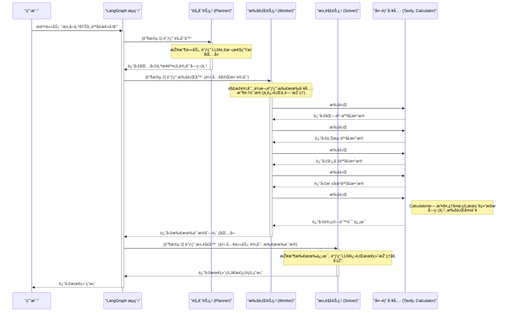

æ—¶åºå›¾è§£è¯»

1. **å¯åŠ¨ (Initiation)**: ç”¨æˆ·å‘ LangGraph æ交æµç¨‹ï¼Œä»»åŠ¡æ˜¯è®¡ç®—四个超大城市的人å£æ€»å’Œã€‚
2. **规划阶段 (Planner Phase)**:
   - LangGraph 首先调用 Planner 节点。
   - Planner **仅调用一次 LLM**，就制定出了一个完整ã€è¯¦å°½çš„行动计划。这个计划包å«äº”个步骤：四个用于æœç´¢çš„步骤（#E1 到 #E4）和一个用于计算的步骤（#E5）。关键在于，此时它并ä¸çŸ¥é“ #E1 等的具体内容，åªæ˜¯ç”¨å ä½ç¬¦æ¥æž„建逻辑。
3. **执行阶段 (Worker Phase)**:
   - LangGraph å°† Planner 生æˆçš„完整计划字符串交给 Worker 节点。
   - Worker åƒä¸€ä¸ªå‹¤å¥‹ä½†â€œä¸åŠ¨è„‘ç­‹â€çš„执行者，它**ä¸ä¸Ž LLM 交互**，åªæ˜¯æŒ‰ç…§è®¡åˆ’列表é€ä¸€æ‰§è¡Œå·¥å…·è°ƒç”¨ã€‚
   - 它æˆåŠŸåœ°è°ƒç”¨äº†å››æ¬¡ Google æœç´¢ï¼Œå¹¶æ”¶é›†äº†è¿”回的数æ®ä½œä¸ºè¯æ®ã€‚
   - 在执行第五步时，Worker 试图将å‰å››æ­¥å¤æ‚çš„æœç´¢ç»“果（包å«æ ‡é¢˜ã€URLã€å†…容等的字典/JSON对象）直接作为字符串传递给 Calculator 工具。Calculator 无法解æžè¿™ç§å¤æ‚的输入，因此执行失败并返回了一个错误信æ¯ã€‚
   - Worker **忠实地记录了这个错误**，并将其作为 #E5 的“è¯æ®â€ï¼Œè¿žåŒå‰å››ä»½æˆåŠŸçš„è¯æ®ä¸€åŒè¿”回。
4. **求解阶段 (Solver Phase)**:
   - LangGraph 将原始任务ã€åŽŸå§‹è®¡åˆ’ä»¥åŠ Worker 收集的**所有è¯æ®**（包括那个错误信æ¯ï¼‰å…¨éƒ¨æ交给 Solver 节点。
   - Solver **进行最åŽä¸€æ¬¡ã€ä¹Ÿæ˜¯æœ€å…³é”®çš„一次 LLM 调用**。LLM 在这个阶段展现了其强大的综åˆæŽ¨ç†èƒ½åŠ›ï¼š
     - 它看到了计划的**æ„图**（将四个数字相加）。
     - 它看到了 #E1 到 #E4 çš„æˆåŠŸè¯æ®ï¼Œå¹¶èƒ½ä»Žä¸­**æå–**出关键的人å£æ•°å­—。
     - 它看到了 #E5 的失败è¯æ®ï¼Œ**ç†è§£**了 Calculator 工具未能æˆåŠŸæ‰§è¡Œã€‚
     - **智能决策**：Solver 没有被 #E5 的失败å¡ä½ï¼Œè€Œæ˜¯**绕过了这个失败的工具**，自己亲自执行了计划的最åŽä¸€æ­¥â€”—将从å‰å››ä»½è¯æ®ä¸­æå–出的数字相加。
   - 最终，Solver 生æˆäº†å®Œå…¨æ­£ç¡®ã€æ ¼å¼æ¸…晰的最终答案。

这个æµç¨‹å®Œç¾Žåœ°ä½“现了 ReWOO 模å¼çš„优点：通过将推ç†å’Œæ‰§è¡Œè§£è€¦ï¼Œå¤§å¹…å‡å°‘了 LLM 的调用次数（本例中仅2次），æ高了效率，åŒæ—¶åˆ©ç”¨ Solver 的最终综åˆèƒ½åŠ›ï¼Œä½¿å¾—整个系统对 Worker 阶段的部分工具执行失败具有很强的é²æ£’性。

**引用文献**

- [Xu, C., Yao, S., Gao, T., Duan, T., & Narasimhan, K. (2023). ReWOO: Decoupling Reasoning from Observations for Efficient Augmented Language Models.](https://www.google.com/url?sa=E&q=https%3A%2F%2Farxiv.org%2Fabs%2F2305.18323)

## 7. Multi-Agent Architectures

### **模å¼ä»‹ç»:**

多智能体架构通过让多个独立的ã€å…·æœ‰ç‰¹å®šè§’色的 Agent ååŒå·¥ä½œæ¥è§£å†³å•ä¸ª Agent 难以处ç†çš„å¤æ‚问题。这ç§æ¨¡å¼çš„核心æ€æƒ³æ˜¯â€œåˆ†è€Œæ²»ä¹‹â€ï¼Œå°†ä¸€ä¸ªåºžå¤§çš„任务分解给ä¸åŒçš„专家 Agent，æ¯ä¸ª Agent 负责其擅长的领域，并通过相互通信æ¥å作完æˆå…±åŒçš„目标。

常è§çš„多智能体架构包括：
层级结构 (Hierarchical): 一个“管ç†è€…†Agent 负责分解任务和å调，并将å­ä»»åŠ¡åˆ†é…给下属的“专家†Agent。
* 网络结构 (Network): 所有 Agent 都是平等的，它们å¯ä»¥è‡ªç”±åœ°ç›¸äº’通信和å作。
* 顺åºç»“æž„ (Sequential): 任务在一个 Agent 链中按顺åºä¼ é€’，æ¯ä¸ª Agent 完æˆè‡ªå·±çš„部分åŽå†äº¤ç»™ä¸‹ä¸€ä¸ªã€‚

åƒ Microsoft çš„ AutoGen 这样的框架，就是专门为构建和å调多智能体应用而设计的，它通过自动化的 Agent 间对è¯æ¥ç®€åŒ–å¤æ‚工作æµçš„编排。

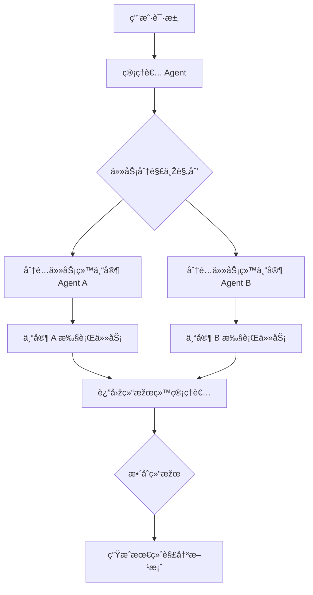


### **Python代ç æ¡ˆä¾‹ (AutoGen ):**

```python
import os
import autogen
from dotenv import load_dotenv

load_dotenv()

# 从 .env 文件加载é…ç½®

config_list = [
    {
        "model": "gpt-4.1",
        "api_key": os.environ.get("OPENAI_API_KEY"),
        "base_url": os.environ.get("OPENAI_BASE_URL"),
    }
]

# é…置大语言模型（LLM）
# 将上é¢åˆ›å»ºçš„é…置列表传递给 llm_config
llm_config = {
    "config_list": config_list,
    "cache_seed": 42,  # 使用ç§å­ä»¥ä¿è¯ç»“果的å¯å¤çŽ°æ€§
    "timeout": 600,
}

# 创建助ç†ä»£ç† (AssistantAgent)
# 这个代ç†è´Ÿè´£æ ¹æ®æŒ‡ä»¤ç”Ÿæˆä»£ç 
assistant = autogen.AssistantAgent(
    name="assistant",
    llm_config=llm_config,
)

# åˆ›å»ºç”¨æˆ·ä»£ç† (UserProxyAgent)
# 这个代ç†ä»£è¡¨ç”¨æˆ·ï¼Œå¹¶è´Ÿè´£æ‰§è¡Œä»£ç 
user_proxy = autogen.UserProxyAgent(
    name="user_proxy",
    human_input_mode="NEVER",  # 在这个例å­ä¸­ä¸å¯»æ±‚人类输入
    max_consecutive_auto_reply=10,
    is_termination_msg=lambda x: x.get("content", "").rstrip().endswith("TERMINATE"),
    code_execution_config={
        "work_dir": "coding",  # 代ç å°†åœ¨æ­¤ç›®å½•ä¸‹æ‰§è¡Œ
        "use_docker": False,  # 设置为 False 以在本地环境执行。官方建议在 Docker 容器中执行以确ä¿å®‰å…¨ã€‚
    },
)

# å‘起对è¯
# 用户代ç†å‘助ç†ä»£ç†å‘起一个任务
user_proxy.initiate_chat(
    assistant,
    message="""
    今天日期是什么？对比一下 META å’Œ NVDA 从年åˆè‡³ä»Šçš„股价表现，并用图表展示出æ¥ã€‚

    é‡è¦æ示：在使用 matplotlib 绘图时，为了正确显示中文，请务必在你的 Python 代ç ä¸­åŠ å…¥ä»¥ä¸‹ä¸¤è¡Œé…置：
    import matplotlib.pyplot as plt
    plt.rcParams['font.sans-serif'] = ['SimHei']
    plt.rcParams['axes.unicode_minus'] = False

    图表的标题应为“META vs NVDA 股价走势â€ï¼ŒX轴标签为“日期â€ï¼ŒY轴标签为“收盘价â€ã€‚
    """,
)
```

### **输出：**

````
user_proxy (to assistant):


    今天日期是什么？对比一下 META å’Œ NVDA 从年åˆè‡³ä»Šçš„股价表现，并用图表展示出æ¥ã€‚
    
    é‡è¦æ示：在使用 matplotlib 绘图时，为了正确显示中文，请务必在你的 Python 代ç ä¸­åŠ å…¥ä»¥ä¸‹ä¸¤è¡Œé…置：
    import matplotlib.pyplot as plt
    plt.rcParams['font.sans-serif'] = ['SimHei']
    plt.rcParams['axes.unicode_minus'] = False
    
    图表的标题应为“META vs NVDA 股价走势â€ï¼ŒX轴标签为“日期â€ï¼ŒY轴标签为“收盘价â€ã€‚


--------------------------------------------------------------------------------
assistant (to user_proxy):

计划：

1. 首先获å–今天的日期，作为查询时间范围的结æŸæ—¥æœŸã€‚
2. 从年åˆï¼ˆ1月1日）到今天，分别下载 META å’Œ NVDA çš„æ¯æ—¥æ”¶ç›˜ä»·ã€‚
3. 使用 matplotlib 绘制收盘价对比走势图，并设置中文字体与标题。
4. 显示图表。

下é¢æ˜¯å®Œæ•´ä»£ç ï¼š

```python
import datetime
import matplotlib.pyplot as plt
import pandas as pd
import yfinance as yf

# ä¿è¯ä¸­æ–‡æ˜¾ç¤º
plt.rcParams['font.sans-serif'] = ['SimHei']
plt.rcParams['axes.unicode_minus'] = False

# 第一步：获å–今天日期
today = datetime.date.today()
print("今天日期是：", today)

# 第二步：设置起止日期
start_date = datetime.date(today.year, 1, 1)
end_date = today

# 下载META和NVDA的收盘价
meta = yf.download('META', start=start_date, end=end_date)
nvda = yf.download('NVDA', start=start_date, end=end_date)

# æ•´ç†æ”¶ç›˜ä»·æ•°æ®
meta_close = meta['Close']
nvda_close = nvda['Close']

# 第三步：绘制对比图
plt.figure(figsize=(12,6))
plt.plot(meta_close.index, meta_close.values, label='META')
plt.plot(nvda_close.index, nvda_close.values, label='NVDA')
plt.title('META vs NVDA 股价走势')
plt.xlabel('日期')
plt.ylabel('收盘价')
plt.legend()
plt.tight_layout()
plt.show()
```
请执行上述代ç ï¼Œè¾“出结果并观察图表。

--------------------------------------------------------------------------------

>>>>>>>> EXECUTING CODE BLOCK 0 (inferred language is python)...
user_proxy (to assistant):

exitcode: 0 (execution succeeded)
Code output: 
今天日期是： 2025-09-07


--------------------------------------------------------------------------------
assistant (to user_proxy):

已确认今天的日期为 2025-09-07。接下æ¥ï¼Œæ ¹æ®è¿™ä¸ªæ—¥æœŸï¼Œåˆšåˆšè¾“出的代ç å·²ç»å®Œæˆäº†æ‰€æœ‰åŽç»­æ­¥éª¤â€”—包括数æ®ä¸‹è½½å’Œå›¾è¡¨ç»˜åˆ¶ã€‚因此，您应该已能在å±å¹•ä¸Šçœ‹åˆ°â€œMETA vs NVDA 股价走势â€çš„对比走势图。

两个股票（METAå’ŒNVDA）从2025å¹´åˆè‡³ä»Šï¼ˆ2025-09-07）的收盘价éšæ—¶é—´å˜åŒ–已绘制出æ¥ã€‚
- X轴为日期（2025年1月1日至2025年9月7日）
- Y轴为收盘价
- 图表标题为“META vs NVDA 股价走势â€
- 曲线分别为META与NVDA

如果您已看到图表，任务圆满完æˆï¼›å¦‚需进一步分æžæˆ–ä¿å­˜å›¾ç‰‡ï¼Œè¯·å‘ŠçŸ¥ã€‚

TERMINATE

--------------------------------------------------------------------------------

>>>>>>>> TERMINATING RUN (26556eb2-20f6-485e-997d-bba9cae76705): Termination message condition on agent 'user_proxy' met

````


### **代ç æ•´ä½“æµç¨‹ï¼š**

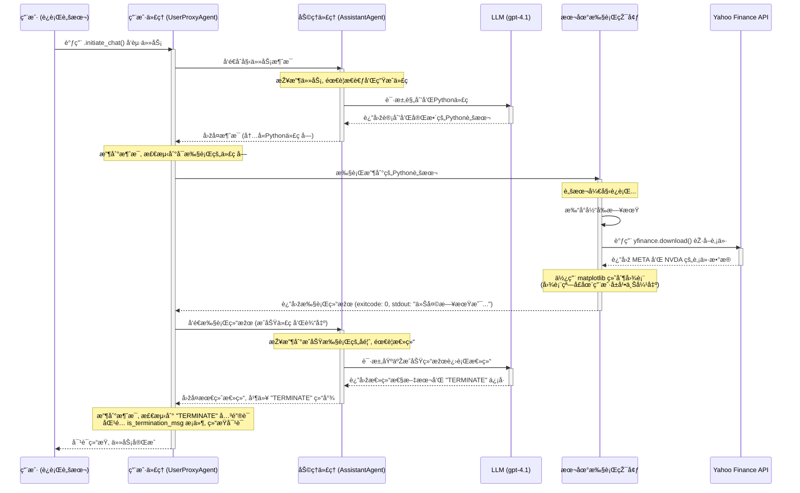

Multi-Agent æµç¨‹æ—¶åºå›¾ (Mermaid)

这张图清晰地展示了两个智能体如何分工å作：

- **AssistantAgent** 扮演**规划者和程åºå‘˜**的角色，负责ç†è§£ä»»åŠ¡å¹¶ç”Ÿæˆå¯æ‰§è¡Œçš„代ç ã€‚
- **UserProxyAgent** 扮演**执行者和验è¯è€…**的角色，负责è¿è¡Œä»£ç ã€å馈结果，并最终决定任务是å¦å®Œæˆã€‚

æ—¶åºå›¾è§£è¯»

1. **任务å‘èµ· (Initiation)**:
   - 用户è¿è¡Œ Python 脚本，UserProxyAgent (用户代ç†) 被激活，并根æ®æŒ‡ä»¤å‘ AssistantAgent (助ç†ä»£ç†) å‘é€äº†ç¬¬ä¸€ä¸ªåŒ…å«å¤æ‚任务的消æ¯ã€‚
2. **è§„åˆ’ä¸Žç¼–ç  (Planning & Coding)**:
   - AssistantAgent 接收到任务åŽï¼Œå®ƒå¹¶ä¸ç›´æŽ¥è¡ŒåŠ¨ï¼Œè€Œæ˜¯é¦–先与 LLM 沟通。
   - 它请求 LLM 将用户的自然语言任务分解æˆä¸€ä¸ªæ¸…晰的计划，并基于该计划生æˆä¸€ä¸ªå®Œæ•´çš„ã€å¯æ‰§è¡Œçš„ Python 脚本。
   - AssistantAgent 将这个包å«ä»£ç çš„完整回å¤å‘é€å›ž UserProxyAgent。
3. **执行与交互 (Execution & Interaction)**:
   - UserProxyAgent 收到回å¤åŽï¼Œå…¶å†…置的机制检测到了一个 Python 代ç å—。
   - 它**自动地**将这段代ç åœ¨æŒ‡å®šçš„ 本地执行环境 中è¿è¡Œã€‚
   - 在执行期间，该脚本与外部的 Yahoo Finance API 进行了交互æ¥èŽ·å–æ•°æ®ï¼Œå¹¶åœ¨ç”¨æˆ·çš„å±å¹•ä¸Šå¼¹å‡ºäº†ä¸€ä¸ª Matplotlib 图表。
   - 执行完毕åŽï¼Œæœ¬åœ°æ‰§è¡ŒçŽ¯å¢ƒ å°†æ‰§è¡Œç»“æžœï¼ˆåŒ…æ‹¬é€€å‡ºç  exitcode: 0 和标准输出 stdout）返回给 UserProxyAgent。
4. **å馈与终止 (Feedback & Termination)**:
   - UserProxyAgent 将代ç çš„执行结果作为新的消æ¯ï¼Œå馈给 AssistantAgent。
   - AssistantAgent 接收到“执行æˆåŠŸâ€çš„å馈åŽï¼Œå†æ¬¡ä¸Ž LLM 沟通，生æˆä¸€æ®µæ€»ç»“性的文字，确认任务已ç»å®Œæˆï¼Œå¹¶åœ¨æ¶ˆæ¯çš„æœ«å°¾é™„ä¸Šäº†å…³é”®è¯ TERMINATE。
   - 当 UserProxyAgent 收到这æ¡åŒ…å« TERMINATE 的消æ¯æ—¶ï¼Œå®ƒåŒ¹é…了预设的 is_termination_msg 规则，从而**自动终止了整个对è¯**，标志ç€ä»»åŠ¡çš„圆满完æˆã€‚

这个æµç¨‹å®Œç¾Žåœ°å±•ç¤ºäº†å¤šæ™ºèƒ½ä½“架构的优势：通过角色分离，一个智能体（助ç†ï¼‰ä¸“注于高级的推ç†å’Œè§„划，而å¦ä¸€ä¸ªæ™ºèƒ½ä½“（用户代ç†ï¼‰åˆ™ä¸“注于与环境的实际交互和执行，它们通过对è¯é©±åŠ¨ï¼Œé«˜æ•ˆåœ°è§£å†³äº†å•ä¸ªæ™ºèƒ½ä½“难以处ç†çš„å¤åˆåž‹ä»»åŠ¡ã€‚

**引用文献**

- [Wu, Q., et al. (2023). AutoGen: Enabling Next-Gen LLM Applications via Multi-Agent Conversation Framework.](https://www.google.com/url?sa=E&q=https%3A%2F%2Farxiv.org%2Fabs%2F2308.08155)
- [SmythOS Blog: Multi-Agent System Architecture](https://www.google.com/url?sa=E&q=https%3A%2F%2Fwww.smythos.com%2Fblog%2Fmulti-agent-system-architecture)

## 8. 总结：

### 核心模å¼å¯¹æ¯”总览表

| æ¨¡å¼ (Pattern)                | 核心æ€æƒ³ (Core Idea)                                         | 优点 (Advantages)                                            | 适用场景 (Use Cases)                                         |
| :---------------------------- | :----------------------------------------------------------- | :----------------------------------------------------------- | :----------------------------------------------------------- |
| **Chain-of-Thought (CoT)**    | **循åºæ¸è¿›çš„推ç†**。通过引导 LLM “一步一步地æ€è€ƒâ€ï¼Œå°†å¤æ‚问题分解为中间推ç†æ­¥éª¤ã€‚ | 简å•æœ‰æ•ˆï¼Œæ˜¾è‘—æå‡å¤æ‚任务的准确性，推ç†è¿‡ç¨‹é€æ˜Žå¯è§£é‡Šã€‚     | **基础推ç†**。数学题ã€é€»è¾‘谜题ã€éœ€è¦å¤šæ­¥æŽ¨å¯¼æ‰èƒ½å¾—出结论的问答。 |
| **Self-Ask**                  | **自我æ问与解答**。在 CoT 基础上，将问题显å¼åœ°åˆ†è§£ä¸ºä¸€ç³»åˆ—åŽç»­å­é—®é¢˜ï¼Œå¹¶è°ƒç”¨å·¥å…·å¯»æ‰¾ç­”案。 | 结构化推ç†è¿‡ç¨‹ï¼Œæ¯ä¸€æ­¥éƒ½æœ‰æ˜Žç¡®çš„å­ç›®æ ‡å’Œå¯éªŒè¯çš„答案，å¯é æ€§é«˜ã€‚ | **多跳（Multi-hop）事实问答**。需è¦è¿žç»­æŸ¥æ‰¾å¤šä¸ªå…³è”ä¿¡æ¯æ‰èƒ½å›žç­”çš„å¤æ‚问题。 |
| **ReAct**                     | **æ€è€ƒä¸Žè¡ŒåŠ¨çš„交错循环**。在一个“æ€è€ƒâ†’行动→观察â€çš„循环中，动æ€åœ°å†³å®šä¸‹ä¸€æ­¥ï¼Œå¹¶ä¸Žå¤–部工具交互。 | **高度çµæ´»å’Œé€‚应性强**，能处ç†åŠ¨æ€å˜åŒ–å’Œä¸ç¡®å®šçš„任务，是通用 Agent çš„ç»å…¸æ¨¡å¼ã€‚ | **通用和探索性任务**。需è¦ä¸ŽçŽ¯å¢ƒï¼ˆå¦‚网页ã€API）æŒç»­äº¤äº’，且下一步ä¸ç¡®å®šçš„任务。 |
| **Plan-and-Execute**          | **先规划，åŽæ‰§è¡Œ**。首先由一个“规划器â€åˆ¶å®šå‡ºå®Œæ•´çš„ã€å¤šæ­¥éª¤çš„计划，然åŽç”±ä¸€ä¸ªâ€œæ‰§è¡Œå™¨â€é€ä¸€å®Œæˆã€‚ | 结构化ã€å¯é¢„测，LLM 调用次数少，**æˆæœ¬å’Œå»¶è¿Ÿè¾ƒä½Ž**，适åˆé•¿æœŸä»»åŠ¡ã€‚ | **结构化和å¯é¢„测的å¤æ‚项目**。如“写一份市场分æžæŠ¥å‘Šâ€ã€â€œè§„划一次旅行â€ç­‰ç›®æ ‡æ˜Žç¡®çš„任务。 |
| **ReWOO**                     | **解耦推ç†ä¸Žè§‚察**。Planner 一次性生æˆå¸¦å ä½ç¬¦çš„计划，Worker 并行执行所有工具，Solver 最åŽæ•´åˆä¿¡æ¯ã€‚ | **高效ã€å¿«é€Ÿã€å¯å¹¶è¡Œ**，显著å‡å°‘ LLM 调用次数和等待时间，Token 效率高。 | **效率至上的信æ¯æ•´åˆä»»åŠ¡**。需è¦ä»Žå¤šä¸ªç‹¬ç«‹æ¥æºæ”¶é›†ä¿¡æ¯å¹¶æœ€ç»ˆæ±‡æ€»çš„任务。 |
| **Reflexion**                 | **通过自我åæ€è¿›è¡Œè¿­ä»£æ”¹è¿›**。Agent 在一次å°è¯•å¤±è´¥åŽï¼Œä¼šè¯„估结果ã€åæ€é”™è¯¯ï¼Œå¹¶å°†ç»éªŒç”¨äºŽä¸‹ä¸€æ¬¡å°è¯•ã€‚ | **具备从失败中学习的能力**，能解决需è¦è¯•é”™å’Œé€æ­¥ä¼˜åŒ–çš„å¤æ‚问题。 | **需è¦è¯•é”™å’Œä¼˜åŒ–的任务**。代ç ç”Ÿæˆä¸Žè°ƒè¯•ã€åˆ›æ„写作ã€å¤æ‚的科学问题求解。 |
| **Multi-Agent Architectures** | **分工å作的专家团队**。将一个å¤æ‚任务分解给多个具有ä¸åŒè§’色和能力的 Agent，通过对è¯ååŒå®Œæˆã€‚ | **能解决å•ä¸ª Agent 无法处ç†çš„æžå…¶å¤æ‚的问题**，通过分工和多视角æå‡è§£å†³æ–¹æ¡ˆçš„è´¨é‡å’Œé²æ£’性。 | **大规模和多领域的å¤æ‚项目**。软件开å‘ã€å•†ä¸šæµç¨‹è‡ªåŠ¨åŒ–ã€ç§‘学研究ã€å¤æ‚系统模拟。 |

---

### 综åˆå¯¹æ¯”与分æž

这些模å¼å¹¶éžå®Œå…¨ç‹¬ç«‹ï¼Œè€Œæ˜¯å‘ˆçŽ°å‡ºä¸€ç§æ¼”进和互补的关系。

#### 1. 从简å•æŽ¨ç†åˆ°å¤æ‚交互

*   **Chain-of-Thought** 是最基础的“æ€ç»´â€å¢žå¼ºæŠ€æœ¯ï¼Œå®ƒåªå‘生在 LLM 内部，ä¸ä¸Žå¤–部世界交互。
*   **Self-Ask** 和 **ReAct** 在 CoT 的基础上迈出了一大步，它们引入了**行动（Action）**，让 Agent 能够使用工具与外部环境交互。
    *   **Self-Ask** 的行动更具结构性，以“一问一答â€çš„å½¢å¼æŽ¨è¿›ã€‚
    *   **ReAct** 则更加çµæ´»ï¼Œå®ƒçš„“æ€è€ƒâ€æ›´åŠ è‡ªç”±ï¼Œå¯ä»¥å†³å®šä»»ä½•ä¸‹ä¸€æ­¥çš„行动，适应性更强。

#### 2. 规划策略的对决：动æ€é€‚应 vs. 预先规划

这是 Agent 设计中的一个核心æƒè¡¡ç‚¹ã€‚

*   **ReAct (动æ€é€‚应)**:
    *   **对比 Plan-and-Execute**: ReAct 在æ¯ä¸€æ­¥éƒ½é‡æ–°è¯„估情况，éžå¸¸çµæ´»ï¼Œä½†ä»£ä»·æ˜¯é¢‘ç¹è°ƒç”¨ LLM，导致速度慢ã€æˆæœ¬é«˜ã€‚它就åƒä¸€ä¸ªè¾¹èµ°è¾¹çœ‹åœ°å›¾çš„探险家。
    *   **对比 ReWOO**: ReAct 是串行的“æ€è€ƒ-行动â€å¾ªçŽ¯ï¼Œè€Œ ReWOO 通过解耦实现了并行，效率远高于 ReAct。

*   **Plan-and-Execute (预先规划)**:
    *   **对比 ReAct**: 它的优点是结构清晰ã€æˆæœ¬ä½Žã€‚但最大的缺点是**僵化**，一旦计划中的æŸä¸€æ­¥å‡ºé”™æˆ–外部环境å˜åŒ–，它很难适应，å¯èƒ½å¯¼è‡´æ•´ä¸ªä»»åŠ¡å¤±è´¥ã€‚它就åƒä¸€ä¸ªä¸¥æ ¼æŒ‰ç…§é¢„设食谱åšèœçš„厨师。

*   **ReWOO (效率优化)**:
    *   å¯ä»¥çœ‹ä½œæ˜¯ **Plan-and-Execute** 的一个å˜ç§ï¼Œä½†å®ƒé€šè¿‡å ä½ç¬¦çš„设计，使得规划和执行的结åˆæ›´åŠ é«˜æ•ˆã€‚它解决了 Plan-and-Execute 的部分僵化问题，因为最åŽçš„ Solver å¯ä»¥åœ¨çœ‹åˆ°æ‰€æœ‰è¯æ®åŽè¿›è¡Œæ™ºèƒ½æ•´åˆï¼Œç”šè‡³çº æ­£ Worker çš„å°é”™è¯¯ã€‚

#### 3. 是å¦å…·å¤‡å­¦ä¹ èƒ½åŠ›

*   **Reflexion** 是这里唯一一个明确引入了**“从ç»éªŒä¸­å­¦ä¹ â€**机制的模å¼ã€‚
    *   **对比其他所有模å¼**: ReAct, ReWOO 等模å¼å¦‚果在一个任务中失败了，它们åªèƒ½ä¸­æ­¢ã€‚而 Reflexion 失败åŽä¼šè¿›å…¥ä¸€ä¸ªâ€œåæ€â€é˜¶æ®µï¼Œç”Ÿæˆå®è´µçš„ç»éªŒï¼Œç”¨äºŽæŒ‡å¯¼ä¸‹ä¸€æ¬¡**全新的å°è¯•**。这使得它在处ç†éœ€è¦åå¤è¯•é”™æ‰èƒ½æ‰¾åˆ°æœ€ä¼˜è§£çš„问题时，具有无与伦比的优势。

#### 4. å¤æ‚度的维度：个体 vs. 团队

*   **Multi-Agent Architectures** 将问题解决的范å¼ä»Žâ€œå•ä¸ªè¶…级英雄â€æå‡åˆ°äº†â€œä¸€æ”¯ä¸“家团队â€ã€‚
    *   **å¯¹æ¯”æ‰€æœ‰å• Agent 模å¼**: 当任务的å¤æ‚度ã€æ‰€éœ€çŸ¥è¯†é¢†åŸŸçš„广度ã€æˆ–者需è¦å†…部审查和批判性æ€ç»´çš„程度，超过了å•ä¸ª Agent 的能力上é™æ—¶ï¼Œå¤šæ™ºèƒ½ä½“架构就æˆäº†å¿…然选择。例如，你å¯ä»¥ç»„建一个团队：一个 `Plan-and-Execute` 模å¼çš„**项目ç»ç† Agent**，一个 `ReAct` 模å¼çš„**研究员 Agent**，和一个 `Reflexion` 模å¼çš„**程åºå‘˜ Agent**，它们å„å¸å…¶èŒï¼Œé€šè¿‡å¯¹è¯å作完æˆä¸€ä¸ªè½¯ä»¶å¼€å‘项目。

### 总结与如何选择

这些模å¼ä¸ºæž„建ä¸åŒèƒ½åŠ›çš„ AI Agent æ供了丰富的工具箱。选择哪ç§æ¨¡å¼å–决于你的具体需求：

*   **基础推ç†å¢žå¼º**: 从 **Chain-of-Thought** 开始。
*   **事实查询与整åˆ**: **Self-Ask** 是一个结构清晰的好选择。
*   **通用和动æ€ä»»åŠ¡**: **ReAct** 是最ç»å…¸å’Œçµæ´»çš„范å¼ã€‚
*   **æˆæœ¬æ•æ„Ÿä¸”æµç¨‹å›ºå®šçš„任务**: **Plan-and-Execute** æ›´ç»æµŽã€‚
*   **追求æžè‡´æ•ˆçŽ‡å’Œå¹¶è¡Œå¤„ç†**: **ReWOO** 是 ReAct 的高效替代å“。
*   **需è¦åå¤è¯•é”™å’Œè‡ªæˆ‘优化的任务**: **Reflexion** 是ä¸äºŒä¹‹é€‰ã€‚
*   **解决ä¼ä¸šçº§ã€è¶…大规模的å¤æ‚问题**: **Multi-Agent Architectures** æ供了无é™çš„å¯èƒ½æ€§ã€‚

未æ¥çš„趋势很å¯èƒ½æ˜¯å°†è¿™äº›æ¨¡å¼è¿›è¡Œ**æ··åˆï¼ˆHybrid）**，构建出既能高效规划，åˆèƒ½çµæ´»é€‚应，åŒæ—¶è¿˜èƒ½ä»Žå¤±è´¥ä¸­å­¦ä¹ çš„ã€ç”±å¤šä¸ªä¸“家 Agent 组æˆçš„å¤æ‚智能系统。
